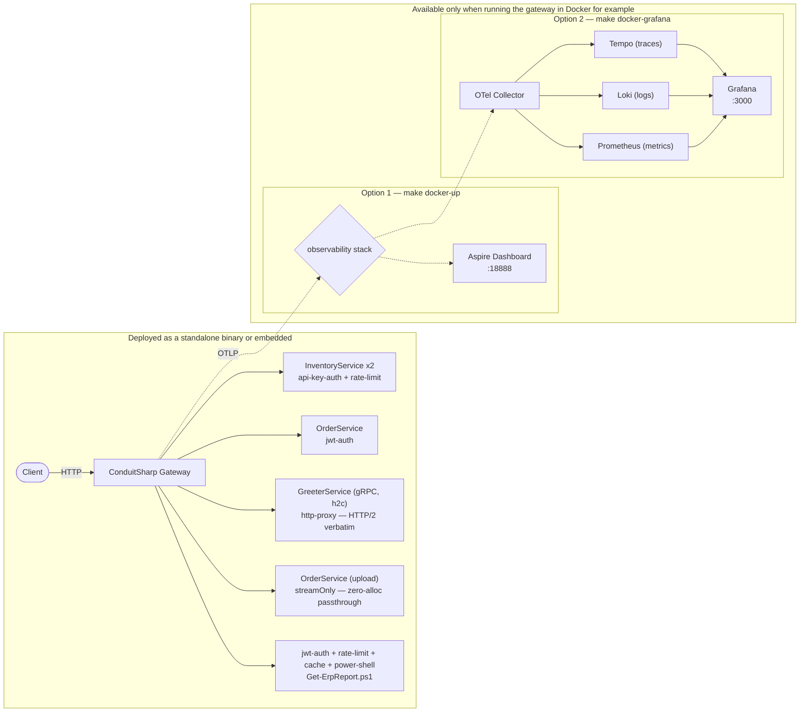
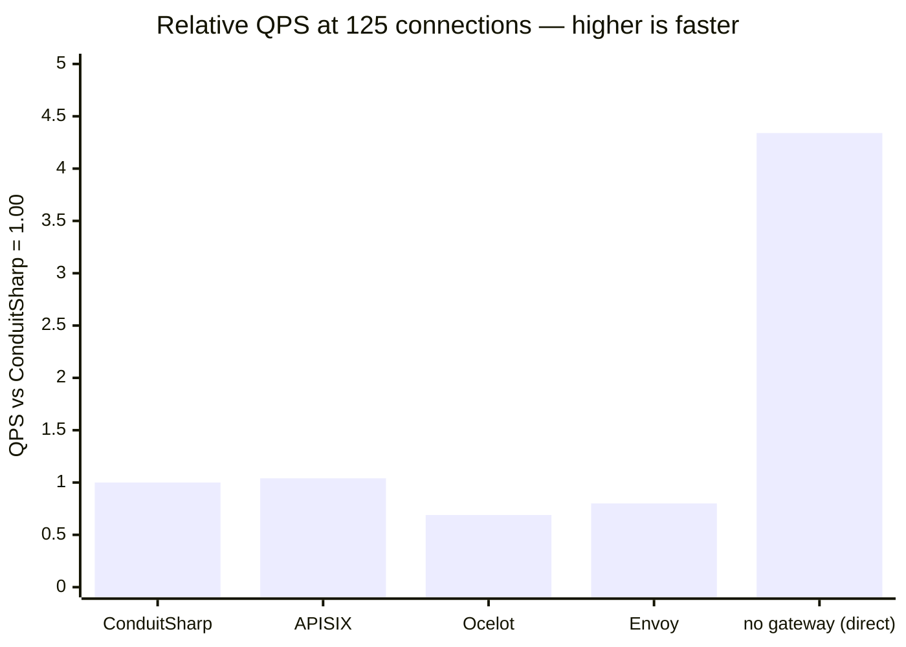
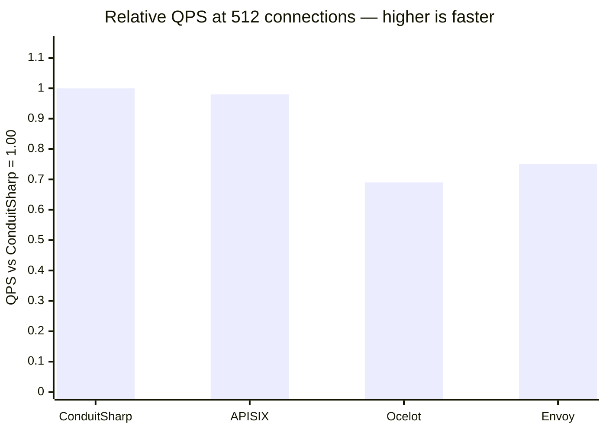
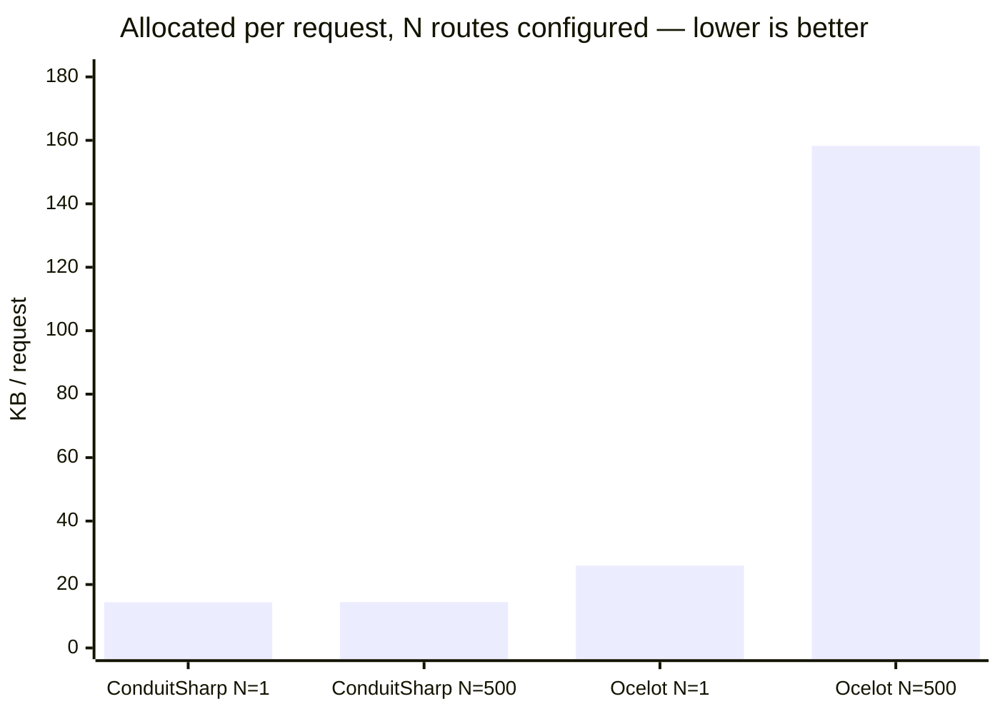
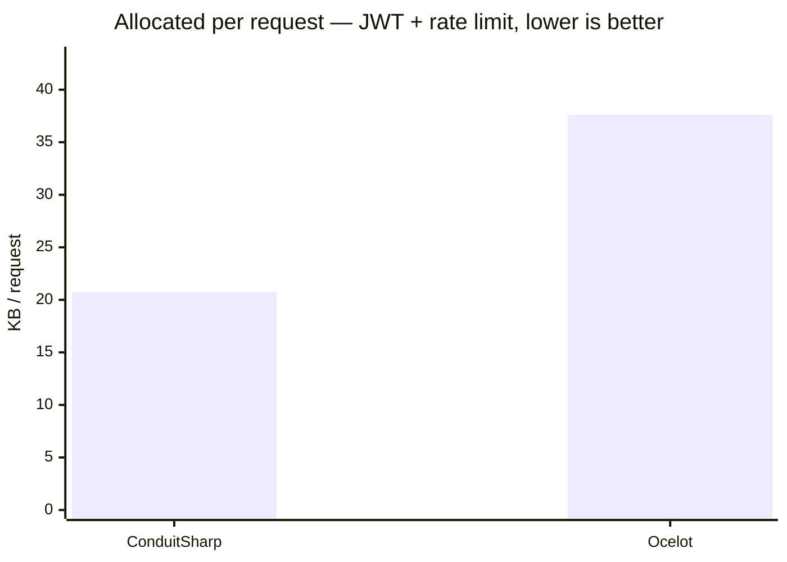
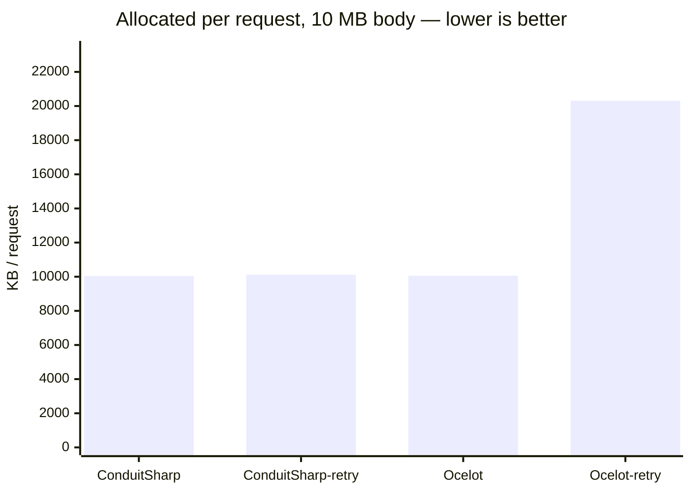
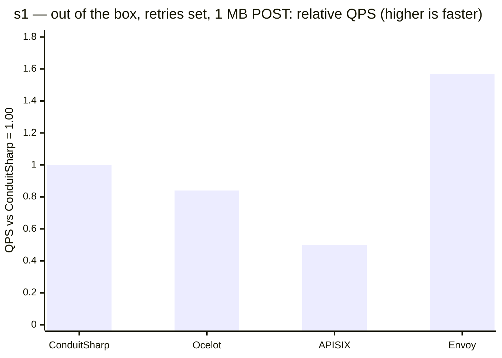
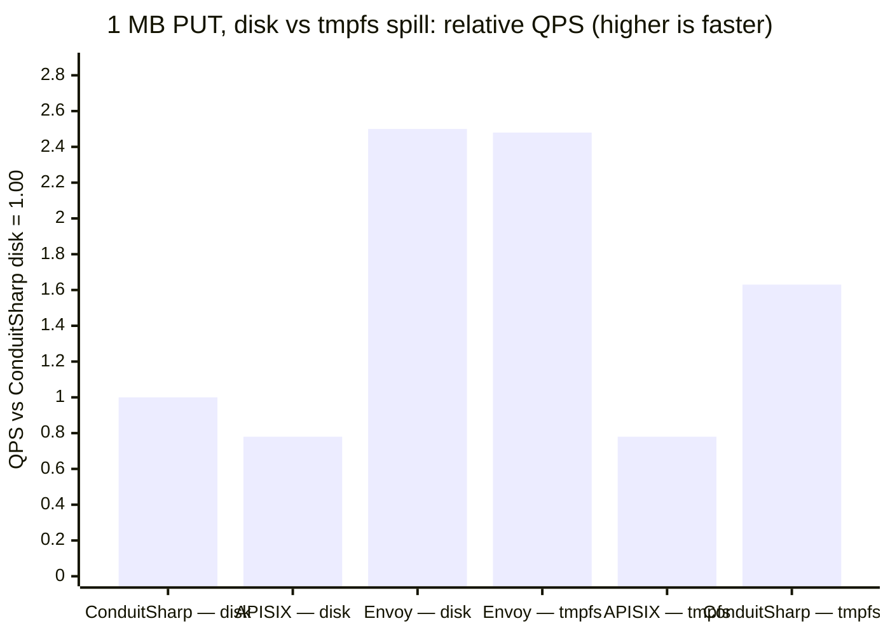

<p align="center">
  
  <h1 align="center">ConduitSharp</h1>
  <p align="center">The .NET API Gateway — a JSON-driven internal integration gateway on YARP, with native retries, circuit breakers, and a memory-bounded per-route plugin pipeline.</p>
  <p align="center">
    <a href="https://github.com/liqngliz/ConduitSharp/actions/workflows/ci.yml"></a>
    <a href="https://www.nuget.org/packages/ConduitSharp.Gateway.AspNetCore"></a>
    
    
    
  </p>
</p>

---

ConduitSharp **Internal Integration Gateway** built on top of Microsoft's YARP (Yet Another Reverse Proxy). It is specifically designed to work in tandem with edge gateway services (like Azure APIM, Cloudflare, or Kong), sitting behind the network perimeter to focus on internal traffic orchestration, legacy workload integration, and microservice routing.

It extends YARP with features like native retries, circuit breakers, a strict memory-bounded plugin pipeline, and robust API configuration hot-reloading. It supports both codeless deployments based purely on JSON configuration and embedded deployments with dependency injection.

## 🎯 Why ConduitSharp

**Powered by YARP:** Built on top of Microsoft’s battle-tested YARP engine rather than reinventing socket-forwarding from scratch. You get YARP's world-class load balancing, connection pooling, and performance, wrapped in a developer-friendly API gateway experience.

**Native Retries & Circuit Breakers:** YARP deliberately omits retries and circuit breaking out of the box because doing them safely requires body buffering. ConduitSharp fills this gap, offering robust JSON-configured resilience policies built with strict safety rails:
  - **Streaming by default:** a body is buffered only when something consumes the buffer — a retry policy (idempotent methods only; a POST on a retry route still streams) or a body-reading plugin. Every other request is pure forward-only streaming, automatically.
  - **Off-heap buffering:** when a body *is* buffered, only the first 64 KiB lives on the heap; the rest spills to a temp file (nginx-style) — large uploads never touch the Large Object Heap.
  - **Memory Budgets:** buffering is additionally capped per request (413) and gateway-wide (503 load-shed) to prevent memory exhaustion.
  - **Fail-Fast Validation:** accidentally mix an explicit `"streamOnly": true` route with a payload-reading plugin? The gateway catches the conflict at startup, preventing mid-flight runtime errors.

**First-Class OpenTelemetry:** Built for production observability from day one. Native OpenTelemetry metrics and distributed tracing are baked directly into the proxy pipeline and are easily configured via environment variables.

---

## ⚡ What You Get — Every Deployment

Whether you embed it in a custom application or run it as a standalone appliance:

**Zero/Low-Code Configuration:** Define routes, upstream clusters, load balancing rules, and plugin chains entirely via the `routes.json` file.


**Hot-Reloading without Dropping Requests:** Update routing configurations via the `POST /admin/routes/reload` API. The gateway atomically swaps the routing table in-memory using YARP's `InMemoryConfigProvider`. In-flight requests gracefully finish on their original rules.


**Batteries Included (Shipped Plugins):** Comes out of the box with highly-optimized built-in plugins for common gateway needs:
  - JWT & API Key Authentication
  - Distributed Rate Limiting
  - Response Caching
  - Header Transformation

---

## 🚀 Quick Start

Run the bundled LegacyGateway example — a gateway with six routes, three upstream services (REST, gRPC, and a streamOnly upload), a PowerShell plugin, JWT + API-key auth, rate limiting, caching, and OpenTelemetry traces — all wired from `routes.json` with no code changes.

```bash
cd examples/LegacyGateway
make docker-up            # macOS / Linux — Docker Compose + Aspire Dashboard
pwsh start.ps1 -DockerUp  # Windows — same stack
```

```bash
# Health check — no auth
curl http://localhost:5050/health

# Inventory — API key
curl http://localhost:5050/api/inventory \
     -H "X-Api-Key: demo-api-key-conduitsharp-example"

# ERP report — JWT (token printed by make docker-up)
curl http://localhost:5050/erp/reports/summary \
     -H "Authorization: Bearer $TOKEN"
```

Open the **Aspire Dashboard** at http://localhost:18888 to see every request's trace. Prefer Grafana/Tempo/Prometheus/Loki? Run `make docker-grafana` and open http://localhost:3000. No Docker? `make run` (macOS/Linux) or `pwsh start.ps1` (Windows) runs the same example as local processes with file-based traces.

---


## 📦 Installation

Pick by how you deploy. The embedded-library and Docker paths fit immutable-infrastructure workflows; the bare-metal / Windows Service / IIS options (the legacy-estate differentiator) live in the [in-depth docs](#-documentation).

### Embedded library (NuGet) — recommended

Host the gateway *inside your own ASP.NET Core app* — the YARP `AddReverseProxy()` / `MapReverseProxy()` model. Plugins arrive as NuGet packages registered in DI, so the whole deployment is one immutable, versioned build.

```bash
dotnet add package ConduitSharp.Gateway.AspNetCore
```

```csharp
using ConduitSharp.Gateway;

var builder = WebApplication.CreateBuilder(args);
builder.AddConduitSharpGateway(options =>
{
    options.PathPrefix = "/api";   // gateway owns /api/*; the rest of the app is yours
});

var app = builder.Build();
app.MapGet("/hello", () => "served by the host app");   // coexists with the gateway
app.UseConduitSharpGateway();
app.Run();
```

### Docker

```bash
docker run -p 5050:5050 \
  -v ./routes.json:/app/Configuration/routes.json \
  ghcr.io/liqngliz/conduitsharp:latest
```

To ship plugins the immutable way, build your own image `FROM` this one and `COPY` the published plugin DLLs into `/app/plugins/`.

### dotnet tool

```bash
dotnet tool install -g ConduitSharp.Gateway
conduitsharp
```

Works on Windows, macOS, and Linux. Requires .NET 10 SDK.

---

## 🧭 Configuring routes

All routing lives in `Configuration/routes.json` — no database, no admin UI, just a file you commit, review, and diff.

```json
{
  "routes": [
    {
      "id": "user-service-route",
      "route": {
        "match": { "path": "/api/users/{**catch-all}", "methods": ["GET", "POST"] }
      },
      "cluster": {
        "loadBalancingPolicy": "RoundRobin",
        "destinations": {
          "node-0": { "address": "http://user-service-1:8080" },
          "node-1": { "address": "http://user-service-2:8080" }
        }
      },
      "retry":          { "maxAttempts": 2, "delayMs": 100 },
      "circuitBreaker": { "threshold": 5, "cooldownMs": 10000 },
      "plugins": [
        { "name": "jwt-auth",   "order": 1, "config": { "issuer": "https://auth.example.com" } },
        { "name": "rate-limit", "order": 2, "config": { "requestsPerWindow": 100 } },
        { "name": "http-proxy", "order": 99 }
      ]
    }
  ]
}
```

A route has two halves, and the split is deliberate:

- **`route` and `cluster` are YARP's own `RouteConfig` and `ClusterConfig`**, used verbatim — so *every* YARP feature (session affinity, active health checks, transforms, header/query matchers) is available the day YARP ships it. `routeId`, `clusterId`, and `order` are derived from the route's `id` and its position in the file, so you never type them.
- **Everything else is ConduitSharp's** — `retry`, `circuitBreaker`, `plugins`, `swagger`, `maxRequestBodyBytes` — because YARP has no concept of any of them.

Write it all in camelCase; YARP's records bind case-insensitively. The full field reference — load balancing policies, retry/circuit-breaker fields, path & query syntax — is in the [in-depth docs](#-documentation).

### JWKS-based authorization (Auth0 · Microsoft Entra ID / Azure AD · Google · Keycloak · Okta)

The `jwks-jwt-auth` plugin validates RS/ES Bearer JWTs against **any** OIDC provider's JWKS endpoint and enforces authorization with `requiredClaims` — no code, just config. Point `jwksUri` / `issuer` / `audience` at your provider and match on whatever claim it emits (`roles`, `groups`, `scp`, `realm_access.roles`, …); it works with **Auth0, Microsoft Entra ID (Azure AD), Google, Keycloak, Okta**, and any OIDC-compliant issuer.

**Example — Microsoft Entra ID (Azure AD).** The three connection fields are the same whether you gate on **app roles** or **security groups**; only the claim differs.

```json
{
  "name": "jwks-jwt-auth",
  "order": 1,
  "config": {
    "jwksUri":  "https://login.microsoftonline.com/{tenantId}/discovery/v2.0/keys",
    "issuer":   "https://login.microsoftonline.com/{tenantId}/v2.0",
    "audience": "{api-app-client-id}",
    "requiredClaims": [
      { "claim": "roles", "anyOf": ["Admin", "Read"] }
    ]
  }
}
```

- **App roles** (above — recommended). Gate on the `roles` claim. Define `appRoles` in the API app registration, then assign users/groups in the Enterprise App; Entra emits `roles` **by default** as readable value strings (e.g. `"Admin"`). No size limit.
- **Security groups.** Swap the rule for `{ "claim": "groups", "anyOf": ["<group-object-id-guid>"] }`. Requires `"groupMembershipClaims": "SecurityGroup"` in the app manifest; values are group **object-id GUIDs** (on-prem AD groups synced via Entra Connect appear as their Entra object IDs). Caveat: a user in **>200 groups** gets no `groups` claim at all — Entra emits a Graph pointer the plugin can't resolve — so prefer app roles at that scale.

`anyOf` = member of any listed value (403 otherwise); use `allOf` to require every one. The endpoints above are v2; a v1-token app uses `https://sts.windows.net/{tenantId}/` as the issuer.

**Other providers** use the same shape — only the `jwksUri`/`issuer` and the claim name change. The `claim` field is looked up as a literal name first, then as a dot-path into nested objects, so provider-specific claims work directly: Keycloak `realm_access.roles`, Auth0 namespaced `https://your-app.example.com/roles`, or a space-delimited OAuth `scp`/`scope` (add `"delimiter": " "`). JWKS endpoints: Auth0 `https://TENANT.auth0.com/.well-known/jwks.json`, Google `https://www.googleapis.com/oauth2/v3/certs`, Keycloak `https://HOST/realms/REALM/protocol/openid-connect/certs`.

---

## 🔌 Plugins
Plugins implement one interface (`IPipelinePlugin`) and can be written in **C#, F#, VB.NET, or PowerShell.**

### Built-in plugins

| Name | What it does |
| --- | --- |
| `jwt-auth` | Validates HS256 Bearer JWTs; enforces exp, nbf, iss, aud, and optional claim-based RBAC (`requiredClaims`) |
| `jwks-jwt-auth` | Validates RS/ES Bearer JWTs via a remote JWKS endpoint (Auth0, Azure AD, Google, Keycloak) |
| `api-key-auth` | Validates API keys from a request header (plain-text comparison) |
| `api-key-auth-hashed` | Validates API keys by comparing SHA-256 hash; keys never stored raw |
| `rate-limit` | Fixed-window quota per route or per client header value |
| `cache` | Response caching with configurable TTL and vary-by-header rules |
| `header-transform` | Add, remove, or rewrite request headers before forwarding upstream |
| `http-proxy` | Not a plugin — names where in the chain YARP forwards upstream. Omit it and the forward is appended at the end of the chain |


## Shipped example plugins

Runnable extensions under [examples/](examples/) — copy the source as a template, or reference the NuGet package directly:

| Example | Kind | NuGet package | What it shows |
| --- | --- | --- | --- |
| [ConduitSharp.Plugin.PowerShell](examples/ConduitSharp.Plugin.PowerShell) | `IPipelinePlugin` (`custom` / `power-shell`) | `ConduitSharp.Plugin.PowerShell` | Runs an existing `.ps1` in-process via the embedded `Microsoft.PowerShell.SDK` — no system `pwsh` install |
| [ConduitSharp.Plugin.BodyCapture](examples/ConduitSharp.Plugin.BodyCapture) | `IPipelinePlugin` (`custom` / `body-capture-streaming`, `body-capture`) | `ConduitSharp.Plugin.BodyCapture` | Logs request bodies two ways: a bounded prefix teed off the streaming path via ASP.NET Core `HttpLogging` (`ReadsRequestBody => false`, no buffering), or the whole body via the gateway's buffer (`ReadsRequestBody => true`) — the two patterns for a payload-inspecting plugin |
| [ConduitSharp.Cache.RedisProtocol](examples/ConduitSharp.Cache.RedisProtocol) | `ICacheService` seam | `ConduitSharp.Cache.RedisProtocol` | Swaps the in-memory `cache` store for Redis/Valkey — shared response cache across instances |
| [ConduitSharp.RateLimit.RedisProtocol](examples/ConduitSharp.RateLimit.RedisProtocol) | `IRateLimitStore` seam | `ConduitSharp.RateLimit.RedisProtocol` | Swaps the in-memory `rate-limit` store for Redis/Valkey — shared quota across instances |
| [ConduitSharp.RateLimit.SlidingWindow](examples/ConduitSharp.RateLimit.SlidingWindow) | `IRateLimiter` seam | `ConduitSharp.RateLimit.SlidingWindow` | Swaps the fixed-window *algorithm* for a sliding log — refuses the 2x burst a fixed window allows across its boundary. The algorithm and the store are separate seams |

## Writing a custom plugin

| Language | How |
|---|---|
| **C#** | Reference `ConduitSharp.Core`, implement `IPipelinePlugin`, drop the DLL in `plugins/` |
| **F# / VB.NET** | Same as C# — they compile to identical .NET IL |
| **PowerShell** | A C# shim hosts `Microsoft.PowerShell.SDK` and runs your `.ps1`; no rewrite of existing scripts |

`IPipelinePlugin.ExecuteAsync` **is** the ASP.NET Core middleware signature — `HttpContext`, the plugin's JSON config, and `next`. To short-circuit, write the response and don't call `next()`:

```csharp
public sealed class PowerShellPlugin : IPipelinePlugin
{
    public PluginName Name    => PluginName.Custom;
    public string?    Variant => "power-shell";
    public string     Id      => "power-shell";

    public async Task ExecuteAsync(HttpContext context, JsonElement config, RequestDelegate next)
    {
        var options = JsonSerializer.Deserialize<PsConfig>(config)
            ?? throw new InvalidOperationException("PowerShell plugin config is null.");

        using var ps = PowerShell.Create();
        ps.AddScript("$ErrorActionPreference = 'Stop'"); // treat all errors as terminating
        ps.AddScript(await File.ReadAllTextAsync(options.ScriptPath));
        ps.AddParameter("Request", context.Request);

        try
        {
            var results = await ps.InvokeAsync();
            await context.Response.WriteAsync(string.Join("\n", results.Select(r => r.ToString())));
        }
        catch (RuntimeException ex) { context.Response.StatusCode = 500; await context.Response.WriteAsync(ex.Message); }
        catch (ParseException)      { context.Response.StatusCode = 500; await context.Response.WriteAsync("PowerShell script configuration error."); }
        // no next() — the script produced the response
    }
}
```

```json
{ "name": "custom", "variant": "power-shell", "order": 99, "config": { "scriptPath": "scripts/MyReport.ps1" } }
```

A ready-to-use build of this pattern lives at [examples/ConduitSharp.Plugin.PowerShell](examples/ConduitSharp.Plugin.PowerShell). Runspace pooling, out-of-process execution, and production guidance are in the [in-depth docs](#-documentation).

---

## 🏗️ Architectural Choices & Trade-offs

ConduitSharp makes deliberate architectural decisions to solve real-world gateway deployment problems. While some choices may seem unconventional at first glance, they are specifically engineered for flexibility and safety.

### 1. Dynamic DLL Loading (The "Appliance" Model)

**The Choice:** Allowing `.dll` files to be dropped into a `plugins/` directory for runtime loading.
**Why:** This is an explicit *option* designed for the Strangler Fig pattern or legacy non-Kubernetes environments where you cannot easily deploy immutable containers. If your team uses modern immutable infrastructure (like Kubernetes), you simply set `options.EnablePluginDirectoryScan = false` and use standard ASP.NET Core Dependency Injection instead.

### 2. Buffering Request Bodies

**The Choice:** Buffer a request body *only when something consumes the buffer* — a retry policy or a body-inspecting plugin. Everything else streams, automatically.
**Why:** **Upstream Retries** need a rewindable body, and plugins like HMAC verification or audit logging must inspect the payload. Those are the only consumers, so they are the only cases that pay:
- **Method-aware:** retries apply to idempotent methods only (`GET`, `PUT`, …) — so a `POST` upload through a retry route still streams; its body could never be replayed anyway.
- **Tiered, not a cliff:** a buffered body is held in RAM while the memory tier (`MaxMemoryBufferedBodyBytes`, default 64 MiB) has headroom — measured 3.3x faster than spilling for a 1 MB body. Once it is full, further bodies spill to a temp file, nginx-style (`proxy_request_buffering`), and are still served. Only when `MaxTotalBufferedBodyBytes` (RAM + spill) is gone does the gateway shed with a 503. Availability degrades in steps rather than falling over.
- **Off-heap:** per-body RAM is capped at `MemoryBufferThresholdBytes` (default 1 MiB, clamped there because `FileBufferingReadStream` stops pooling above it). Large uploads never churn the .NET Large Object Heap.
- **Safety:** buffering is enforced by a per-request limit (413) and the gateway-wide `RequestBodyBudget` (503 load-shed) to prevent memory exhaustion.
- **Escape hatch:** `"streamOnly": true` still forces pure streaming and is validated at startup against retry policies and body-reading plugins.

### 3. Stateful Hot-Reloading API

**The Choice:** A `POST /admin/routes/reload` API that writes `routes.json` to local disk.
**Why:** This provides zero-downtime updates for standalone VM/AppService deployments. However, it is **inert by default**. To prevent split-brain scenarios in Kubernetes clusters, you simply do not provide an `AdminKeyHash` in your configuration. This disables the API, allowing you to manage `routes.json` via a standard Kubernetes ConfigMap rollout.

### 4. Custom JSON Plugin Pipeline vs. Standard Middleware

**The Choice:** A custom `IPipelinePlugin` interface driven by JSON arrays instead of `app.Use()` middleware.
**Why:** YARP natively runs a single, monolithic pipeline for all proxied routes. ConduitSharp solves this by dynamically compiling an isolated `IApplicationBuilder` pipeline *for every single route* defined in the JSON. This allows Route A to run Heavy Rate Limiting and JWT Auth, while Route B runs pure streaming with zero middleware overhead, all built using native Kestrel middleware primitives under the hood.

---

## 🚀 Two Paths for Hosting & Extension - Example Project

ConduitSharp is designed to be flexible, supporting two distinct deployment models based on how you want to extend it. The provided example projects demonstrate these models side-by-side.



### Path 1: The Modern "Code-First" Gateway (Recommended)

This approach treats ConduitSharp like a standard .NET library. It is ideal for mature engineering teams who prefer immutable infrastructure, infrastructure-as-code, and standard ASP.NET Core practices.

**Why choose this path?**

- **Standard Dependency Injection:**: Use (`builder.Services.AddSingleton<...>`) to register your custom plugins.
- **Custom Plugins:** Written in C# alongside your gateway setup without managing separate `.dll` deployments. Plugins are available through nuget
- **Standard ASP.NET**: Mix and match with standard ASP.NET Core middleware (`app.Use(...)`) and Minimal APIs.

### Path 2: The Legacy "Appliance" Gateway

This approach treats ConduitSharp like a standalone infrastructure appliance (similar to Kong or Envoy). It is ideal for Operations or DevOps teams who want to manage an API gateway without writing C# wrapper code.

**Why choose this path?**

- **Dynamic Plugin System:** Extend the gateway by dropping compiled `.dll` files into the `plugins/` directory. The gateway will automatically scan and load them at runtime.
- **Zero Coding Required:** Deploy the pre-built ConduitSharp binary and run it purely via JSON.

---


## ⚖️ Compared to alternatives

ConduitSharp can replace an existing gateway or sit behind one. Against Ocelot it competes directly. Rather than competing with YARP, it builds on top of it as the forwarding engine. Against Kong, APISIX, or Azure APIM it complements — those handle external edge traffic while ConduitSharp handles legacy workload execution and internal observability at the layer below.

|  | ConduitSharp | Ocelot | YARP | Envoy | APISIX |
| --- | --- | --- | --- | --- | --- |
| **Language** | C# / .NET | C# / .NET | C# / .NET | C++ | Lua / Nginx |
| **Plugin language** | **C# / F# / VB.NET / PowerShell**<br/> + ASP.NET middleware | None | ASP.NET middleware | C++ / Lua / WASM | Lua |
| **PowerShell script execution** | ✅ Plugin | ❌ | ❌ | ❌ | ❌ |
| **Per-route plugin pipeline** | ✅ | ⚠️ per-route hook <br/> (DelegatingHandler, code-registered) | ❌ | ✅ | ✅ |
| **Drop-in external plugins** | ✅ | ❌ | ❌ | ✅ WASM | ✅ Lua |
| **Plugin contract as NuGet** | ✅ | ❌ | ❌ | — | — |
| **Unit-testable without HTTP** | ✅ | ❌ | ❌ | — | — |
| **OpenTelemetry (traces + metrics)** | ✅ Built-in | ❌ | ✅ | ✅ Native | ✅ Plugin |
| **Forwarding engine** | **YARP native** | Custom | YARP native | Envoy native | Nginx |
| **Windows Service / IIS native** | ✅ | ✅ | ✅ | ❌ | ❌ |
| **Config format** | JSON file | JSON file | JSON / YAML | YAML / xDS | YAML / etcd |

---


## 📊 Benchmarks

<!-- BENCH:START -->
### Throughput — relative, same rig, sequential runs

#### 125 connections



| gateway | QPS (relative) | p50 | p99 |
|---|---:|---:|---:|
| ConduitSharp | 1.00× | 5.07 ms | 20.61 ms |
| APISIX | 1.04× | 5.25 ms | 14.36 ms |
| Ocelot | 0.69× | 7.75 ms | 23.96 ms |
| Envoy | 0.80× | 7.08 ms | 14.23 ms |
| *(no gateway — direct to nginx)* | 4.34× | 1.20 ms | 4.54 ms |

#### 512 connections



| gateway | QPS (relative) | p50 | p99 |
|---|---:|---:|---:|
| ConduitSharp | 1.00× | 20.58 ms | 71.77 ms |
| APISIX | 0.98× | 22.41 ms | 61.29 ms |
| Ocelot | 0.69× | 31.21 ms | 90.25 ms |
| Envoy | 0.75× | 29.60 ms | 55.82 ms |

Pure proxy, 1 KB upstream response, bombardier, gateways benched sequentially on the
identical rig. **Measured on shared GitHub Actions runners (4 vCPU) — only ratios are
meaningful there; absolute QPS on shared CI is noise.** Raw figures for this exact run:
[CI run](https://github.com/liqngliz/ConduitSharp/actions/runs/29957816337). Method & how to reproduce on pinned hardware:
[benchmarks/load](benchmarks/load/README.md).
<!-- BENCH:END -->

<!-- BENCH-MICRO:START -->
### Head-to-head microbenchmarks — ConduitSharp vs Ocelot (.NET gateways only)

#### Route-table scaling — request hits the last of N routes



| Method     | Gateway      | RouteCount | Mean     | Error    | StdDev   | Gen0    | Allocated |
|----------- |------------- |----------- |---------:|---------:|---------:|--------:|----------:|
| **ProxiedGet** | **ConduitSharp** | **1**          | **222.9 μs** | **345.4 μs** | **18.93 μs** |  **0.9766** |  **14.42 KB** |
| **ProxiedGet** | **ConduitSharp** | **500**        | **226.1 μs** | **271.2 μs** | **14.87 μs** |  **1.4648** |  **14.45 KB** |
| **ProxiedGet** | **Ocelot**       | **1**          | **400.7 μs** | **796.7 μs** | **43.67 μs** |  **1.9531** |  **25.96 KB** |
| **ProxiedGet** | **Ocelot**       | **500**        | **455.6 μs** | **294.5 μs** | **16.14 μs** | **15.6250** | **158.25 KB** |

ConduitSharp rides ASP.NET endpoint routing's DFA: flat time and allocations at any
route count. Ocelot's route finder scans templates per request — cost grows with N.

#### Policy chain — JWT auth (HS256) + rate limit on both sides



| Method    | Gateway      | Mean     | Error      | StdDev   | Gen0   | Allocated |
|---------- |------------- |---------:|-----------:|---------:|-------:|----------:|
| **AuthedGet** | **ConduitSharp** | **279.3 μs** |   **404.2 μs** | **22.16 μs** | **1.9531** |  **20.75 KB** |
| **AuthedGet** | **Ocelot**       | **491.1 μs** | **1,014.0 μs** | **55.58 μs** | **2.9297** |  **37.61 KB** |

#### Upload bodies — POST (streamed) and PUT on a retry route (buffered)



| Method   | Gateway            | BodyKB | Mean        | Error       | StdDev      | Gen0     | Gen1     | Gen2     | Allocated   |
|--------- |------------------- |------- |------------:|------------:|------------:|---------:|---------:|---------:|------------:|
| **PostBody** | **ConduitSharp**       | **1**      |    **254.7 μs** |    **367.5 μs** |    **20.15 μs** |   **1.4648** |        **-** |        **-** |    **15.94 KB** |
| **PostBody** | **ConduitSharp**       | **10240**  | **15,482.2 μs** |  **7,758.6 μs** |   **425.27 μs** | **312.5000** | **281.2500** |        **-** |  **10044.2 KB** |
| **PostBody** | **ConduitSharp-retry** | **1**      |    **275.5 μs** |    **522.8 μs** |    **28.66 μs** |   **1.4648** |        **-** |        **-** |    **17.38 KB** |
| **PostBody** | **ConduitSharp-retry** | **10240**  | **22,897.9 μs** | **18,259.8 μs** | **1,000.88 μs** | **343.7500** | **281.2500** |        **-** | **10118.59 KB** |
| **PostBody** | **Ocelot**             | **1**      |    **426.6 μs** |    **823.5 μs** |    **45.14 μs** |   **2.9297** |        **-** |        **-** |    **29.23 KB** |
| **PostBody** | **Ocelot**             | **10240**  | **15,675.6 μs** |  **3,755.3 μs** |   **205.84 μs** | **343.7500** | **281.2500** |        **-** | **10057.96 KB** |
| **PostBody** | **Ocelot-retry**       | **1**      |    **478.7 μs** |    **735.7 μs** |    **40.33 μs** |   **3.9063** |        **-** |        **-** |     **41.5 KB** |
| **PostBody** | **Ocelot-retry**       | **10240**  | **18,742.8 μs** | **17,950.7 μs** |   **983.94 μs** | **625.0000** | **562.5000** | **312.5000** | **20310.52 KB** |

Both gateways stream a POST upload — retries never apply to a POST, whose body could not
be safely replayed, so neither side allocates a buffer. Identical work: the delta is
per-request overhead, and ConduitSharp allocates about half.

The `-retry` arms are the buffered path, same-on-same: a PUT each side must be able to
replay. Ocelot ships no retry, so it runs the load rig's, built on its official Polly
package's `AddPolly` seam
([BufferingPollyHandler](benchmarks/load/ocelot/BufferingPollyHandler.cs)) — the whole body
held on the heap via `LoadIntoBufferAsync`, per in-flight request, no ceiling. ConduitSharp
buffers up to 1 MiB in pooled memory and spills the rest to tmpfs on this rig — bounded
RAM either way, and the tiers degrade to disk and then 503 instead of OOM under
concurrency (measured in [benchmarks/load](benchmarks/load/README.md)).

Both gateways in-proc (TestServer), forwarding over a real loopback socket to the same
1 KB upstream — identical downstream cost, the delta is gateway overhead.
**Allocated per request is deterministic — compare that column;** time columns are
trend-only on shared CI runners. APISIX is nginx/Lua and cannot be micro-benched
in-process; its comparison is the throughput ratio table above. Full tables:
[docs/benchmarks/micro.md](docs/benchmarks/micro.md) · [source run](https://github.com/liqngliz/ConduitSharp/actions/runs/29957816337)
<!-- BENCH-MICRO:END -->

<!-- BENCH-MATRIX-SUMMARY:START -->
### Body handling under load — the s1..s5 matrix (relative QPS, same rig)

#### Streaming path — a 1 MB body nobody needs to replay



| scenario (c=96) | ConduitSharp | Ocelot | APISIX | Envoy |
|---|---:|---:|---:|---:|
| s1 — retries configured, 1 MB POST (ConduitSharp streams it: method-aware) | 1.00× | 0.84× | 0.50× (1.9x to disk) | 1.57× |
| s2 — pure streaming, 1 MB POST (APISIX de-tuned to qualify, forfeiting retry) | 1.00× | 1.01× | 0.55× | 1.46× |

#### Buffered path — forced to disk (s4), and tmpfs as the answer (s5)



| scenario (c=96) | ConduitSharp | Ocelot | APISIX | Envoy |
|---|---:|---:|---:|---:|
| s4 — buffering forced onto disk, 1 MB PUT | 1.00× (1.0x to disk) | — | 0.78× (1.9x to disk) | 2.50× |
| s5 — buffered, spill target is tmpfs, 1 MB PUT | 1.00× | — | 0.48× (1.9x to disk) | 1.53× |

#### Body Capture Logging — a 24 KB POST logged to Loki

| scenario (c=96) | ConduitSharp | Ocelot | APISIX | Envoy |
|---|---:|---:|---:|---:|

Structured comparison: each scenario fixes the shape of the work, then compares gateways doing that shape, with bytes-written-to-storage measured rather than assumed. s4 is the honest row: forced entirely onto disk, nginx wins — the design's answer is s5 and the RAM tier that makes disk rare. Full tables, method, and the parts that hurt: [benchmarks/load](benchmarks/load/README.md#structured-comparison--measured-not-hand-typed) · [CI run](https://github.com/liqngliz/ConduitSharp/actions/runs/29957816337).
<!-- BENCH-MATRIX-SUMMARY:END -->

Full microbenchmark tables (routing, plugin dispatch, buffered-vs-stream allocations, JWT
hot path) are published to [docs/benchmarks/micro.md](docs/benchmarks/micro.md); source in
[benchmarks/ConduitSharp.Benchmarks](benchmarks/ConduitSharp.Benchmarks), load rig and
method in [benchmarks/load](benchmarks/load/README.md).

---

## 📚 Documentation

The front page above covers getting started. The full reference lives in the in-depth docs:

- [Gateway settings](docs/GATEWAY_SETTINGS.md) — `appsettings.json`, env-var overrides, request-body budgets
- [Configuring routes — full reference](docs/ROUTING.md) — load balancing, path & query syntax, per-route limits
- [Retries and circuit breaking](docs/ROUTING.md#retries-and-circuit-breaking)
- [Claim-based authorization (RBAC)](docs/AUTHORIZATION.md) · [Microsoft Entra ID setup](docs/AUTHORIZATION.md#microsoft-entra-id-azure-ad--v20-token-app-role-rbac)
- [TLS / HTTPS and mTLS](docs/TLS.md)
- [Observability](docs/OBSERVABILITY.md)
- [Deployment patterns](docs/ARCHITECTURE.md#deployment-patterns) — edge · sidecar · per-Data-Product
- [Architecture](docs/ARCHITECTURE.md) — request lifecycle, package graph, key decisions
- [Bare-metal / Windows Service / IIS install](docs/DEPLOYMENT_BAREMETAL.md)
- [Migration guide](CHANGELOG.md#migrating-routesjson)

---

## 🤝 Contributing

Issues and PRs welcome — see [CONTRIBUTING.md](CONTRIBUTING.md) and the [Code of Conduct](CODE_OF_CONDUCT.md). Report security issues via [SECURITY.md](SECURITY.md).

## 📄 License

Apache 2.0 — see [LICENSE](LICENSE).

