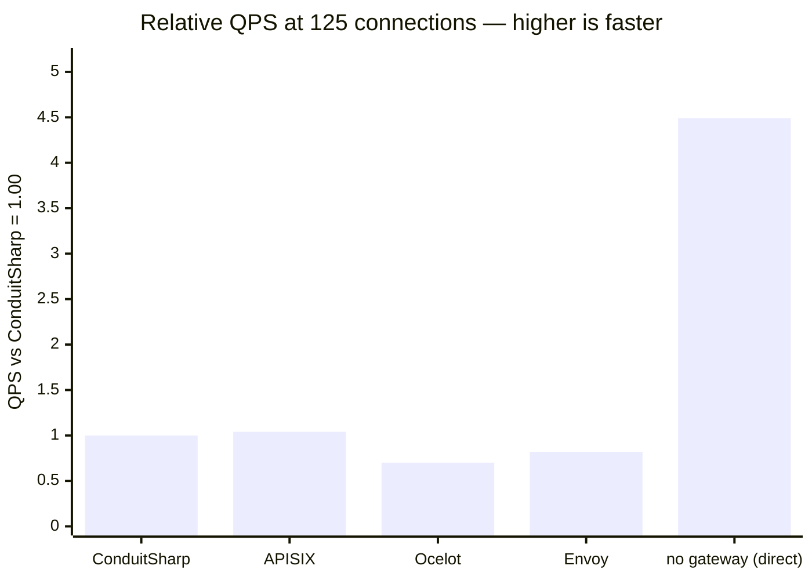
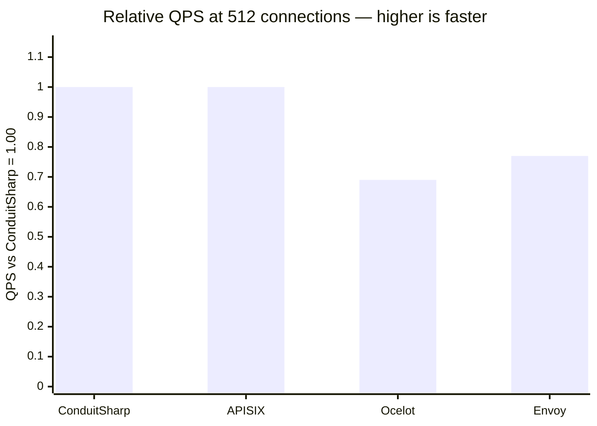
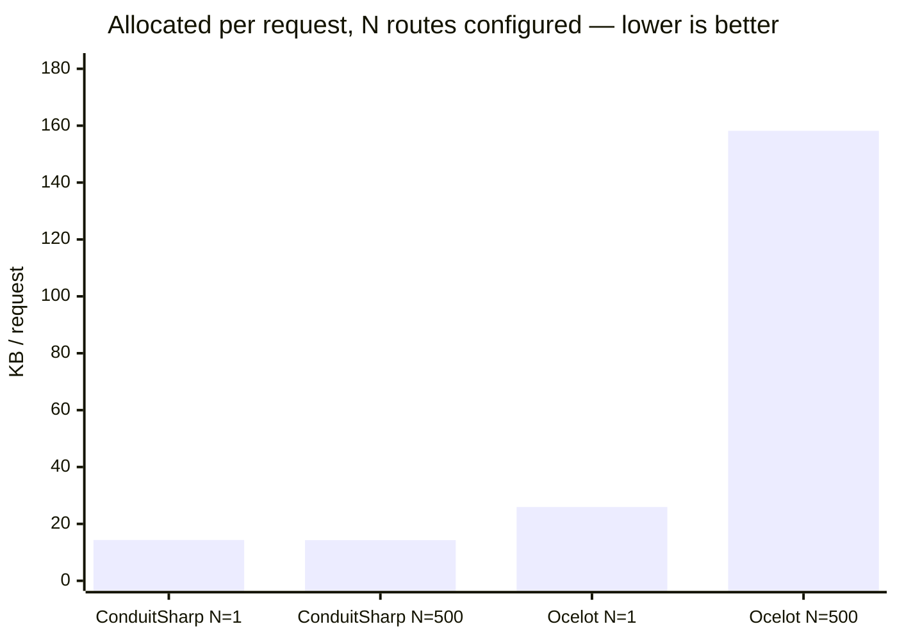
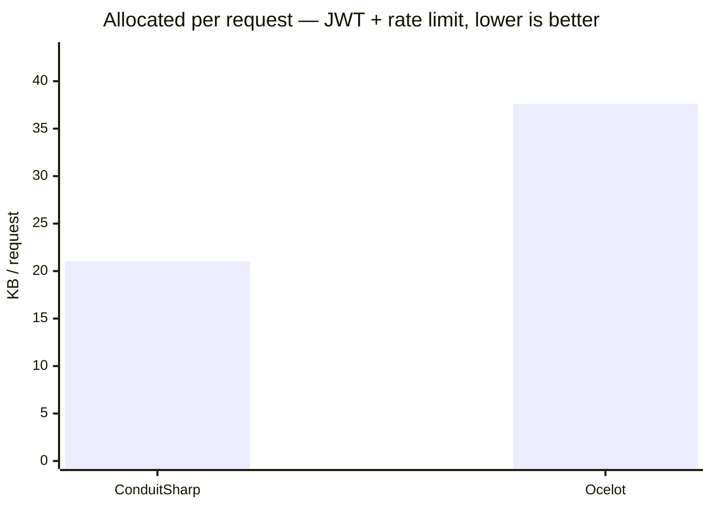
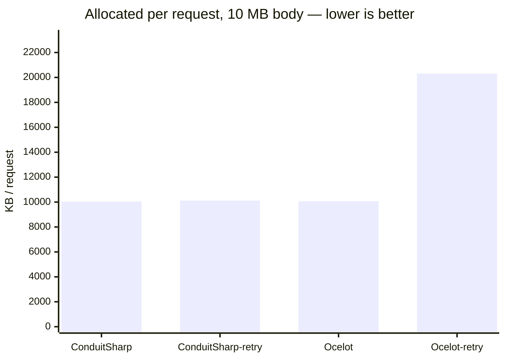
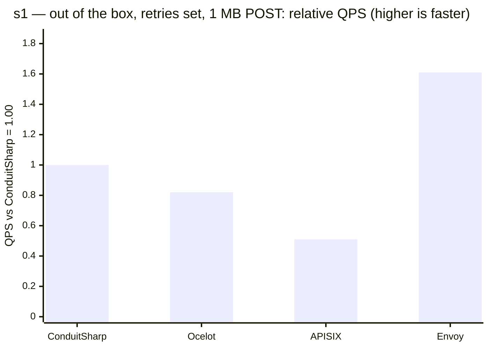
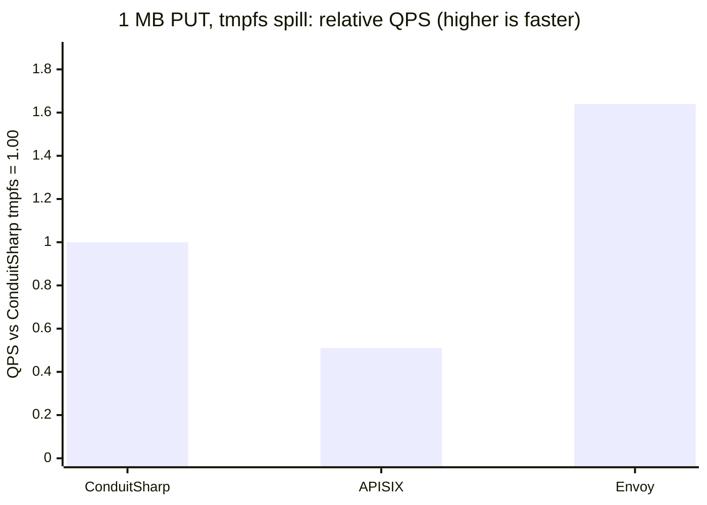
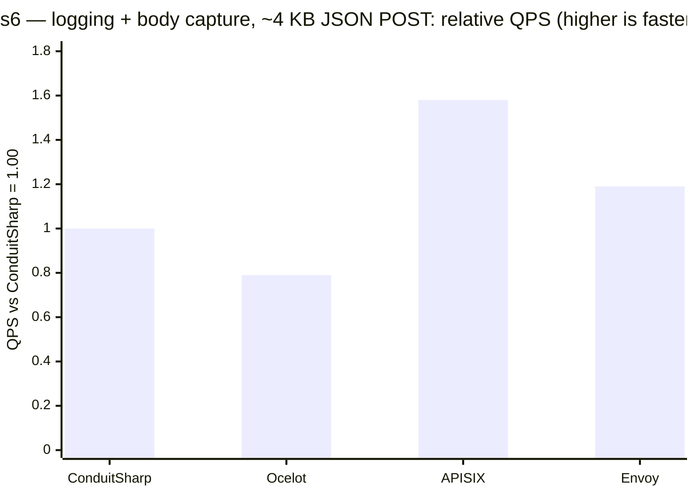
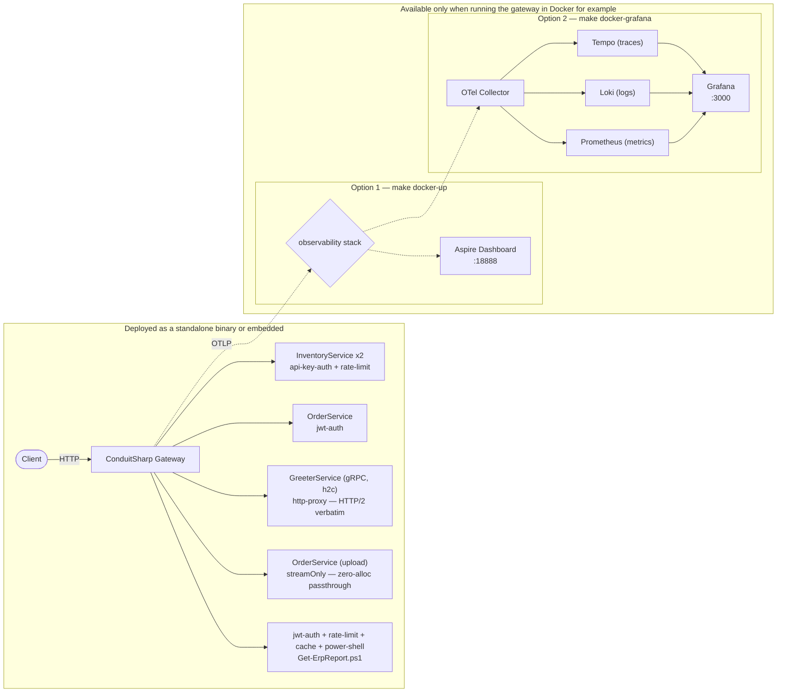

<p align="center">
  
  <h1 align="center">ConduitSharp</h1>
  <p align="center">The .NET API Gateway. JSON-driven internal integration on YARP, with native retries, circuit breakers, and a memory-bounded per-route plugin pipeline.</p>
  <p align="center">
    <a href="https://github.com/liqngliz/ConduitSharp/actions/workflows/ci.yml"></a>
    <a href="https://www.nuget.org/packages/ConduitSharp.Gateway.AspNetCore"></a>
    
    
    
  </p>
</p>

---

ConduitSharp is an **internal integration gateway** built on Microsoft's YARP (Yet Another Reverse Proxy). It sits behind the network perimeter, under an edge gateway such as Azure APIM, Cloudflare, or Kong, and handles internal traffic orchestration, legacy workload integration, and microservice routing.

It adds native retries, circuit breakers, a memory-bounded plugin pipeline, and config hot-reloading. Deploy it codeless from JSON, or embed it as a library with DI.

## 🎯 Why ConduitSharp

**Powered by YARP:** YARP does the forwarding, so its load balancing, connection pooling, and performance come with it. ConduitSharp adds the gateway layer on top.

**Native Retries & Circuit Breakers:** YARP omits both, because doing them safely requires body buffering. ConduitSharp configures them from JSON, with safety rails:
  - **Streaming by default:** a body is buffered only when something consumes the buffer: a retry policy (idempotent methods only; a POST on a retry route still streams) or a body-reading plugin. Everything else is forward-only streaming.
  - **Off-heap buffering:** when a body *is* buffered, up to 1 MiB lives in pooled memory; the rest spills to a temp file (nginx-style), so large uploads never touch the Large Object Heap.
  - **Memory Budgets:** buffering is capped per request (413) and gateway-wide (503 load-shed).
  - **Fail-Fast Validation:** mixing `"streamOnly": true` with a payload-reading plugin is caught at startup, not mid-flight.

**First-Class OpenTelemetry:** metrics and distributed tracing live in the proxy pipeline itself, configured via environment variables.

---

## ⚡ What you get, embedded or standalone

**Zero/Low-Code Configuration:** Define routes, upstream clusters, load balancing rules, and plugin chains entirely via the `routes.json` file.


**Hot-Reloading without Dropping Requests:** Update routing configurations via the `POST /admin/routes/reload` API. The gateway atomically swaps the routing table in-memory using YARP's `InMemoryConfigProvider`. In-flight requests gracefully finish on their original rules.


**Batteries Included (Shipped Plugins):**
  - JWT & API Key Authentication
  - Distributed Rate Limiting
  - Response Caching
  - Header Transformation

---

## 🚀 Quick Start

Run the bundled LegacyGateway example: six routes, three upstream services (REST, gRPC, and a streamOnly upload), a PowerShell plugin, JWT + API-key auth, rate limiting, caching, and OpenTelemetry traces, all wired from `routes.json` with no code changes.

```bash
cd examples/LegacyGateway
make docker-up            # macOS / Linux — Docker Compose + Aspire Dashboard
pwsh start.ps1 -DockerUp  # Windows — same stack
```

```bash
# Health check — no auth
curl http://localhost:5050/health

# Inventory — API key
curl http://localhost:5050/api/inventory \
     -H "X-Api-Key: demo-api-key-conduitsharp-example"

# ERP report — JWT (token printed by make docker-up)
curl http://localhost:5050/erp/reports/summary \
     -H "Authorization: Bearer $TOKEN"
```

Open the **Aspire Dashboard** at http://localhost:18888 to see every request's trace. Prefer Grafana/Tempo/Prometheus/Loki? Run `make docker-grafana` and open http://localhost:3000. No Docker? `make run` (macOS/Linux) or `pwsh start.ps1` (Windows) runs the same example as local processes with file-based traces.

---


## 📦 Installation

Pick by how you deploy. The embedded-library and Docker paths fit immutable-infrastructure workflows; the bare-metal / Windows Service / IIS options (the legacy-estate differentiator) live in the [in-depth docs](#-documentation).

### Embedded library (NuGet, recommended)

Host the gateway *inside your own ASP.NET Core app*, the YARP `AddReverseProxy()` / `MapReverseProxy()` model. Plugins arrive as NuGet packages registered in DI, so the deployment is one immutable, versioned build.

```bash
dotnet add package ConduitSharp.Gateway.AspNetCore
```

```csharp
using ConduitSharp.Gateway;

var builder = WebApplication.CreateBuilder(args);
builder.AddConduitSharpGateway(options =>
{
    options.PathPrefix = "/api";   // gateway owns /api/*; the rest of the app is yours
});

var app = builder.Build();
app.MapGet("/hello", () => "served by the host app");   // coexists with the gateway
app.UseConduitSharpGateway();
app.Run();
```

### Docker

```bash
docker run -p 5050:5050 \
  -v ./routes.json:/app/Configuration/routes.json \
  ghcr.io/liqngliz/conduitsharp:latest
```

To ship plugins the immutable way, build your own image `FROM` this one and `COPY` the published plugin DLLs into `/app/plugins/`.

### dotnet tool

```bash
dotnet tool install -g ConduitSharp.Gateway
conduitsharp
```

Works on Windows, macOS, and Linux. Requires .NET 10 SDK.

---

## 🧭 Configuring routes

All routing lives in `Configuration/routes.json`: no database, no admin UI, one file you commit, review, and diff.

```json
{
  "routes": [
    {
      "id": "user-service-route",
      "route": {
        "match": { "path": "/api/users/{**catch-all}", "methods": ["GET", "POST"] }
      },
      "cluster": {
        "loadBalancingPolicy": "RoundRobin",
        "destinations": {
          "node-0": { "address": "http://user-service-1:8080" },
          "node-1": { "address": "http://user-service-2:8080" }
        }
      },
      "retry":          { "maxAttempts": 2, "delayMs": 100 },
      "circuitBreaker": { "threshold": 5, "cooldownMs": 10000 },
      "plugins": [
        { "name": "jwt-auth",   "order": 1, "config": { "issuer": "https://auth.example.com" } },
        { "name": "rate-limit", "order": 2, "config": { "requestsPerWindow": 100 } },
        { "name": "http-proxy", "order": 99 }
      ]
    }
  ]
}
```

`route` and `cluster` are YARP's own `RouteConfig` and `ClusterConfig`, used verbatim, so every YARP feature is available the day YARP ships it. Everything else (`retry`, `circuitBreaker`, `plugins`, `swagger`, `maxRequestBodyBytes`) is ConduitSharp's, because YARP has no concept of any of it.

**[docs/ROUTING.md](docs/ROUTING.md) is the full field reference:** every field, load balancing policies, retry and circuit-breaker options, path and query syntax, and the built-in plugin list.

### JWKS-based authorization (Auth0 · Microsoft Entra ID / Azure AD · Google · Keycloak · Okta)

The `jwks-jwt-auth` plugin validates RS/ES Bearer JWTs against **any** OIDC provider's JWKS endpoint and enforces authorization with `requiredClaims`, config only. Point `jwksUri` / `issuer` / `audience` at your provider and match on whatever claim it emits (`roles`, `groups`, `scp`, `realm_access.roles`, …); it works with **Auth0, Microsoft Entra ID (Azure AD), Google, Keycloak, Okta**, and any OIDC-compliant issuer.

**Example: Microsoft Entra ID (Azure AD).** The three connection fields are the same whether you gate on **app roles** or **security groups**; only the claim differs.

```json
{
  "name": "jwks-jwt-auth",
  "order": 1,
  "config": {
    "jwksUri":  "https://login.microsoftonline.com/{tenantId}/discovery/v2.0/keys",
    "issuer":   "https://login.microsoftonline.com/{tenantId}/v2.0",
    "audience": "{api-app-client-id}",
    "requiredClaims": [
      { "claim": "roles", "anyOf": ["Admin", "Read"] }
    ]
  }
}
```

- **App roles** (above, recommended). Gate on the `roles` claim. Define `appRoles` in the API app registration, then assign users/groups in the Enterprise App; Entra emits `roles` **by default** as readable value strings (e.g. `"Admin"`). No size limit.
- **Security groups.** Swap the rule for `{ "claim": "groups", "anyOf": ["<group-object-id-guid>"] }`. Requires `"groupMembershipClaims": "SecurityGroup"` in the app manifest; values are group **object-id GUIDs** (on-prem AD groups synced via Entra Connect appear as their Entra object IDs). Caveat: a user in **>200 groups** gets no `groups` claim at all (Entra emits a Graph pointer the plugin can't resolve), so prefer app roles at that scale.

`anyOf` = member of any listed value (403 otherwise); use `allOf` to require every one. The endpoints above are v2; a v1-token app uses `https://sts.windows.net/{tenantId}/` as the issuer.

**Other providers** use the same shape; only the `jwksUri`/`issuer` and the claim name change. The `claim` field is looked up as a literal name first, then as a dot-path into nested objects, so provider-specific claims work directly: Keycloak `realm_access.roles`, Auth0 namespaced `https://your-app.example.com/roles`, or a space-delimited OAuth `scp`/`scope` (add `"delimiter": " "`). JWKS endpoints: Auth0 `https://TENANT.auth0.com/.well-known/jwks.json`, Google `https://www.googleapis.com/oauth2/v3/certs`, Keycloak `https://HOST/realms/REALM/protocol/openid-connect/certs`.

---

## 🔌 Plugins
Plugins implement one interface (`IPipelinePlugin`) and can be written in **C#, F#, VB.NET, or PowerShell.**

### Built-in plugins

| Name | What it does |
| --- | --- |
| `jwt-auth` | Validates HS256 Bearer JWTs; enforces exp, nbf, iss, aud, and optional claim-based RBAC (`requiredClaims`) |
| `jwks-jwt-auth` | Validates RS/ES Bearer JWTs via a remote JWKS endpoint (Auth0, Azure AD, Google, Keycloak) |
| `api-key-auth` | Validates API keys from a request header (plain-text comparison) |
| `api-key-auth-hashed` | Validates API keys by comparing SHA-256 hash; keys never stored raw |
| `rate-limit` | Fixed-window quota per route or per client header value |
| `cache` | Response caching with configurable TTL and vary-by-header rules |
| `header-transform` | Add, remove, or rewrite request headers before forwarding upstream |
| `http-proxy` | Chain-position marker for where YARP forwards upstream. Omit it and the forward is appended at the end of the chain |


## Shipped plugins

Drop-ins under [plugins/](plugins/), each with its own `src/` and `tests/`. Copy the source as a template, or reference the NuGet package directly:

| Plugin | Kind | NuGet package | What it shows |
| --- | --- | --- | --- |
| [ConduitSharp.Plugin.PowerShell](plugins/ConduitSharp.Plugin.PowerShell) | `IPipelinePlugin` (`custom` / `power-shell`) | `ConduitSharp.Plugin.PowerShell` | Runs an existing `.ps1` in-process via the embedded `Microsoft.PowerShell.SDK`, no system `pwsh` install |
| [ConduitSharp.Plugin.BodyCapture](plugins/ConduitSharp.Plugin.BodyCapture) | `IPipelinePlugin` (`custom` / `body-capture`) | `ConduitSharp.Plugin.BodyCapture` | Logs a bounded prefix of the request body, never forcing the gateway to buffer (`ReadsRequestBody => false`): it reuses the gateway's existing seekable buffer when a retry route already made one, and otherwise tees the prefix off the streaming path via ASP.NET Core `HttpLogging` |
| [ConduitSharp.Cache.RedisProtocol](plugins/ConduitSharp.Cache.RedisProtocol) | `ICacheService` seam | `ConduitSharp.Cache.RedisProtocol` | Swaps the in-memory `cache` store for Redis/Valkey: shared response cache across instances |
| [ConduitSharp.RateLimit.RedisProtocol](plugins/ConduitSharp.RateLimit.RedisProtocol) | `IRateLimitStore` seam | `ConduitSharp.RateLimit.RedisProtocol` | Swaps the in-memory `rate-limit` store for Redis/Valkey: shared quota across instances |
| [ConduitSharp.RateLimit.SlidingWindow](plugins/ConduitSharp.RateLimit.SlidingWindow) | `IRateLimiter` seam | `ConduitSharp.RateLimit.SlidingWindow` | Swaps the fixed-window *algorithm* for a sliding log; refuses the 2x burst a fixed window allows across its boundary. The algorithm and the store are separate seams |

## 🔀 TokenFlow

A gateway built on ConduitSharp that sits in front of your AI agents and records what every request
costs in tokens, with a live dashboard. One command, no clone:

```bash
npx tokenflow                                                # Node, no .NET
dotnet tool install -g ConduitSharp.TokenFlow && tokenflow   # .NET 10 SDK
dnx ConduitSharp.TokenFlow                                    # .NET 10 SDK, no install

docker run -d --restart unless-stopped --name tokenflow \
  -p 5050:5050 -v "$PWD/logs:/data" \
  ghcr.io/liqngliz/tokenflow
```

Ships with Claude Code, Codex, and local OpenAI-compatible routes pre-configured. Dashboard on
`http://localhost:5050`, one JSON row per request in `~/.conduit-spend` (`./logs` in the image). See
[examples/ConduitSharp.Spend](examples/ConduitSharp.Spend) for the setup lines each tool needs.

## Writing a custom plugin

| Language | How |
|---|---|
| **C#** | Reference `ConduitSharp.Core`, implement `IPipelinePlugin`, drop the DLL in `plugins/` |
| **F# / VB.NET** | Same as C#; they compile to identical .NET IL |
| **PowerShell** | A C# shim hosts `Microsoft.PowerShell.SDK` and runs your `.ps1`; no rewrite of existing scripts |

`IPipelinePlugin.ExecuteAsync` **is** the ASP.NET Core middleware signature: `HttpContext`, the plugin's JSON config, and `next`. To short-circuit, write the response and don't call `next()`:

```csharp
public sealed class PowerShellPlugin : IPipelinePlugin
{
    public PluginName Name    => PluginName.Custom;
    public string?    Variant => "power-shell";
    public string     Id      => "power-shell";

    public async Task ExecuteAsync(HttpContext context, JsonElement config, RequestDelegate next)
    {
        var options = JsonSerializer.Deserialize<PsConfig>(config)
            ?? throw new InvalidOperationException("PowerShell plugin config is null.");

        using var ps = PowerShell.Create();
        ps.AddScript("$ErrorActionPreference = 'Stop'"); // treat all errors as terminating
        ps.AddScript(await File.ReadAllTextAsync(options.ScriptPath));
        ps.AddParameter("Request", context.Request);

        try
        {
            var results = await ps.InvokeAsync();
            await context.Response.WriteAsync(string.Join("\n", results.Select(r => r.ToString())));
        }
        catch (RuntimeException ex) { context.Response.StatusCode = 500; await context.Response.WriteAsync(ex.Message); }
        catch (ParseException)      { context.Response.StatusCode = 500; await context.Response.WriteAsync("PowerShell script configuration error."); }
        // no next() — the script produced the response
    }
}
```

```json
{ "name": "custom", "variant": "power-shell", "order": 99, "config": { "scriptPath": "scripts/MyReport.ps1" } }
```

A ready-to-use build of this pattern lives at [plugins/ConduitSharp.Plugin.PowerShell](plugins/ConduitSharp.Plugin.PowerShell). Runspace pooling, out-of-process execution, and production guidance are in the [in-depth docs](#-documentation).

---


## ⚖️ Compared to alternatives

ConduitSharp can replace an existing gateway or sit behind one. It competes with Ocelot directly and uses YARP as its forwarding engine. Kong, APISIX, and Azure APIM handle external edge traffic; ConduitSharp handles legacy workload execution and internal observability at the layer below.

|  | ConduitSharp | Ocelot | YARP | Envoy | APISIX |
| --- | --- | --- | --- | --- | --- |
| **Language** | C# / .NET | C# / .NET | C# / .NET | C++ | Lua / Nginx |
| **Plugin language** | **C# / F# / VB.NET / PowerShell**<br/> + ASP.NET middleware | None | ASP.NET middleware | C++ / Lua / WASM | Lua |
| **PowerShell script execution** | ✅ Plugin | ❌ | ❌ | ❌ | ❌ |
| **Per-route plugin pipeline** | ✅ | ⚠️ per-route hook <br/> (DelegatingHandler, code-registered) | ❌ | ✅ | ✅ |
| **Drop-in external plugins** | ✅ | ❌ | ❌ | ✅ WASM | ✅ Lua |
| **Plugin contract as NuGet** | ✅ | ❌ | ❌ | — | — |
| **Unit-testable without HTTP** | ✅ | ❌ | ❌ | — | — |
| **OpenTelemetry (traces + metrics)** | ✅ Built-in | ❌ | ✅ | ✅ Native | ✅ Plugin |
| **Forwarding engine** | **YARP native** | Custom | YARP native | Envoy native | Nginx |
| **Windows Service / IIS native** | ✅ | ✅ | ✅ | ❌ | ❌ |
| **Config format** | JSON file | JSON file | JSON / YAML | YAML / xDS | YAML / etcd |

---


## 📊 Benchmarks

<!-- BENCH:START -->
### Throughput: relative, same rig, sequential runs

#### 125 connections


```mermaid
xychart-beta
    title "Relative QPS at 125 connections — higher is faster"
    x-axis ["ConduitSharp", "APISIX", "Ocelot", "Envoy", "no gateway (direct)"]
    y-axis "QPS vs ConduitSharp = 1.00" 0 --> 5.16
    bar [1.00, 1.04, 0.70, 0.82, 4.49]
```

| gateway | QPS (relative) | p50 | p99 |
|---|---:|---:|---:|
| ConduitSharp | 1.00× | 5.29 ms | 20.28 ms |
| APISIX | 1.04× | 5.47 ms | 14.93 ms |
| Ocelot | 0.70× | 7.82 ms | 24.27 ms |
| Envoy | 0.82× | 6.94 ms | 15.09 ms |
| *(no gateway, direct to nginx)* | 4.49× | 1.17 ms | 4.98 ms |

#### 512 connections


```mermaid
xychart-beta
    title "Relative QPS at 512 connections — higher is faster"
    x-axis ["ConduitSharp", "APISIX", "Ocelot", "Envoy"]
    y-axis "QPS vs ConduitSharp = 1.00" 0 --> 1.15
    bar [1.00, 1.00, 0.69, 0.77]
```

| gateway | QPS (relative) | p50 | p99 |
|---|---:|---:|---:|
| ConduitSharp | 1.00× | 21.35 ms | 74.43 ms |
| APISIX | 1.00× | 22.75 ms | 58.66 ms |
| Ocelot | 0.69× | 33.04 ms | 91.43 ms |
| Envoy | 0.77× | 30.12 ms | 53.76 ms |

Pure proxy, 1 KB upstream response, bombardier, gateways benched sequentially on the
identical rig. **Measured on shared GitHub Actions runners (4 vCPU); only ratios are
meaningful there; absolute QPS on shared CI is noise.** Raw figures for this exact run:
[CI run](https://github.com/liqngliz/ConduitSharp/actions/runs/30165314699). Method & how to reproduce on pinned hardware:
[benchmarks/load](benchmarks/load/README.md).
<!-- BENCH:END -->

<!-- BENCH-MICRO:START -->
### Head-to-head microbenchmarks: ConduitSharp vs Ocelot (.NET gateways only)

#### Route-table scaling: request hits the last of N routes


```mermaid
xychart-beta
    title "Allocated per request, N routes configured — lower is better"
    x-axis ["ConduitSharp N=1", "ConduitSharp N=500", "Ocelot N=1", "Ocelot N=500"]
    y-axis "KB / request" 0 --> 181.94
    bar [14.34, 14.28, 25.92, 158.21]
```

| Method     | Gateway      | RouteCount | Mean     | Error      | StdDev   | Gen0    | Allocated |
|----------- |------------- |----------- |---------:|-----------:|---------:|--------:|----------:|
| **ProxiedGet** | **ConduitSharp** | **1**          | **234.0 μs** |   **152.7 μs** |  **8.37 μs** |  **1.4648** |  **14.34 KB** |
| **ProxiedGet** | **ConduitSharp** | **500**        | **218.0 μs** |   **491.3 μs** | **26.93 μs** |  **1.4648** |  **14.28 KB** |
| **ProxiedGet** | **Ocelot**       | **1**          | **366.8 μs** |   **707.0 μs** | **38.75 μs** |  **1.9531** |  **25.92 KB** |
| **ProxiedGet** | **Ocelot**       | **500**        | **463.4 μs** |   **248.9 μs** | **13.64 μs** | **15.6250** | **158.21 KB** |

ConduitSharp rides ASP.NET endpoint routing's DFA: flat time and allocations at any
route count. Ocelot's route finder scans templates per request, so cost grows with N.

#### Policy chain: JWT auth (HS256) + rate limit on both sides


```mermaid
xychart-beta
    title "Allocated per request — JWT + rate limit, lower is better"
    x-axis ["ConduitSharp", "Ocelot"]
    y-axis "KB / request" 0 --> 43.26
    bar [21.01, 37.62]
```

| Method    | Gateway      | Mean     | Error    | StdDev   | Gen0   | Allocated |
|---------- |------------- |---------:|---------:|---------:|-------:|----------:|
| **AuthedGet** | **ConduitSharp** | **286.2 μs** | **457.1 μs** | **25.05 μs** | **1.9531** |  **21.01 KB** |
| **AuthedGet** | **Ocelot**       | **498.7 μs** | **658.0 μs** | **36.07 μs** | **2.9297** |  **37.62 KB** |

#### Upload bodies: POST (streamed) and PUT on a retry route (buffered)


```mermaid
xychart-beta
    title "Allocated per request, 10 MB body — lower is better"
    x-axis ["ConduitSharp", "ConduitSharp-retry", "Ocelot", "Ocelot-retry"]
    y-axis "KB / request" 0 --> 23357.89
    bar [10043.79, 10118.84, 10062.00, 20311.21]
```

| Method   | Gateway            | BodyKB | Mean        | Error       | StdDev      | Gen0     | Gen1     | Gen2     | Allocated   |
|--------- |------------------- |------- |------------:|------------:|------------:|---------:|---------:|---------:|------------:|
| **PostBody** | **ConduitSharp**       | **1**      |    **356.6 μs** |    **228.2 μs** |    **12.51 μs** |   **0.9766** |        **-** |        **-** |    **16.08 KB** |
| **PostBody** | **ConduitSharp**       | **10240**  | **15,659.0 μs** |  **4,789.6 μs** |   **262.54 μs** | **343.7500** | **281.2500** |        **-** | **10043.79 KB** |
| **PostBody** | **ConduitSharp-retry** | **1**      |    **268.6 μs** |    **450.9 μs** |    **24.72 μs** |   **1.4648** |        **-** |        **-** |    **17.86 KB** |
| **PostBody** | **ConduitSharp-retry** | **10240**  | **23,840.6 μs** | **25,545.6 μs** | **1,400.24 μs** | **312.5000** | **281.2500** |        **-** | **10118.84 KB** |
| **PostBody** | **Ocelot**             | **1**      |    **427.5 μs** |    **223.3 μs** |    **12.24 μs** |   **2.9297** |        **-** |        **-** |    **29.26 KB** |
| **PostBody** | **Ocelot**             | **10240**  | **15,299.4 μs** |  **4,404.7 μs** |   **241.44 μs** | **312.5000** | **250.0000** |        **-** |    **10062 KB** |
| **PostBody** | **Ocelot-retry**       | **1**      |    **477.8 μs** |  **1,229.1 μs** |    **67.37 μs** |   **3.9063** |        **-** |        **-** |    **41.42 KB** |
| **PostBody** | **Ocelot-retry**       | **10240**  | **18,529.8 μs** | **14,757.8 μs** |   **808.92 μs** | **625.0000** | **531.2500** | **312.5000** | **20311.21 KB** |

Both gateways stream a POST upload; retries never apply to a POST, whose body could not
be safely replayed, so neither side allocates a buffer. Identical work: the delta is
per-request overhead, and ConduitSharp allocates about half.

The `-retry` arms are the buffered path, same-on-same: a PUT each side must be able to
replay. Ocelot ships no retry, so it runs the load rig's, built on its official Polly
package's `AddPolly` seam
([BufferingPollyHandler](benchmarks/load/ocelot/BufferingPollyHandler.cs)), with the whole body
held on the heap via `LoadIntoBufferAsync`, per in-flight request, no ceiling. ConduitSharp
buffers up to 1 MiB in pooled memory and spills the rest to tmpfs on this rig: bounded
RAM either way, and the tiers degrade to disk and then 503 instead of OOM under
concurrency (measured in [benchmarks/load](benchmarks/load/README.md)).

Both gateways in-proc (TestServer), forwarding over a real loopback socket to the same
1 KB upstream, identical downstream cost; the delta is gateway overhead.
**Allocated per request is deterministic, compare that column;** time columns are
trend-only on shared CI runners. APISIX is nginx/Lua and cannot be micro-benched
in-process; its comparison is the throughput ratio table above. Full tables:
[docs/benchmarks/micro.md](docs/benchmarks/micro.md) · [source run](https://github.com/liqngliz/ConduitSharp/actions/runs/30165314699)
<!-- BENCH-MICRO:END -->

<!-- BENCH-MATRIX-SUMMARY:START -->
### Body handling under load: the s1..s6 matrix (relative QPS, same rig)

#### Streaming path: a 1 MB body nobody needs to replay


```mermaid
xychart-beta
    title "s1 — out of the box, retries set, 1 MB POST: relative QPS (higher is faster)"
    x-axis ["ConduitSharp", "Ocelot", "APISIX", "Envoy"]
    y-axis "QPS vs ConduitSharp = 1.00" 0 --> 1.86
    bar [1.00, 0.82, 0.51, 1.61]
```

| scenario (c=96) | ConduitSharp | Ocelot | APISIX | Envoy |
|---|---:|---:|---:|---:|
| s1: retries configured, 1 MB POST (ConduitSharp streams it: method-aware) | 1.00× | 0.82× | 0.51× (1.9x to disk) | 1.61× |
| s2: pure streaming, 1 MB POST (APISIX de-tuned to qualify, forfeiting retry) | 1.00× | 1.00× | 0.54× | 1.43× |

#### Buffered path: forced to disk (s4), and tmpfs as the answer (s5)


```mermaid
xychart-beta
    title "1 MB PUT, tmpfs spill: relative QPS (higher is faster)"
    x-axis ["ConduitSharp", "APISIX", "Envoy"]
    y-axis "QPS vs ConduitSharp tmpfs = 1.00" 0 --> 1.89
    bar [1.00, 0.51, 1.64]
```

| scenario (c=96) | ConduitSharp | Ocelot | APISIX | Envoy |
|---|---:|---:|---:|---:|
| s4: buffering forced onto disk, 1 MB PUT | 1.00× (1.0x to disk) | — | 0.77× (1.9x to disk) | 2.43× |
| s5: buffered, spill target is tmpfs, 1 MB PUT | 1.00× | — | 0.51× (2.0x to disk) | 1.64× |

#### Body Capture Logging: a ~4 KB JSON POST logged to Loki


```mermaid
xychart-beta
    title "s6 — logging + body capture, ~4 KB JSON POST: relative QPS (higher is faster)"
    x-axis ["ConduitSharp", "Ocelot", "APISIX", "Envoy"]
    y-axis "QPS vs ConduitSharp = 1.00" 0 --> 1.81
    bar [1.00, 0.79, 1.58, 1.19]
```

| scenario (c=96) | ConduitSharp | Ocelot | APISIX | Envoy |
|---|---:|---:|---:|---:|
| s6: logging + body capture, ~4 KB JSON POST (c=50) | 1.00× | 0.79× | 1.58× | 1.19× |

Structured comparison: each scenario fixes the shape of the work, then compares gateways doing that shape, with bytes-written-to-storage measured rather than assumed. s4 is the honest row: forced entirely onto disk, nginx wins; the design's answer is s5 and the RAM tier that makes disk rare. s6 is the other honest row: capturing and shipping every body is real work, so APISIX and Envoy lead it while ConduitSharp buries Ocelot. Full tables, method, and the parts that hurt: [benchmarks/load](benchmarks/load/README.md#structured-comparison--measured-not-hand-typed) · [CI run](https://github.com/liqngliz/ConduitSharp/actions/runs/30165314699).
<!-- BENCH-MATRIX-SUMMARY:END -->

Full microbenchmark tables (routing, plugin dispatch, buffered-vs-stream allocations, JWT
hot path) are published to [docs/benchmarks/micro.md](docs/benchmarks/micro.md); source in
[benchmarks/ConduitSharp.Benchmarks](benchmarks/ConduitSharp.Benchmarks), load rig and
method in [benchmarks/load](benchmarks/load/README.md).

---

## 🏗️ Architectural Choices & Trade-offs

### 1. Dynamic DLL Loading (The "Appliance" Model)

**The Choice:** Allowing `.dll` files to be dropped into a `plugins/` directory for runtime loading.
**Why:** An *option* for the Strangler Fig pattern and legacy non-Kubernetes environments where immutable containers are not available. On Kubernetes, set `options.EnablePluginDirectoryScan = false` and register plugins through ASP.NET Core DI instead.

### 2. Buffering Request Bodies

**The Choice:** Buffer a request body *only when something consumes the buffer*: a retry policy or a body-inspecting plugin. Everything else streams.
**Why:** **Upstream Retries** need a rewindable body, and plugins like HMAC verification or audit logging must inspect the payload. Those are the only consumers, so they are the only cases that pay:
- **Method-aware:** retries apply to idempotent methods only (`GET`, `PUT`, …), so a `POST` upload through a retry route still streams; its body could never be replayed anyway.
- **Tiered, not a cliff:** a buffered body is held in RAM while the memory tier (`MaxRamBufferedBodyBytes`, default 64 MiB) has headroom, measured 3.3x faster than spilling for a 1 MB body. Once it is full, further bodies spill to a temp file, nginx-style (`proxy_request_buffering`), and are still served. Only when the disk budget (`MaxDiskBufferedBodyBytes`) is gone too does the gateway shed with a 503. Availability degrades in steps rather than falling over.
- **Off-heap:** per-body RAM is capped at `RamBufferThresholdBytes` (default 1 MiB, clamped there because `FileBufferingReadStream` stops pooling above it). Large uploads never churn the .NET Large Object Heap.
- **Safety:** buffering is enforced by a per-request limit (413) and the gateway-wide `RequestBodyBudget` (503 load-shed) to prevent memory exhaustion.
- **Escape hatch:** `"streamOnly": true` still forces pure streaming and is validated at startup against retry policies and body-reading plugins.

### 3. Stateful Hot-Reloading API

**The Choice:** A `POST /admin/routes/reload` API that writes `routes.json` to local disk.
**Why:** Zero-downtime updates for standalone VM/AppService deployments. It is **inert by default**: omit `AdminKeyHash` and the API is disabled, so a Kubernetes cluster manages `routes.json` through a ConfigMap rollout with no split-brain risk.

### 4. Custom JSON Plugin Pipeline vs. Standard Middleware

**The Choice:** A custom `IPipelinePlugin` interface driven by JSON arrays instead of `app.Use()` middleware.
**Why:** YARP runs one pipeline for every proxied route. ConduitSharp compiles an isolated `IApplicationBuilder` pipeline *per route* from the JSON, so route A runs rate limiting and JWT auth while route B streams with zero middleware overhead, both on native Kestrel middleware primitives.

---

## 🚀 Two paths for hosting and extension

Two deployment models, demonstrated side by side in the example projects.


```mermaid
flowchart LR
    subgraph deploy ["Deployed as a standalone binary or embedded"]
        client(["Client"]) -->|HTTP| gw["ConduitSharp Gateway"]
        gw --> inv["InventoryService x2\napi-key-auth + rate-limit"]
        gw --> ord["OrderService\njwt-auth"]
        gw --> grt["GreeterService (gRPC, h2c)\nhttp-proxy — HTTP/2 verbatim"]
        gw --> upl["OrderService (upload)\nstreamOnly — zero-alloc passthrough"]
        gw --> fin["jwt-auth + rate-limit + cache + power-shell\nGet-ErpReport.ps1"]
    end

    gw -.OTLP.-> choice{"observability stack"}

    subgraph docker ["Available only when running the gateway in Docker for example"]
        subgraph opt1 ["Option 1 — make docker-up"]
            choice -.-> aspire["Aspire Dashboard\n:18888"]
        end

        subgraph opt2 ["Option 2 — make docker-grafana"]
            choice -.-> collector["OTel Collector"]
            collector --> tempo["Tempo (traces)"]
            collector --> loki["Loki (logs)"]
            collector --> prom["Prometheus (metrics)"]
            tempo & loki & prom --> grafana["Grafana\n:3000"]
        end
    end
```

### Path 1: The Modern "Code-First" Gateway (Recommended)

ConduitSharp as a standard .NET library. Fits immutable infrastructure, infrastructure-as-code, and standard ASP.NET Core practice.

- **Standard Dependency Injection:** register custom plugins with `builder.Services.AddSingleton<...>`.
- **Custom Plugins:** written in C# alongside the gateway setup, no separate `.dll` deployments. Shipped plugins come from NuGet.
- **Standard ASP.NET:** ASP.NET Core middleware (`app.Use(...)`) and Minimal APIs alongside it.

### Path 2: The Legacy "Appliance" Gateway

ConduitSharp as a standalone appliance, like Kong or Envoy. For teams running a gateway without writing C# wrapper code.

- **Dynamic Plugin System:** drop compiled `.dll` files into `plugins/`; the gateway scans and loads them at runtime.
- **Zero Coding Required:** deploy the pre-built binary, configure it in JSON.

---


## 📚 Documentation

- [Gateway settings](docs/GATEWAY_SETTINGS.md): `appsettings.json`, env-var overrides, request-body budgets
- [Configuring routes, full reference](docs/ROUTING.md): load balancing, path & query syntax, per-route limits
- [Retries and circuit breaking](docs/ROUTING.md#retries-and-circuit-breaking)
- [Claim-based authorization (RBAC)](docs/AUTHORIZATION.md) · [Microsoft Entra ID setup](docs/AUTHORIZATION.md#microsoft-entra-id-azure-ad-v20-token-app-role-rbac)
- [TLS / HTTPS and mTLS](docs/TLS.md)
- [Observability](docs/OBSERVABILITY.md)
- [Deployment patterns](docs/ARCHITECTURE.md#deployment-patterns): edge · sidecar · per-Data-Product
- [Architecture](docs/ARCHITECTURE.md): request lifecycle, package graph, key decisions
- [Bare-metal / Windows Service / IIS install](docs/DEPLOYMENT_BAREMETAL.md)
- [Migration guide](CHANGELOG.md#migrating-routesjson)
- [Releasing](docs/RELEASE.md): the git commands that publish each artifact

---

## 🤝 Contributing

Issues and PRs welcome. See [CONTRIBUTING.md](CONTRIBUTING.md) and the [Code of Conduct](CODE_OF_CONDUCT.md). Report security issues via [SECURITY.md](SECURITY.md).

## 📄 License

Apache 2.0. See [LICENSE](LICENSE).

