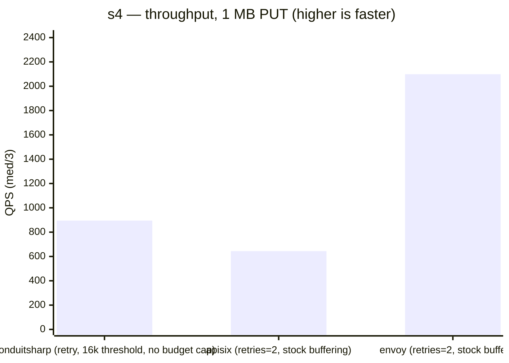
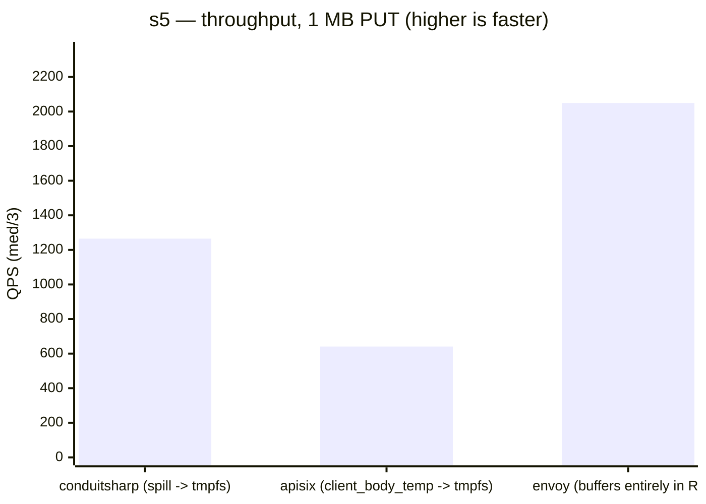

# ConduitSharp load benchmarks (Phase 2/3)

APISIX-style macro benchmarks: gateway in Docker, nginx serving a 1 KB response as
two round-robin upstream nodes, bombardier as load generator. Method and rationale:
[docs/planning/BENCHMARKS_PLAN.md](../../docs/planning/BENCHMARKS_PLAN.md).

## Run

```bash
./run.sh all          # direct + scenario-a + scenario-b + flood (30s each)
./run.sh matrix       # the structured s1..s5 comparison
./run.sh soak         # 30-min soak, run explicitly
DUR=60s RATE=5000 ./run.sh scenario-a
```

Results append to `results.md` (one table per invocation, environment stamped).

## Scenarios

| Run | What it measures |
|---|---|
| direct | bombardier → nginx, no gateway: the added-hop baseline |
| scenario-a | pure proxy, no plugins — routing/forward ceiling (mirrors APISIX scenario 1) |
| scenario-b | jwt-auth + rate-limit — cost of policy (mirrors APISIX scenario 2) |
| flood | Phase 3: 6 MB uploads vs 32 MB global buffer budget — 503 load-shed, bounded RSS |
| push-to-failure | Phase 3: ramps 6 MB uploads until the gateway stops coping — 503 load-shed vs OOM-kill. ConduitSharp + Ocelot, both **streaming** |
| ptf-buffered | Phase 3: same ramp against the **buffering** pair — ConduitSharp's retry route + APISIX (which always buffers) |
| soak | Phase 3: long fixed-rate run — stable RSS ≈ no leak |
| ocelot / apisix | competitor pure-proxy on the identical rig (Ocelot minimal host, APISIX standalone-yaml) |
| compare | the money chart: direct + scenario-a + ocelot + apisix, sequential, same box |
| compare-hc | high-concurrency pass (`CONNS=512 APPEND=1 ./run.sh compare-hc`) — tail-latency spread |
| **matrix (s1–s5)** | the structured comparison: shape fixed per scenario, buffering measured not assumed — see below |

## The structured comparison (s1–s5)

```bash
CONNS=96 DUR=15s GW_MEM=512m ./run.sh matrix         # all five, at the validated operating point
./run.sh s1                                          # one scenario
CONNS=96 GW_MEM=1g TMPFS_SIZE=512m ./run.sh s5       # s5 needs room for the tmpfs AND the heap
```

CI runs this matrix on demand (`benchmarks.yml`, `matrix` job) at `DUR=60s`: shared-runner noise
arrives in bursts longer than a short sample, so a 15–30s run can sit entirely inside one and read
3x low, while 60s averages across them. Local runs keep 15s — the Mac rig's noise is between runs,
not within them, and the gate + median already handle that.

### What makes a run of this matrix valid

c=384 with 1 MB bodies asks the dedicated box's Docker VM (3.83 GB, 8 vCPU, virtual network
shared by four containers) — where this protocol was validated — for more than it has, and past
saturation the scheduler decides the winner: the same config measured 3340 QPS on one run and
106 QPS (p99 136 s) on the next. Those runs measure the rig, and the same knee exists on the
4-vCPU GitHub Actions runner CI benches on, only lower.
A valid run needs four things, and the harness now enforces the first three:

1. **A settled VM** — `rig_gate` refuses to bench while the Docker VM's 1-min load is ≥ `GATE_LOAD`
   (default 2.0). Container builds/teardowns spike load past 8; every wild number traced back to
   benching through that.
2. **A warmup pass, discarded** — .NET's cold first run measures ~3x under its warm self.
3. **Median of `REPS` runs** (default 3), spread printed next to it; a spread over ±30% is flagged
   `UNSTABLE` and must not be quoted.
4. **Concurrency below the rig's knee** — c=96 for 1 MB bodies here. At c=96 every arm repeats to
   within ±5%; at c=384 nothing does. c=384 remains valid **only for s3**, whose result is
   categorical (shed vs die — RSS bound, 5xx vs conn, container alive), not a throughput number.

Cross-scenario comparisons still carry more error than within-scenario ones (arms of one scenario
run adjacent; scenarios can be minutes apart). Compare rows inside a table, not across tables.
Absolute numbers remain Linux-host (`PIN=1`) material; this rig ranks and shapes, it does not price.

Each scenario **fixes the shape of the work first**, then compares gateways doing that shape. This
is the whole point: benched on the wrong side, ConduitSharp reads 184 QPS vs 854 (dedicated-box
run, c=8) — a 4.6x swing that is entirely the shape, not the gateway. Every scenario also reports **bytes written to storage
÷ bytes uploaded**, so a disk-backed buffer is measured rather than claimed.

**That column sees disk, not memory.** A gateway buffering the whole body in RAM writes nothing and
reads 0.00x — Ocelot's `LoadIntoBufferAsync` does exactly that. So the column is titled *spilled to
disk?*, and 0.00x means "never touched storage", never "never buffered". In-RAM buffering shows up
as throughput instead: giving Ocelot a working retry cost it 29% (6006 → 4236 QPS at c=32,
dedicated-box run) while its write ratio stayed at 0.00x.

| | Load | Config | Question |
|---|---|---|---|
| **s1** | 1 MB POST, retries configured | ConduitSharp stock (`retry.maxAttempts: 2`); Ocelot's retry built on its official `Ocelot.Provider.Polly` seam; Envoy buffers POST regardless (`envoy.filters.http.buffer`) | What does each gateway do with a POST it can never replay? |
| **s2** | 1 MB POST, no retries | streaming-only, optimized: APISIX needs non-default `proxy_request_buffering off`, which **forfeits retry entirely**; Envoy streams natively (no buffer filter) | Pure streaming ceiling — nobody may buffer |
| **s3** | 1 MB PUT ramp | ConduitSharp only, tight budget vs a `GW_MEM` pod | Does it shed (503) or die (OOM)? |
| **s4** | 1 MB PUT | ConduitSharp configured *like APISIX's defaults*; Envoy stock buffering (in RAM) | Buffered path on disk, like-for-like |
| **s5** | 1 MB PUT | ConduitSharp/APISIX spill to `tmpfs`, Envoy buffers entirely in RAM | Buffered path with the disk I/O removed |

**s1's retry is on the route, and ConduitSharp applies it only to idempotent methods** — `GET`,
`PUT`, `DELETE`, `HEAD`, `OPTIONS`, `TRACE`. A `POST` on that same route streams and is never
retried: a POST is not safe to replay, so buffering one to enable a replay that must not happen
would be pure cost. That is exactly what s1 asks, and `written÷uploaded` is the answer — 0.00x
means the gateway worked out it could not retry this request and declined to pay for the option.
s4/s5 use `PUT` on the same route shape precisely to exercise the path where the retry *is* live.

s4 deliberately hands ConduitSharp nginx's settings rather than its own: `MemoryBufferThresholdBytes=16384`
(nginx's `client_body_buffer_size`) and `MaxTotalBufferedBodyBytes=0` (unlimited, never sheds), so
both sides buffer every upload to disk and serve it. No budget advantage, no policy difference.

<!-- BENCH-MATRIX:START -->
### Structured comparison — measured, not hand-typed

#### Streaming path — a 1 MB body nobody needs to replay

| s1 — out of the box: retries set, 1 MB POST | QPS (med/3) | p99 ms | written÷uploaded | spilled to disk? |
|---|---:|---:|---:|---|
| conduitsharp (retry route, POST is method-aware) | 1314 | 177 | 0.00x | no |
| ocelot (retry via official Polly seam: buffers every body) | 1088 | 133 | 0.00x | no |
| apisix (retries=2, buffers POST regardless) | 645 | 299 | 1.94x | **yes** |
| envoy (retries=2, buffers POST regardless) | 2049 | 94 | 0.00x | no |

| s2 — streaming-only, optimized, 1 MB POST | QPS (med/3) | p99 ms | written÷uploaded | spilled to disk? |
|---|---:|---:|---:|---|
| conduitsharp (stream) | 1325 | 203 | 0.00x | no |
| ocelot (stream) | 1254 | 191 | 0.00x | no |
| apisix (proxy_request_buffering off — non-default, forfeits retry) | 713 | 355 | 0.13x | no |
| envoy (stream) | 1873 | 122 | 0.00x | no |

#### Buffered path — a 1 MB PUT each side must replay (charted: the disk story)



| s4 — buffered on disk, 1 MB PUT | QPS (med/3) | p99 ms | written÷uploaded | spilled to disk? |
|---|---:|---:|---:|---|
| conduitsharp (retry, 16k threshold, no budget cap) | 895 | 177 | 1.00x | **yes** |
| apisix (retries=2, stock buffering) | 644 | 291 | 1.94x | **yes** |
| envoy (retries=2, stock buffering) | 2099 | 96 | 0.00x | no |



| s5 — spill target is tmpfs, 1 MB PUT | QPS (med/3) | p99 ms | written÷uploaded | spilled to disk? |
|---|---:|---:|---:|---|
| conduitsharp (spill -> tmpfs) | 1265 | 177 | 0.00x | no |
| apisix (client_body_temp -> tmpfs) | 641 | 303 | 1.92x | **yes** |
| envoy (buffers entirely in RAM) | 2049 | 96 | 0.00x | no |

Median of 3 runs at c=96 on a shared GitHub Actions runner (4 vCPU), each behind the rig gate and a discarded warmup — see [What makes a run of this matrix valid](#what-makes-a-run-of-this-matrix-valid). **Ratios travel; absolute QPS on shared CI does not.** written÷uploaded measures writes to *storage*: a 0.00x row did not touch disk, which is not the same as not buffering — an in-RAM buffer (Ocelot's LoadIntoBufferAsync) is invisible to it and shows as its throughput cost instead. Raw figures: [CI run](https://github.com/liqngliz/ConduitSharp/actions/runs/29905486090).
<!-- BENCH-MATRIX:END -->

s3 is absent from that table on purpose: its result is categorical (shed vs die — RSS bound, 5xx
vs conn, container alive), not a throughput number. Read it from the run's `results.md`.

### What the numbers say, including the parts that hurt

The tables above are the latest **GitHub Actions matrix run** (shared 4-vCPU runner — ratios
travel, absolute QPS is trend-only there). The prose below quotes ratios, not absolutes,
because those tables regenerate from each CI run while prose does not — absolute QPS here
would go stale the day after it was written (and once did). Where a bullet cites a specific
investigation, the rig it ran on is named.

- **s1 — out of the box — is the design win, and ConduitSharp is fastest in it.** Buffering is
  method-aware: a POST on a retry route can never be safely replayed, so it streams and writes
  nothing (0.00x) at full streaming speed — ~25% ahead of Ocelot in the latest matrix. APISIX
  and Envoy buffer it anyway, paying throughput and latency for a replay that will never happen
  (APISIX buffers to disk ~1.8–1.9x written; Envoy buffers entirely in RAM). nginx and Envoy
  do not special-case the method natively when their retry/buffer features are enabled.
- **s2 — streaming-only — needed APISIX de-tuned to even qualify**: `proxy_request_buffering off`
  is a non-default `nginx_config` snippet, and an APISIX configured this way **cannot do retry
  routes at all** (nginx documents that an unbuffered request cannot be retried). Envoy achieves
  this by omitting the buffer filter entirely. All gateways stream within the same band; which
  one leads has not survived across rigs — an earlier dedicated-box run read APISIX ahead,
  the latest CI matrix reads it ~20% behind — so the only durable claims are the band and
  the caveat APISIX paid to enter it.
- **A retry route does not slow ConduitSharp's streamed POSTs** — settled by an A/B/A run on the
  earlier dedicated-box rig (plain route, retry route, plain route again, back to back in one
  gated VM window): plain 6896/6892/6802, retry 6179/6236/6392, plain again 6333/6506/6635.
  Two lessons the tables must be read with: cross-scenario drift is ~±6% even gated (A vs A'
  medians 6892 vs 6506), so compare rows within a table, never across tables; and the retry
  wrapper on a streamed POST costs at most a few percent.
- **s4 is the real weakness: the disk-spill path.** Forced onto disk (nginx's 16k threshold),
  ConduitSharp trails APISIX ~2.5x in the latest matrix (~4.6x on the earlier dedicated box —
  the gap is real on every rig, its size is not portable), p99 worst of any scenario. nginx
  writes request bodies inline in its event loop; .NET has no true async file I/O on Unix and
  dispatches every spill write to the thread pool.
- **s5 shows the fix is keeping bodies off disk, and the tiers do exactly that.** With defaults,
  the RAM tier absorbs ~90%+ of bodies at c=96 (0.06x written in the latest matrix) and
  ConduitSharp comes out **ahead of APISIX** (~1.3x) — APISIX must write every body even to
  tmpfs (~1.9x written). The buffered path is only slow when bodies actually hit storage; the
  design's job is to make that rare, and measured, it does.
- **Earlier c=384 tables from this rig are retracted.** They said Ocelot collapses (469 QPS, conn
  errors) and APISIX beats us 8x on disk. At the valid operating point Ocelot is fast and clean,
  and the disk gap is ~4.6x. The c=384 numbers measured VM saturation — see "What makes a run of
  this matrix valid".

### Why 5xx and conn are separate columns

A 503 is the gateway deliberately shedding load — the pass condition for s3 and `flood`. `conn` is
bombardier failing to complete a request at all: timeout, reset, refused, usually the rig. An
earlier version of `row.py` summed `4xx + 5xx + others` into one "errors" number, which made a
healthy load-shed and a falling-over gateway look identical. They are reported separately now.

## Slow readers — the response-side buffering cost

```bash
./slow-readers.sh conduit && ./slow-readers.sh apisix
```

Request-side buffering has a response-side twin, and fast local load generators never trigger it:
nginx's `proxy_buffering` (on by default in APISIX, ~32–64 KB RAM buffers) only spills to
`proxy_temp` on disk when the **client drains slower than the upstream fills** — bombardier on
localhost never does, which is why fast-client GET sweeps show APISIX writing nothing (measured
1.01x, socket writes only, at 128 KB and 1 MB response sizes — where stock APISIX is in fact
~10–19% ahead on this rig). Real WAN clients pulling 100 KB–1 MB API responses are exactly the
slow client.

`slow-readers.sh` measures that shape: 200 connections each draining a 1 MB response at 64 KB/s.
No CI job runs it — the table below is a dedicated-box measurement, refreshed by hand; RSS and
write-ratio figures are structural (what gets written, where it sits) and stabler across rigs
than QPS.

| 200 × 1 MB to slow readers | idle RSS | mid-run RSS | bytes written to storage |
|---|---:|---:|---:|
| conduitsharp | 28 MiB | 44 MiB (+16) | **0 MiB** |
| apisix (stock) | 137 MiB | 139 MiB (+2) | **200 MiB — one full copy of every response** |

Both served all 200 without error, and — read the idle column — **neither gateway's memory
balloons**: APISIX stays flat precisely *because* it parks every response on disk, and
ConduitSharp stays flat because backpressure means it never accepts more than transit buffers
(~80 KB/connection) from the upstream. The entire difference is the disk: sustained slow-client
traffic costs APISIX one full write of every response, continuously, proportional to response
volume — and costs ConduitSharp nothing. (The idle numbers are their own finding: the APISIX
runtime's resting footprint is ~5x ConduitSharp's, which matters when sizing small pods.)

## push-to-failure

```bash
./run.sh push-to-failure                                   # the streaming pair: conduitsharp + ocelot
./run.sh ptf-buffered                                      # the buffering pair: conduitsharp retry + apisix
STEPS="8 32 128" PTF_DUR=15s GW_MEM=512m ./run.sh ptf-ocelot
```

Ramps 6 MB `PUT` uploads through `STEPS` concurrency levels against one gateway at a time, all
under the same `GW_MEM` container limit, recording peak RSS and whether the container survived.
**A 503 is a pass** — it means the gateway shed load deliberately. An OOM-kill or a container that
stops answering is the failure this scenario hunts for.

Sized to co-exist with the upstream and load-gen on a 4 GB GitHub Actions runner; the gateway
spills to a disk-backed named volume (`spill:`), never the container's `/tmp`, which is `tmpfs`
on many images and would make the "disk" tier RAM.

### Gateways are grouped by what they do with the body

Scoring a buffering gateway against a streaming one measures the shape, not the gateway. So the
ramps are split by behaviour, which was verified rather than assumed:

| Gateway | Streams? | Buffers the body? | Can retry? |
|---|---|---|---|
| ConduitSharp | yes, by default | only on a retry route / body-reading plugin | yes |
| Ocelot 24 | yes | only if you hand-write it — unbounded, in RAM | hand-addable (`AddPolly<TProvider>`) |
| APISIX | only with non-default `proxy_request_buffering off` — which disables retry | by default, always, to disk | yes — but only while buffering |

- **Ocelot ships no retry, but one can be added through its official Polly package's seam — and doing so forces buffering.**
  `FileQoSOptions` is `{ ExceptionsAllowedBeforeBreaking, DurationOfBreak, TimeoutValue }`, and its
  official QoS package matches: `Ocelot.Provider.Polly`'s pipeline calls `AddCircuitBreaker` and
  `AddTimeout`, never `AddRetry`. `AddPolly<TProvider>` is the seam, so the rig builds one
  ([`ocelot/RetryQoSProvider.cs`](ocelot/RetryQoSProvider.cs), `OCELOT_RETRY=1`).

  Built naively it cannot replay a body — attempt 1 drains the stream and .NET rejects attempt 2
  with *"Sent 0 request content bytes, but Content-Length promised 4096"*, which Ocelot surfaces as
  a 502. That is not an Ocelot defect; it is the same single-use-`HttpContent` problem YARP has
  ([reverse-proxy#2125](https://github.com/microsoft/reverse-proxy/issues/2125)), and the fix every
  source gives is the same: make the content re-readable *by buffering it* before you retry
  ([tutorialpedia](https://www.tutorialpedia.org/blog/retrying-httpclient-unsuccessful-requests/)).
  With `LoadIntoBufferAsync()` ([`ocelot/BufferingPollyHandler.cs`](ocelot/BufferingPollyHandler.cs))
  the retry replays the body intact and returns 200 — reproduce both with `OCELOT_RETRY=1` and
  `OCELOT_RETRY=broken`.

  So the honest framing is **not** "ConduitSharp can retry and Ocelot cannot". Every gateway here
  must buffer to retry — a replay needs bytes a sent stream no longer has. The difference is what
  the buffer costs when it does not fit:

  | | how a retryable body is held | when it outgrows memory |
  |---|---|---|
  | ConduitSharp | RAM tier, per-request cap, gateway-wide budget | spills to disk, then sheds with 503 |
  | Ocelot + retry via `AddPolly` seam | `LoadIntoBufferAsync()` — whole body, heap, per request | nothing: no spill, no budget; `maxBufferSize` throws |
  | APISIX | `client_body_buffer_size` (16k) then `client_body_temp` | spills to disk, unbounded |

  Ocelot also buffers *every* request the handler sees, idempotent or not, because a
  `DelegatingHandler` cannot know the route's retry policy the way ConduitSharp's method-aware
  check does.

- **APISIX does not stream as it ships, and streaming costs it retries.** Its generated
  `nginx.conf` sets no `proxy_request_buffering`, so nginx's default (`on`) applies, and no
  `client_body_buffer_size` means anything past ~16k lands in `client_body_temp`. Measured: ~48 MiB
  of write syscalls per 48 MiB uploaded, against ConduitSharp's **0 MiB** on the streaming route.
  It *can* stream — s2 runs it with `proxy_request_buffering off` via an `nginx_config` snippet
  (`config-stream.yaml`) and the writes drop to ~0.16x — but that is a non-default override, and
  nginx documents the price: an unbuffered request cannot be retried, so an APISIX configured to
  stream has no retry routes at all. The constraint (a replay needs a buffered body) is the same
  one ConduitSharp has; the difference is the granularity of the choice. APISIX picks
  buffer-or-stream **globally, in server config**; ConduitSharp picks **per request** — buffer
  only when a retry policy or body-reading plugin consumes it, and even then only for methods a
  retry could legally replay. Same trade, paid wholesale versus paid per use.

Hence `push-to-failure` = ConduitSharp + Ocelot (both streaming), and `ptf-buffered` =
ConduitSharp's retry route + APISIX (both writing the upload to disk before forwarding).

The grouping is not pedantry. Benched on the wrong side, ConduitSharp reads 184 QPS at c=8 versus
854 streaming — a 4.6x swing that is entirely the shape, not the gateway.

### Reading ptf-buffered

The two sides make different promises, so read behaviour rather than a winner. ConduitSharp has a
configurable budget and sheds with a 503 once it binds; APISIX has no such limit and instead queues
everyone. In the dedicated-box run (no CI job ramps this pair), at c=96 under a 512 MiB cap both
landed at ~333 MiB RSS and neither was OOM-killed, but
APISIX's p99 had climbed from 29 ms to 2.8 s while ConduitSharp answered 349 requests fast and
rejected the rest immediately. Shed versus degrade — pick deliberately.

If you tighten `MAX_TOTAL_BUFFERED` to force the shed (as the numbers above did, at 64 MiB), you are
measuring the mechanism, not throughput. Leave it at the default to compare service levels.

## Reading the numbers

- **Latency**: use a fixed-rate run (`RATE=...`) — open-loop max-QPS latency
  suffers coordinated omission.
- **QPS**: use the max-QPS (no `--rate`) run.
- **flood / s3**: a populated **5xx** column is the *correct* outcome — that is the deliberate 503
  load-shed. The claim being proven is bounded memory, not throughput. A populated **conn** column
  is the opposite: requests that never completed.

## Where numbers count

- **macOS / Docker Desktop**: smoke tests and self-relative comparisons only —
  Docker runs in a VM, core pinning is meaningless, absolute numbers are junk.
- **Linux host**: publishable. Add APISIX-comparable core pinning with `PIN=1`
  (gateway on cores 0-3, upstream 4-5, load-gen 6-7; needs ≥8 cores).
- **GitHub Actions**: rig works (Linux), but runners are shared 4-vCPU VMs —
  treat results as trend/regression signal, never as published numbers.

Runtime config pinned for fairness: ServerGC on, plain HTTP, logging at Warning.
The jwt-auth signing key in scenario-b is a public bench-only secret.

## Observability & Custom Code additions (`s6`)

For the `s6` logging scenario, body capture and observability logging was added to Ocelot and Envoy:

### Ocelot Custom Middleware
To capture bodies in Ocelot, we had to introduce a custom ASP.NET Core middleware in `ocelot/Program.cs` that explicitly enables buffering and reads the stream. This forces Ocelot to buffer the body in RAM/Disk:
```csharp
app.Use(async (context, next) =>
{
    context.Request.EnableBuffering();
    using var reader = new StreamReader(context.Request.Body, leaveOpen: true);
    var body = await reader.ReadToEndAsync();
    context.Request.Body.Position = 0;
    
    // Log the body via OpenTelemetry to Loki
    app.Logger.LogInformation("Request Body: {Body}", body);
    await next(context);
});
```

### Envoy Tap Filter
For Envoy, we used the native HTTP tap filter in `envoy/envoy-logging.yaml` to dump the raw HTTP exchange directly to disk, which Promtail then ships to Loki:
```yaml
http_filters:
  - name: envoy.filters.http.tap
    typed_config:
      "@type": type.googleapis.com/envoy.extensions.filters.http.tap.v3.Tap
      common_config:
        static_config:
          match_config:
            any_match: true
          output_config:
            sinks:
              - format: JSON_BODY_AS_STRING
                file_per_tap:
                  path_prefix: /tmp/envoy-logs/tap
```
