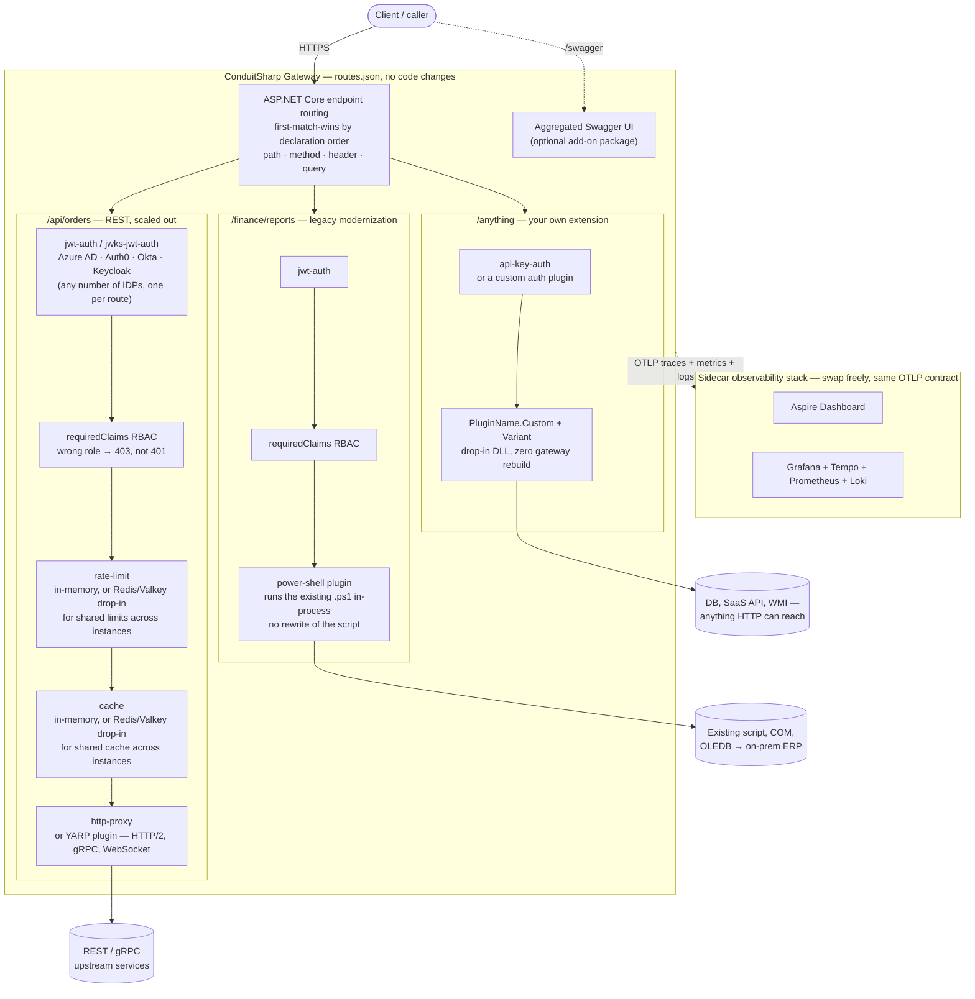
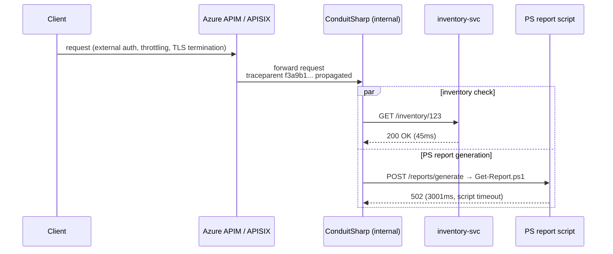
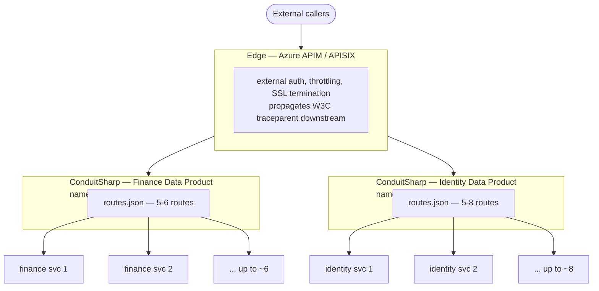

# ConduitSharp — Architecture

## Capabilities at a glance

Every route gets its own independent plugin chain from `routes.json` — no code, no
recompile. The diagram below shows three routes exercising the capabilities enterprises
ask for most: multi-IDP auth with claim-based RBAC, a distributed cache, a swappable
forwarding engine, legacy modernization via the PowerShell plugin, open-ended extension
via `Custom`, and a sidecar observability stack that plugs into whatever backend you run.



**What this demonstrates:**
- **Auth + RBAC** — `jwt-auth` (HS256) and `jwks-jwt-auth` (RS/ES via JWKS) both accept an
  optional `requiredClaims` block; a different IDP per route is just a different config
  block, no code. A failed claim check is `403` (authorization), a bad/expired token is
  `401` (authentication) — see [Claim-based authorization](AUTHORIZATION.md#claim-based-authorization-rbac).
- **Expandability** — any built-in plugin (auth, cache, forwarding) can be replaced by a
  drop-in DLL using the same `PluginName` (last-registration-wins), and `PluginName.Custom`
  gives genuinely new plugin types with zero `Core` recompile.
- **Cache** — in-memory by default; drop `ConduitSharp.Cache.RedisProtocol` into `plugins/`
  to share one cache across every gateway instance, with request coalescing and
  per-route invalidation.
- **Rate-limit store** — per-process fixed window by default; drop
  `ConduitSharp.RateLimit.RedisProtocol` into `plugins/` to enforce one shared limit
  across every gateway instance (same `IRateLimitStore` seam, fail-open on backend outage).
- **Route matching strategy** — uses native ASP.NET Core Endpoint Routing for high-performance DFA-based matching.
- **Load-balancing policy** — YARP's policies (`RoundRobin`, `Random`, `PowerOfTwoChoices`,
  `LeastRequests`, `FirstAlphabetical`) are available by name; drop an `ILoadBalancingPolicy`
  DLL into `plugins/` to add your own and select it with `cluster.loadBalancingPolicy`.
- **Forwarding engine is YARP** — `IHttpForwarder` handles HTTP/2, gRPC, WebSockets, streaming,
  and trailers on every route. Not a plugin, and not swappable: `http-proxy` in a route's plugin
  list simply names where in the chain the forward happens.
- **Legacy modernization** — `power-shell` runs an existing `.ps1` in-process, so a script
  with no API surface becomes an authenticated, observable HTTP endpoint without touching
  its logic.
- **Observability is a sidecar, not a fork in the road** — every instance emits the same
  OTLP traces/metrics/logs regardless of which backend collects them; swap Aspire for
  Grafana/Tempo/Prometheus/Loki (or Jaeger, Datadog, Honeycomb) without touching the gateway.

---

## Deployment patterns

### Edge gateway (standard)

One ConduitSharp instance at the perimeter. All external traffic passes through it. This is the typical API gateway deployment — auth, rate limiting, and routing enforced at a single boundary.

### Sidecar / terminating wrapper

Deploy a small ConduitSharp instance directly next to each workload — a legacy service, a PowerShell ETL job, a batch processor. Each instance enforces the same auth and observability standards locally, regardless of what the workload is or what language it speaks.

ConduitSharp does not have to be the edge. It slots behind Azure API Management, APISIX, or any existing gateway and adds the observability and execution layer that those gateways cannot provide for legacy workloads.



Both calls carry the same `traceparent`. All spans flow to the OTLP collector. In Grafana Tempo, the full waterfall is correlated under a single trace ID:

```
Trace f3a9b1                                        3050ms  ✗ ERROR
  ├─ [inventory-check]  GET /inventory/123            45ms  ✓ 200
  └─ [ps-erp-wrapper]   POST /reports/generate      3001ms  ✗ 502
       route: erp-report-generate
       conduitsharp.route_id: erp-report-generate
       http.response.status_code: 502                         ← source of failure
```

The edge gateway sees a 502 and knows the request failed. ConduitSharp tells you *which* downstream failed, on *which* route, after *how long* — without touching the PowerShell script or the inventory service.

Each instance runs independently with its own `routes.json`. The legacy workloads don't know ConduitSharp exists.

### Domain gateway per Data Product

The pattern above generalizes past a single legacy workload: scope one ConduitSharp instance
to one Data Product's namespace — 5-8 microservices it owns — rather than one instance per
edge or one instance per workload. A separate Data Product gets its own instance, its own
`routes.json`, its own namespace. One large edge gateway (Azure API Management, APISIX) sits
above all of them, handling external auth, throttling, and TLS termination for the whole
estate.



Why per-Data-Product rather than one shared gateway for everything: each team owns its own
`routes.json`, sized to what it actually runs, and reviews it without wading through every
other team's routes. The edge gateway still gives you one external contract, one place to
enforce org-wide policy, and one aggregation point for client-facing auth — ConduitSharp
underneath doesn't compete with that, it's the layer that makes each Data Product's own
surface auditable. Every instance still emits the same OTLP traces (below), so a request
that crosses the edge into a Data Product gateway is one correlated trace, not a black box
per team.

### Single observability plane across all instances

Every ConduitSharp instance emits OTLP traces and metrics to the same collector. Because `AddHttpClientInstrumentation` automatically injects the W3C `traceparent` header on every forwarded request, spans from different instances share the same trace ID when they are part of the same request chain.

In Grafana Tempo, a single trace waterfall shows every hop:

```
Trace: a3f8c1...

  edge gateway           GET /finance/reports/margin    12ms   OK
    │
    └─ PS ERP wrapper    GET /finance/reports/margin   450ms   ERROR  502
```

You see exactly which instance failed, at what latency, with the route ID tagged. If the PowerShell script times out behind its sidecar you know it in milliseconds — not after the on-call engineer checks the server at 9am Monday.

**What you can see per hop:**
- Which route matched and on which instance
- Status code and latency
- Whether it was a plugin short-circuit (auth rejection, rate limit) or an upstream/script failure
- The full chain from edge to terminal workload, correlated by trace ID

**What you cannot see:**
- Internal steps inside a PowerShell script — the span covers the whole script execution. The script itself would need to emit spans for finer granularity.
- Event bus hops (Kafka, Service Bus) — ConduitSharp is HTTP only. It can sit in front of the webhook consumer that the event bus triggers, but the queue transit itself is invisible to it.

### Horizontal scaling and in-memory state

By default, rate limiting and response caching are **in-memory and per-process**. Running multiple gateway instances behind a load balancer means:

- **Rate limits are per-instance by default** — but **shared enforcement is available**: drop the `ConduitSharp.RateLimit.RedisProtocol` assembly into the gateway's plugins root and set the connection string. The gateway then counts requests in a Redis-protocol backend (Valkey, Redis 7, or any RESP-compatible server) through the `IRateLimitStore` seam, so all instances enforce one shared window. It fails open — a backend outage allows requests rather than failing them. See `examples/ConduitSharp.RateLimit.RedisProtocol`.
- **Cache is per-instance by default** — but a **shared distributed cache is available**: drop the `ConduitSharp.Cache.RedisProtocol` assembly into the gateway's plugins root and set `Gateway:Cache:Redis:ConnectionString`. The gateway then uses a Redis-protocol backend (Valkey, Redis 7, or any RESP-compatible server) in place of the in-process cache, so all instances share one cache, with request coalescing (stampede protection) and route invalidation via `DELETE /admin/cache/{routeId}`. It fails open — a backend outage degrades to no-caching rather than failing requests. See `examples/ConduitSharp.Cache.RedisProtocol`.

Single-instance deployments (Windows Service, single container, IIS on one node) work with the built-in in-memory cache and need no external dependency.

---

## Request lifecycle

The middleware pipeline below is wired by `UseConduitSharpGateway()` (in
`ConduitSharp.Gateway.AspNetCore`); the standalone Host, the Docker image, and any app embedding
the gateway all get the same lifecycle. Each `Use()` stage is individually toggleable via
`ConduitSharpGatewayOptions` when embedding.

```
HTTP request
  → Kestrel
  → Admin middleware (Use()) — POST /admin/routes/reload, DELETE /admin/cache/{routeId}
                               if Gateway:AdminKeyHash is set          [EnableAdminApi]
  → Health middleware (Use()) — /healthz (liveness), /readyz (readiness)  [MapHealthEndpoints]
  → SwaggerUI + spec proxy middleware — /swagger/**    [optional add-on package:
                                                        app.UseConduitSharpGatewaySwagger()]
  → OTel ActivitySource.StartActivity("gateway.request")   [wraps every gateway request,
                                                           including ones that match no route]
  → ASP.NET Core endpoint routing   native DFA over path + method + header + query
                                    (route list order → RouteConfig.Order, so declaration
                                     order breaks overlaps: first match wins)
      → 404 if no route matched, 405 if the path matched but the verb did not

  ── route has an upstream → YARP's proxy pipeline (MapReverseProxy) ──
      → plugin dispatch    looks the route's precompiled RequestDelegate up by RouteId
          → sets Items["ConduitSharp.RouteId"] (a string) and Items["ConduitSharp.ProxyNext"]
          → BufferRequestBody      per-route/global body cap (413) + total budget (503);
                                   leaves a seekable body the retry loop can rewind
          → ordered plugin chain   (auth → rate-limit → cache → transform → …)
              → a plugin that writes a response and does not call next() short-circuits;
                YARP never forwards
              → terminal step invokes ProxyNext — i.e. the rest of YARP's pipeline runs
                INSIDE the plugins' next(), so the cache plugin's tee wraps the real forward
      → UpstreamProtocol   inbound HTTP/2 → swap in an h2c prior-knowledge cluster model (gRPC)
      → UpstreamRetry      Polly-driven attempt loop (idempotent methods only):
                             rewind body → restore destination set → forward → judge outcome
                             a retryable attempt's response is suppressed, never reaching the client
      → UseLoadBalancing        picks a destination per attempt (RoundRobin by default)
      → UsePassiveHealthChecks  ConsecutiveFailuresHealthPolicy — circuit breaker
      → ForwarderMiddleware     IHttpForwarder.SendAsync → streams headers, body, trailers back
                                504 on timeout, 502 on transport failure

  ── route has no cluster ("cluster": null) → plain endpoint ──
      → same precompiled chain; terminal step is a 502 if no plugin produced a response

  → finally: release the body budget; tag the activity with the status code, mark Error if 5xx
```

---

## Package structure and dependency graph

```
src/
  ConduitSharp.Core                    ← contracts + pure domain logic; NO ASP.NET dependency
  ConduitSharp.Traffic                 → Core   (rate limiting, caching, load balancers)
  ConduitSharp.Security                → Core   (JWT HS256, JWKS RS/ES, API key plain+hashed)
  ConduitSharp.Transformation          → Core   (header-transform plugin)
  ConduitSharp.Observability           → Core   (logging, metrics, OTel instruments, IRequestObserver)
  ConduitSharp.Gateway.AspNetCore      → Core + all feature packages  (embeddable library:
                                          AddConduitSharpGateway / UseConduitSharpGateway —
                                          middleware, proxy engine, plugin loader, options)
  ConduitSharp.Gateway.AspNetCore.Swagger → Gateway.AspNetCore  (optional add-on: aggregated
                                          Swagger UI; carries the Swashbuckle dependency)
  ConduitSharp.Host                    → Gateway.AspNetCore + Swagger add-on  (thin executable
                                          shell that dogfoods the library; ships as the
                                          `ConduitSharp.Gateway` dotnet tool and Docker image)

tests/
  ConduitSharp.Core.Tests          → Core
  ConduitSharp.Security.Tests      → Security
  ConduitSharp.Traffic.Tests       → Traffic
  ConduitSharp.Transformation.Tests → Transformation
  ConduitSharp.Observability.Tests → Observability
  ConduitSharp.Integration.Tests   → Host  (in-process via WebApplicationFactory; also
                                     exercises the embeddable surface on a TestServer)
  ConduitSharp.LegacyGateway.E2E.Tests → out-of-process E2E against the real gateway binary
  ConduitSharp.Grafana.E2E.Tests   → Docker observability-pipeline E2E (Tempo/Prometheus/Loki)
  ConduitSharp.Mtls.E2E.Tests      → Docker mTLS E2E (real client-cert handshake; cross-platform)

examples/
  EmbeddedGateway/                   — embeds the gateway in a plain ASP.NET Core app and adds
                                       the Redis cache plugin from NuGet, in code
  ConduitSharp.Plugin.PowerShell/    — PluginName.PowerShell drop-in that runs a .ps1
                                       in-process via the embedded Microsoft.PowerShell.SDK
  ConduitSharp.Cache.RedisProtocol/  — drop-in distributed ICacheService (Valkey / Redis 7 / RESP)
  ConduitSharp.RateLimit.RedisProtocol/ — drop-in distributed IRateLimitStore (shared limits, fail-open)
```

**Rule:** feature packages reference only `Core` — never each other or the gateway library.
`ConduitSharp.Gateway.AspNetCore` is the single aggregation point; `Host` adds nothing but the
executable entry point and its `Configuration/` packaging convention. All `ConduitSharp.*`
packages version together from a single `<Version>` in the root `Directory.Build.props`.

---

## Key architectural decisions

### The gateway is an embeddable library; the Host is a thin shell

All wiring lives in `ConduitSharp.Gateway.AspNetCore` as two extension methods —
`AddConduitSharpGateway(builder, options => …)` (config binding, HttpClients, plugins, routes,
observability) and `UseConduitSharpGateway(app)` (admin, health, terminal middleware) — the YARP
`AddReverseProxy()`/`MapReverseProxy()` model. The standalone Host executable is ~40 lines that
add its `Configuration/appsettings.json` convention and call both methods; the Docker image and
dotnet tool package that same shell.

`ConduitSharpGatewayOptions` exposes the composition knobs an embedder needs so the gateway does
not collide with an app that already owns those concerns: `ConfigureObservability` (don't clobber
the host's OTel), `EnablePluginDirectoryScan` (plugins via DI instead of a folder),
`EnableAdminApi` (reload calls `StopApplication()` — wrong for a shared process),
`MapHealthEndpoints`, `PathPrefix` (mount the terminal middleware under a sub-path via `UseWhen`
so the host keeps the rest of its routing), and `Routes`/`RoutesPath` (in-memory route table or a
file). Defaults reproduce the standalone host exactly. Because the pipeline is resolved from DI
after `Build()`, plugins registered *after* `AddConduitSharpGateway` are picked up — which is
what makes one-line NuGet plugin registration work (see `examples/EmbeddedGateway`).

### PluginName is a strict enum; extensibility lives in `Custom` + `Variant`

`PluginName` is a closed enum (`JwtAuth`, `RateLimit`, `Cache`, `HttpProxy`, …) deserialized
strictly from kebab-case JSON via `StrictEnumConverter<T>` — an unrecognised name in
`routes.json` throws at load time, so typos fail fast rather than surfacing per request.
`LoadBalancingStrategy` and `HttpVerb` follow the same pattern.

Open extensibility comes from two enum members plus a disambiguator:

- **`Custom`** — third-party plugins declare `Name => PluginName.Custom` with a self-chosen
  `Variant` string (e.g. `"llm-proxy"`); routes select them with
  `{ "name": "custom", "variant": "llm-proxy" }`. Plugins are registered and resolved under a
  `PluginKey` (name + case-folded variant), so any number of custom plugins coexist without
  each needing a core enum value. Config validation enforces the pairing at startup: `custom`
  requires a variant, built-in names must not carry one.
- **`PowerShell`** — a reserved escape hatch with no built-in implementation.

A built-in name can also be *taken over* wholesale — a plugin declaring an existing name (null
variant), like the YARP example's `PluginName.HttpProxy`, replaces the built-in via
last-registration-wins. One failure mode remains deferred by design: a route naming a plugin
that has no registered implementation (e.g. `custom`/`power-shell` with no DLL supplying it) is
skipped by startup config validation and surfaces as a 500 when the route's chain is first
built — the registry can legitimately gain entries only after route validation runs.

### Plugins are native middleware over HttpContext

`IPipelinePlugin.ExecuteAsync(HttpContext, JsonElement config, RequestDelegate next)` — the ASP.NET
Core middleware shape, no custom context types. Each route's chain is compiled once (at startup and
on reload) via `IApplicationBuilder.New()` into a single `RequestDelegate`, ordered by `Order`
ascending with the lowest order outermost. The only gateway-specific contract is
`HttpContext.Items`: `"ConduitSharp.RouteId"` (the matched route's id, a string) and
`"ConduitSharp.ProxyNext"` (the continuation into YARP's pipeline, invoked by the chain's terminal
step). Plugins are unit-testable with a bare `DefaultHttpContext`.

### Last registration wins (override mechanism)

Plugins resolve from DI as `IEnumerable<IPipelinePlugin>` with a `LastOrDefault` match on
(name, variant). Registration order (in `AddConduitSharpGateway`) is: built-ins first, then
external DLLs scanned from `plugins/` — and when embedding, anything the host app registers in DI
*after* `AddConduitSharpGateway` comes last. Later registrations win, so an external DLL, a NuGet
plugin registered in code, or a test plugin can replace any built-in by using the same plugin name
(this is how `examples/EmbeddedGateway` swaps in the Redis cache with one `AddSingleton` line).

### Forwarding is health-aware and retryable

`timeoutMs` becomes the cluster's `ForwarderRequestConfig.ActivityTimeout`, bounding each
*attempt* rather than the whole request; YARP maps a timeout to 504 and a transport failure to
502, so a timeout stays distinguishable from a client disconnect.

Idempotent methods (`GET`, `HEAD`, `OPTIONS`, `PUT`, `DELETE`, `TRACE`) retry per the route's
`retry` policy — a `POST`/`PATCH` never retries, since it may already have been applied upstream.
Attempts are scheduled by a per-route Polly `ResiliencePipeline` (`Fixed`/`Linear`/`Exponential`
backoff, optional jitter, configurable `retryOn` status set). The loop owns what Polly cannot see:
it rewinds the buffered request body, restores the full destination set so YARP's load balancer
re-picks (giving cross-node failover), and resets the status and headers a failed attempt left
behind. A retried attempt never reaches the client — `SuppressRetriedResponseTransform` holds its
body back while another attempt remains, so the forwarder returns without starting the response.

Every attempt's outcome feeds `ConsecutiveFailuresHealthPolicy`, a YARP `IPassiveHealthCheckPolicy`:
after `circuitBreaker.threshold` consecutive failures the destination is marked unhealthy and drops
out of the load balancer's available set for `circuitBreakerCooldownMs` (the reactivation period),
after which one trial request decides whether it resets or re-opens. A client disconnect is never
counted as a node failure. An absent `circuitBreaker` block disables it (passive health checks are not
enabled on the cluster at all).

### Per-plugin config validation runs at startup, not per request

`IPipelinePlugin.ValidateConfig(JsonElement)` defaults to a no-op; a plugin overrides it
to reject invalid config early (`rate-limit` requires a positive window/max, `cache` a
positive ttl, `jwks-jwt-auth` a `jwksUri`). `PluginPipelineExecutor.ValidateRouteConfigs`
calls it for every enabled route/plugin at startup and on admin reload, wrapping failures
with route/plugin context so a bad value fails the deploy or reload instead of the first
request that happens to hit it. This is separate from a plugin's own `static
From(JsonElement)` config-loading convention, which still runs per request in
`ExecuteAsync` — `ValidateConfig` is the opt-in fail-fast layer on top.

### Forwarding is YARP, and the plugin chain runs inside it

routes.json is translated at startup into YARP `RouteConfig`/`ClusterConfig` pairs (one cluster per
route, `ClusterId == RouteId`) served through an `InMemoryConfigProvider`. YARP's own appsettings
schema is never bound — routes.json stays the only config surface.

Each route's plugin chain is compiled once into a `RequestDelegate` and dispatched *inside* YARP's
per-proxy pipeline, so the forwarder always runs within the plugins' `next()`. That ordering is what
makes the cache plugin's response tee wrap the real forward (coalescing always engages) and lets any
plugin short-circuit by simply not calling `next()`.

`http-proxy` in a route's plugin list is not a plugin — it names where in the chain the forward
happens. Omit it and the forward is appended at the end. It is deliberately *not* swappable:
protocol fidelity (HTTP/2, gRPC, WebSockets, trailers) is the whole reason to stand on YARP.

What YARP does not do, the gateway keeps around the forwarder:

- **Retries** — a proxy cannot safely replay a half-streamed body. The gateway buffers the request,
  drives attempts from a per-route Polly `ResiliencePipeline` (backoff, jitter), rewinds the body,
  and re-runs load balancing per attempt so a retry lands on a different node. A retried attempt's
  response is suppressed before it reaches the client (`SuppressRetriedResponseTransform`).

  Every gateway that retries must buffer the body somewhere — a sent stream no longer has the
  bytes a replay needs. The difference is what happens when the buffer does not fit:

  | Gateway | Retryable body lives in | When it does not fit |
  |---|---|---|
  | ConduitSharp | RAM tier, then disk spill | `503` when the combined budget is gone |
  | Envoy | memory only (`request_body_buffer_limit`) | `507`, retry abandoned |
  | nginx / APISIX | `client_body_buffer_size`, then a temp file | unbounded spill |
  | Ocelot | nothing shipped; a retry built on its official `AddPolly` seam must `LoadIntoBufferAsync` | whole body on the heap, no ceiling |
- **Circuit breaking** — `ConsecutiveFailuresHealthPolicy`, an `IPassiveHealthCheckPolicy`. YARP's
  stock `TransportFailureRate` is rate-over-a-window and cannot express routes.json's
  consecutive-failure threshold; cooldown maps to the reactivation period.
- **Per-route mTLS** — `UpstreamForwarderHttpClientFactory` attaches the route's client certificate
  to the cluster's `SocketsHttpHandler`. YARP's `HttpClientConfig` covers
  `skipCertificateVerification` but has no client-certificate knob.
- **HTTP/2 prior knowledge** — a cluster's `ForwarderRequestConfig` is static, but the right
  outbound protocol depends on how the client arrived. For an inbound HTTP/2 request
  `UpstreamProtocol` swaps in an h2c-exact cluster model, so gRPC is not silently downgraded to
  HTTP/1.1 against a cleartext upstream.

### Routes without an upstream bypass YARP

YARP rejects a route with no cluster before any middleware runs, so plugin-only routes
(`"cluster": null`) are served as ordinary endpoints from a mutable `EndpointDataSource` running
the same compiled chain — which is also what lets an admin reload add and remove them.

### Response capture is a Body swap inside the plugin's own next()

The cache plugin needs the response (status, content-type, bytes) to store it, but responses are
*streamed*, so capturing means teeing bytes as they flow to the client. The tee is nothing more
than swapping `context.Response.Body` for a `CapturingStream` before calling `next()` and
restoring it after.

That works — including for YARP — because of two facts:

1. Setting `Response.Body` makes ASP.NET Core install a `StreamResponseBodyFeature` over the new
   stream, which routes **both** write surfaces through it: `Response.Body` (a `Stream`) *and*
   `Response.BodyWriter` (the `PipeWriter` YARP's `IHttpForwarder` writes to). YARP cannot bypass
   the swap. (A plugin that captured a raw `IHttpResponseBodyFeature` reference *before* the swap
   could — nothing in this codebase does.)
2. The forward runs *inside* the plugins' `next()` (the chain's terminal step invokes YARP's
   pipeline), so the swap is always in place while the forwarder writes, and coalescing — the
   leader publishing the captured body to concurrent misses — always engages.

Only 2xx responses within `maxCacheableBytes` are stored; an oversized body streams to the client
uncaptured. `CacheEndToEndTests` proves the whole path against a real YARP forward
(`X-Cache: HIT`, `ConcurrentMisses_AreCoalesced_UpstreamCalledOnce`).

### Gateway-owned endpoints are Use() middleware, routes are endpoints

Admin (`/admin/*`), health (`/healthz`, `/readyz`), and the Swagger add-on are plain `Use()`
middleware registered by `UseConduitSharpGateway()` (Swagger's
`UseConduitSharpGatewaySwagger()` must be called before it) — they answer and return before
endpoint routing runs, so no routes.json route can shadow them. Everything in routes.json becomes
a real endpoint (YARP's or the plugin-only data source's), which is what makes 404/405 semantics,
`MatcherPolicy` drop-ins, and hot reload native.

### No assembly isolation — plugins share the host's load context

Every DLL in `plugins/` is loaded into `AssemblyLoadContext.Default` with full trust. Isolated (collectible) contexts were deliberately abandoned: they break plugins that use native P/Invoke (e.g. the PowerShell SDK's `libpsl-native`). A `Resolving` handler resolves each plugin's private dependencies from the files published alongside its DLL, and assemblies the host already loaded are reused — so the plugin's `IPipelinePlugin` has the same type identity as the host's. The resulting security model: plugins run in-process with the gateway's full privileges; only deploy DLLs from sources you control.

Scoping: plugin *activation* is per-route (each route's `plugins` list in routes.json picks which plugins run — auth, rate-limit, cache, the forwarder — with per-route config), but DLL *discovery* is gateway-wide: the `plugins/{routeId}/` folders only organize files, and every discovered plugin type is registered globally by (name, variant), available to any route that declares it. Service backends dropped in the plugins root (`ICacheService`, `IRateLimitStore`, YARP `ILoadBalancingPolicy`, ASP.NET Core `MatcherPolicy`) are instance-wide and apply to all routes.

### One HttpMessageInvoker per cluster, built by YARP

Upstream forwarding no longer uses `IHttpClientFactory`. YARP builds one `HttpMessageInvoker` per
cluster (= per route) from the cluster's `HttpClientConfig`, so
`skipCertificateVerification` maps straight to `DangerousAcceptAnyServerCertificate`.

`HttpClientConfig` has no *client*-certificate knob, so `UpstreamForwarderHttpClientFactory`
(an `IForwarderHttpClientFactory`) attaches the route's certificate to the cluster's
`SocketsHttpHandler`. Clusters are keyed by route id, so a certificate configured for
`Gateway:Tls:ClientCertificates[n]:RouteId` lands on the matching cluster. Certificates load when
YARP builds the client at config load — a bad path or thumbprint fails the gateway at startup, not
on the first request.

Because the insecure client carries **no client certificate**, configuring both a client cert and `skipCertificateVerification` on the same route would silently drop the cert — `AddConduitSharpGateway` rejects that combination at startup with a clear error rather than letting mTLS silently not happen. (For a self-signed upstream that also requires mTLS, trust its CA instead — e.g. `SSL_CERT_FILE` on Linux; `tests/mtls-e2e/` demonstrates exactly this.)

### Swagger aggregation is an optional add-on package

The aggregated Swagger UI lives in `ConduitSharp.Gateway.AspNetCore.Swagger`, not the core library, so embedders who don't want it never take the Swashbuckle dependency. It is one extension method — `app.UseConduitSharpGatewaySwagger()`, called before `UseConduitSharpGateway()` — that resolves the route table from DI and mounts the spec-proxy + UI middleware. The standalone Host references the add-on, so `/swagger` works out of the box in the tool/Docker distributions.

### Hop-by-hop headers stripped before forwarding

`BuildUpstreamRequest` removes `Connection`, `Keep-Alive`, `Transfer-Encoding`, and related headers. The `Host` header is also removed so the upstream sees its own hostname.

### First-match-wins routing

Route priority is determined by position in `routes.json`. There is no scoring or specificity algorithm. Put more-specific routes before catch-alls — the list order is the contract.

This is a deliberate trade-off for readability, not a missing feature. A scoring/specificity
algorithm (most-specific-path-wins, like some gateways implement) is more convenient to
author but opaque to review — you cannot tell what a request matches without mentally
running the algorithm. First-match-wins plus a flat declarative JSON file means a route
table can be read top-to-bottom, in order, by a reviewer who has never seen it before — which
matters most during a security audit, where someone has to answer "what can reach this
service, through what auth, in what plugin order" without reverse-engineering precedence
rules. See [Domain gateway per Data Product](#domain-gateway-per-data-product) above for why
this scales: each instance's `routes.json` stays small (one Data Product's routes, not a
global table) specifically so it stays reviewable at a glance.

### Static routing — dynamic node discovery is a non-goal

There is deliberately no Consul / Kubernetes / DNS service-discovery integration and no
control plane. Routes *and* upstream nodes are a version-controlled file, and that is the
feature:

- **Auditability** — git history answers who changed a route, when, and to what. A dynamic
  registry can only tell you its current state; reconstructing history means trusting a
  second system.
- **Zero drift** — the gateway in production is guaranteed to match the configuration in
  the repo. No route or node can appear via a runaway process or a manual poke at a live
  store.
- **Operational simplicity** — the gateway is a stateless appliance. No etcd/Consul quorum
  to operate, back up, or repair; a failed node is replaced, never "fixed".

Node changes flow through the same reviewed pipeline as code (edit `routes.json` → PR →
`POST /admin/routes/reload` or redeploy). Deployments that genuinely need dynamic upstreams
can replace the forwarding plugin (`PluginName.HttpProxy`, last-registration-wins — the same
mechanism the YARP example uses) with one that resolves nodes itself; that choice then lives
visibly in that deployment's plugin set instead of silently in the core.

---

## Implementation status

| Package | Status |
|---|---|
| `Core` | **Fully implemented** — routing, pipeline executor, all types |
| Load balancing | **YARP** — `RoundRobin` (default), `Random`, `PowerOfTwoChoices`, `LeastRequests`, `FirstAlphabetical`, or a drop-in `ILoadBalancingPolicy` DLL, selected by `cluster.loadBalancingPolicy` |
| `Traffic` — rate limiting | **Implemented** — `RateLimitPlugin`, `FixedWindowRateLimiter` (injectable clock, eviction), `ValidateConfig` rejects non-positive window/max |
| `Traffic` — caching | **Implemented** — `CachePlugin`, `InMemoryCacheService`, `ValidateConfig` rejects non-positive ttl |
| `Security` — JWT (HS256) | **Implemented** — `JwtAuthPlugin`, `JwtAuthHandler`, `JwtClaimsValidator`, `JwtBase64Url` |
| `Security` — JWT (RS/ES via JWKS) | **Implemented** — `JwksJwtAuthPlugin`, `JwksJwtAuthHandler`, `JwksSignatureVerifier`, `JwksKeyProvider`, `ValidateConfig` requires `jwksUri` |
| `Security` — API key (plain) | **Implemented** — `ApiKeyAuthPlugin`, `ApiKeyAuthHandler` |
| `Security` — API key (hashed) | **Implemented** — `ApiKeyAuthHashedPlugin`, `ApiKeyAuthHashedHandler` |
| `Transformation` — header-transform | **Implemented** — `HeaderTransformPlugin` (add, remove, set) |
| `Observability` — structured logging | **Implemented** — `StructuredRequestLogger`, `StructuredLogEntry` |
| `Observability` — OpenTelemetry | **Implemented** — `GatewayTelemetry` (ActivitySource + Meter), `OtelMetricsObserver` |
| `Gateway.AspNetCore` — embeddable library | **Implemented** — `AddConduitSharpGateway` / `UseConduitSharpGateway` + `ConduitSharpGatewayOptions` composition knobs; ships as a NuGet package |
| `Gateway.AspNetCore` — request pipeline | **Implemented** — OTel tracing, body limits/budget, per-route compiled plugin chains, hot reload (`GatewayRouteTable`) |
| `Gateway.AspNetCore` — forwarding | **YARP `IHttpForwarder`** — HTTP/2, gRPC, WebSockets, streaming, trailers. Around it: `YarpConfigTranslator` (routes.json → route/cluster config), `UpstreamRetry` (Polly-driven, idempotent-only, body rewind, cross-node failover), `ConsecutiveFailuresHealthPolicy` (circuit breaker), `UpstreamForwarderHttpClientFactory` (per-route mTLS), `UpstreamProtocol` (h2c prior knowledge) |
| `Gateway.AspNetCore` — admin API | **Implemented** — `POST /admin/routes/reload`, `DELETE /admin/cache/{routeId}`, gated by `Gateway:AdminKeyHash` |
| `Gateway.AspNetCore` — plugin loader | **Implemented** — `PluginAssemblyLoader` (loads into the shared default `AssemblyLoadContext`; no isolation) |
| `Gateway.AspNetCore.Swagger` — add-on | **Implemented** — `UseConduitSharpGatewaySwagger()`; `SwaggerAggregationExtensions` (fetchFrom + specFile modes, SSRF/path-traversal guards) |
| `Host` — standalone shell | **Implemented** — thin executable over the library; dotnet tool (`conduitsharp`) + arch-portable Docker image (amd64/arm64) |
| `Custom` | **No core-provided implementation** — `PluginName.Custom` + a self-chosen `Variant` is the open-ended escape hatch; implement as a drop-in DLL |
| `PowerShell` | **Example implementation** — `examples/ConduitSharp.Plugin.PowerShell` runs a `.ps1` in-process via the embedded PowerShell SDK; see [PowerShell plugin — production considerations](#powershell-plugin--production-considerations) before heavy concurrent/ETL use |
| `examples/EmbeddedGateway` | **Example** — embeds the gateway in a plain ASP.NET Core app; wires the Redis cache plugin from NuGet in code |
| `examples/PowerShell` | **Example** — `ConduitSharp.Plugin.PowerShell`: in-process `.ps1` execution via `Microsoft.PowerShell.SDK`, no system `pwsh` required |
| `examples/Cache.RedisProtocol` | **Example** — drop-in distributed `ICacheService` over RESP (Valkey / Redis 7) |
| `examples/RateLimit.RedisProtocol` | **Example** — drop-in distributed `IRateLimitStore` over RESP; one shared limit across all instances, fail-open |

---

## PowerShell plugin — production considerations

`examples/ConduitSharp.Plugin.PowerShell` is a working drop-in (`PluginName.PowerShell`)
that runs a `.ps1` in-process via the embedded `Microsoft.PowerShell.SDK` — no system
`pwsh` install required — and short-circuits with the script's output. It follows the
same `PowerShell.Create()`-per-request shape as the README's illustrative shim below,
which is correct for illustrating the pattern but not suitable for production under
concurrent load or heavy ETL workloads. Three concerns must be addressed before
deploying either one at scale.

### 1. Runspace pooling

`PowerShell.Create()` per request creates a new runspace on every call. The PowerShell SDK assemblies are loaded once and shared in process memory, so this is not a 50MB-per-request cost — but it does produce significant GC pressure from short-lived runspace objects and places no ceiling on concurrency. Under load this causes GC pause spikes and unpredictable latency.

The fix is a `RunspacePool`, sized to match expected concurrency. This caps memory growth, eliminates repeated initialisation overhead, and bounds the number of concurrent script executions — the same principle as a database connection pool.

```csharp
public sealed class PowerShellPlugin : IPipelinePlugin, IDisposable
{
    private readonly RunspacePool _pool;

    public PowerShellPlugin()
    {
        var state = InitialSessionState.CreateDefault();
        _pool = RunspaceFactory.CreateRunspacePool(minRunspaces: 2, maxRunspaces: 20, state, host: null);
        _pool.Open();
    }

    public PluginName Name => PluginName.PowerShell;

    public async Task ExecuteAsync(HttpContext context, JsonElement config, RequestDelegate next)
    {
        var options = JsonSerializer.Deserialize<PsConfig>(config)
            ?? throw new InvalidOperationException("PowerShell plugin config is null.");

        using var ps = PowerShell.Create();
        ps.RunspacePool = _pool;  // borrow from pool rather than allocate a new runspace

        ps.AddScript("$ErrorActionPreference = 'Stop'");
        ps.AddScript(await File.ReadAllTextAsync(options.ScriptPath));
        ps.AddParameter("Request", context.Request);

        try
        {
            var results = await ps.InvokeAsync();
            await context.Response.WriteAsync(string.Join("\n", results.Select(r => r.ToString())));
        }
        catch (RuntimeException ex)
        {
            context.Response.StatusCode = 500;
            await context.Response.WriteAsync(ex.Message);
        }
        catch (ParseException)
        {
            context.Response.StatusCode = 500;
            await context.Response.WriteAsync("PowerShell script configuration error.");
        }
        // short-circuit: next() is deliberately not called — the script IS the response
    }

    public void Dispose() => _pool.Dispose();
}
```

Register as a singleton so the pool persists for the lifetime of the process:

```csharp
builder.Services.AddSingleton<IPipelinePlugin, PowerShellPlugin>();
```

**Sizing the pool:** `maxRunspaces` caps concurrent script executions. Requests that arrive when the pool is exhausted block until a runspace is returned. Set `maxRunspaces` to match your expected peak concurrency, not an arbitrary ceiling. Monitor `conduitsharp.gateway.request.duration` to detect pool exhaustion — latency will spike while concurrency stays flat.

### 2. Out-of-process execution

If scripts are memory-volatile — processing large files, loading COM automation objects, or performing heavy ERP data extraction — hosting the PowerShell SDK inside the Kestrel process is a liability. A memory leak or runaway allocation in a script degrades the gateway for all other routes.

For these workloads, execute PowerShell as an external process via `System.Diagnostics.Process`. When the script completes, the OS reclaims 100% of its allocated memory. The gateway process is unaffected.

```csharp
public async Task ExecuteAsync(HttpContext context, JsonElement config, RequestDelegate next)
{
    var options = JsonSerializer.Deserialize<PsConfig>(config)!;

    var psi = new ProcessStartInfo("pwsh", $"-NonInteractive -File \"{options.ScriptPath}\"")
    {
        RedirectStandardOutput = true,
        RedirectStandardError  = true,
        UseShellExecute        = false,
    };

    using var process = Process.Start(psi)!;
    var stdout = await process.StandardOutput.ReadToEndAsync();
    var stderr = await process.StandardError.ReadToEndAsync();
    await process.WaitForExitAsync();

    if (process.ExitCode != 0)
    {
        context.ShortCircuit(500, stderr);
        return;
    }

    context.ShortCircuit(200, stdout);
}
```

**Trade-off:** `pwsh` process startup adds 100–300ms cold-start latency per invocation. This is acceptable for triggered ETL jobs and on-demand reporting endpoints. It is not acceptable for low-latency APIs.

**At scale, pool the processes.** Spawning a new `pwsh` process per request under concurrency causes its own resource exhaustion. Maintain a fixed pool of warm `pwsh` processes using the same bounded-pool pattern as `RunspacePool`, or use a channel-based worker queue to serialise script execution within a controlled concurrency limit.

### 3. Script authoring — bypass PSCustomObject for heavy data

When a script processes large datasets, memory bloat frequently originates in PowerShell cmdlets themselves rather than the engine. Piping thousands of rows through `Import-Csv` transforms every cell into a fully-hydrated `PSCustomObject` with property bags, type metadata, and reflection overhead. For a 100k-row CSV this can allocate several hundred MB before a single byte of business logic runs.

Because PowerShell scripts run on the .NET runtime, scripts can use .NET classes directly. Instruct plugin authors to prefer:

```powershell
# Instead of:
$rows = Import-Csv "data.csv"   # allocates PSCustomObject per row

# Use:
$reader = [System.IO.StreamReader]::new("data.csv")
while (-not $reader.EndOfStream) {
    $line = $reader.ReadLine()
    # process $line directly — no PSCustomObject allocated
}
$reader.Dispose()

# Or for JSON:
$json = [System.IO.File]::ReadAllText("data.json")
$parsed = [System.Text.Json.JsonSerializer]::Deserialize[MyType]($json)
```

This bypasses the PowerShell pipeline object model entirely and runs at native .NET allocation rates. The same pattern applies to database queries — use `System.Data.SqlClient` directly rather than piping `Invoke-SqlCmd` output through the pipeline.

This is a script authoring convention. The gateway cannot enforce it; it should be documented as a standard for infrastructure engineers writing production PowerShell plugins.

### Decision guide

| Scenario | Recommended approach |
|---|---|
| Low concurrency, simple scripts, <10ms script execution | `PowerShell.Create()` per request (README example) — acceptable |
| Moderate concurrency, general-purpose scripts | `RunspacePool` with bounded max runspaces |
| Memory-volatile scripts, large file processing, COM automation | Out-of-process `pwsh` with process pool |
| Heavy ETL inside scripts | Out-of-process + native .NET classes in script (bypass `PSCustomObject`) |
