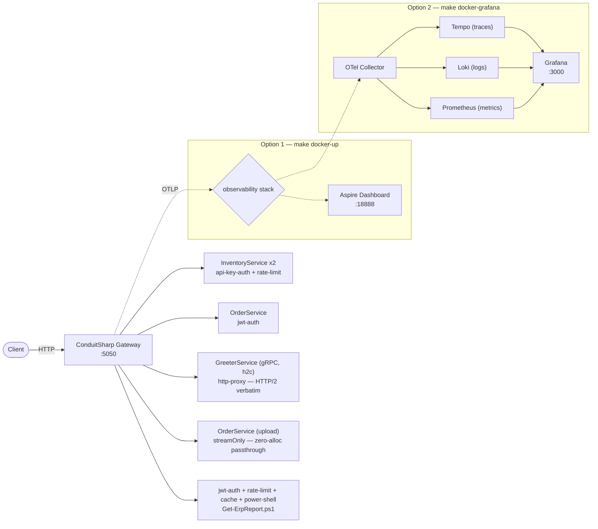
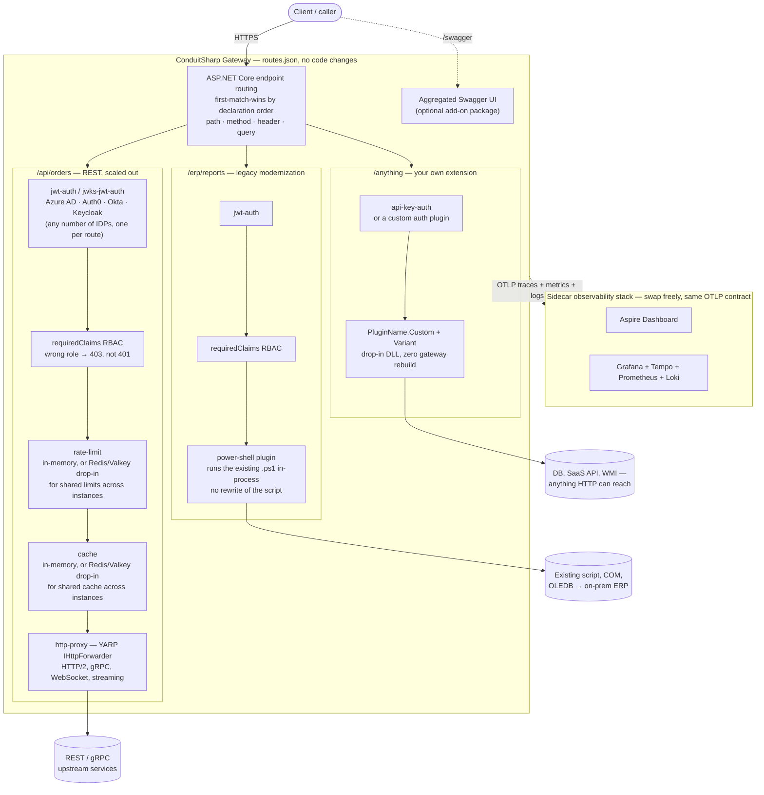
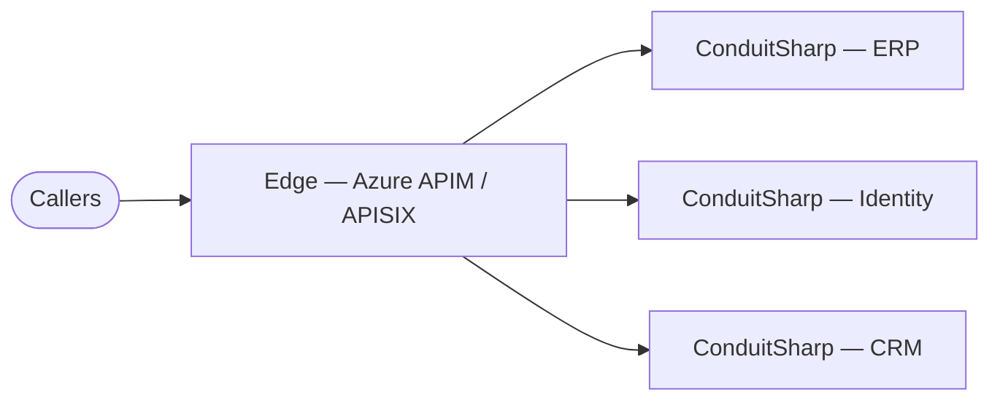
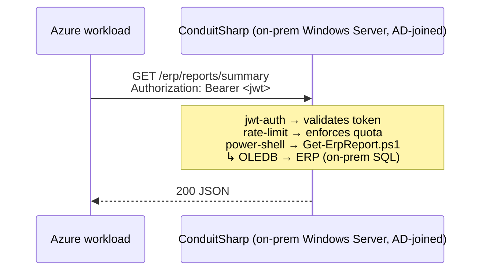
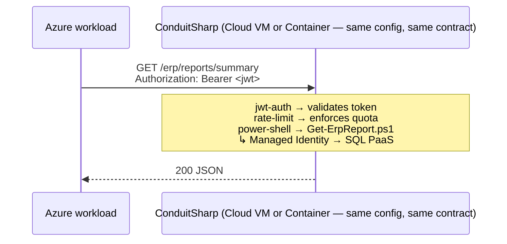
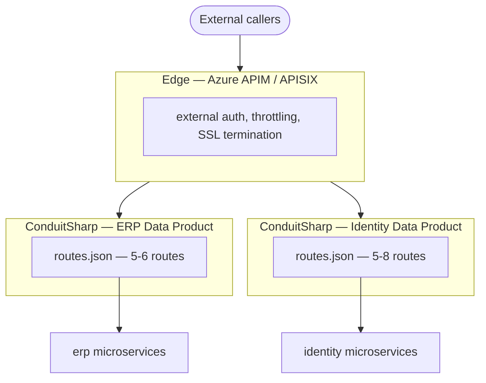

<p align="center">
  <h1 align="center">ConduitSharp</h1>
  <p align="center">The enterprise integration gateway for .NET — expose existing automation as authenticated, observable APIs. No rewrites required.</p>
  <p align="center">
    
    
    
  </p>
</p>

---

## Requirements

- **.NET 10** (LTS) — the gateway and all plugins must be compiled and run on .NET 10.
- **PowerShell 7 - Windows** (`pwsh`) — To run the LegacyGateway example launcher (`start.ps1`) as an alternative to `make`.
- **Docker** for the containerised example stack.

## Quick start

```bash
cd examples/LegacyGateway
make docker-up          # macOS / Linux — Docker Compose + Aspire Dashboard
pwsh start.ps1 -DockerUp  # Windows — same stack
```

```bash
# Health check — no auth
curl http://localhost:5050/health

# Inventory — API key
curl http://localhost:5050/api/inventory \
     -H "X-Api-Key: demo-api-key-conduitsharp-example"

# ERP report — JWT (token printed by make docker-up)
curl http://localhost:5050/erp/reports/summary \
     -H "Authorization: Bearer $TOKEN"
```

The example runs a gateway with six routes, three upstream services (REST, gRPC, and a streamOnly upload), a PowerShell plugin, JWT and API key auth, rate limiting, caching, and OpenTelemetry traces — all wired from `routes.json` with no code changes required. Open the **Aspire Dashboard** at `http://localhost:18888` to see every request's trace.



Prefer Grafana/Tempo/Prometheus/Loki instead of Aspire? Run `make docker-grafana` (macOS/Linux) or `docker compose -f docker-compose.grafana.yml up --build -d` (Windows) and open `http://localhost:3000`. No Docker available? `make run` (macOS/Linux) or `pwsh start.ps1` (Windows) runs the same example as local processes with file-based traces.

---

Most enterprises run decades of working automation — PowerShell scripts, .NET Framework services, scheduled tasks, ERP report extracts — that have no API surface, no authentication, and no observability. Making them first-class citizens in a modern API ecosystem typically means a rewrite. ConduitSharp eliminates that choice.



Per-route auth (multiple IDPs or a custom auth plugin), claim-based RBAC, a swappable
cache and rate-limit store (in-memory or Redis/Valkey), a swappable load-balancing policy,
a YARP forwarding engine (HTTP/2, gRPC, WebSockets), legacy scripts turned into endpoints via
the PowerShell plugin, open-ended extension via `Custom`, an aggregated Swagger UI as an
opt-in add-on, and a sidecar observability stack that plugs into Aspire or Grafana without
touching the gateway — see [ARCHITECTURE.md](docs/ARCHITECTURE.md#capabilities-at-a-glance)
for what each piece is doing.

That's one gateway. It scales the same way across an org — one ConduitSharp instance per
Data Product, each with its own small `routes.json`, behind one shared edge gateway:



One external contract, one org-wide policy point at the edge; every team below it owns a
route table small enough to actually review. See
[Deployment patterns](#deployment-patterns) for the full topology.

---

## Contents

- [The enterprise integration problem](#the-enterprise-integration-problem)
- [Enterprise scenarios](#enterprise-scenarios) — Scenario 1: ERP reporting · Scenario 2: AD/SailPoint · Scenario 3: Batch jobs
- [Why ConduitSharp](#why-conduitsharp)
- [At a glance](#at-a-glance)
- [Deployment patterns](#deployment-patterns) — edge · sidecar · APIM integration (see [ARCHITECTURE.md](docs/ARCHITECTURE.md#deployment-patterns) for diagrams)
- [Compared to alternatives](#compared-to-alternatives)
- [Installation](#installation)
- [Gateway settings](docs/GATEWAY_SETTINGS.md)
- [Configuring routes](docs/ROUTING.md)
- [Claim-based authorization (RBAC)](docs/AUTHORIZATION.md)
- [TLS / HTTPS](docs/TLS.md)
- [Observability](docs/OBSERVABILITY.md)
- [Swagger aggregation](#swagger-aggregation)
- [Health endpoints](#health-endpoints)
- [Admin API](#admin-api)
- [Writing a plugin](#writing-a-plugin)
- [Plugin examples](#plugin-examples)
- [Shipping a plugin as a NuGet package](#shipping-a-plugin-as-a-nuget-package)
- [Drop-in external plugins](#drop-in-external-plugins-no-gateway-rebuild)
- [Contributing](#contributing)
- [Code of conduct](#code-of-conduct)
- [License](#license)

---

## The enterprise integration problem

Every large organisation carries the same burden: hundreds of automation scripts and legacy services that run critical processes but are invisible to the modern API ecosystem. They have no auth, no rate limiting, no observability, and no contract. Calling them means SSH sessions, scheduled tasks, or tribal knowledge.

The standard answer is to rewrite them. That takes quarters, carries regression risk, and burns engineering capacity that could be spent on new capabilities. And when the rewrite is done, the next script appears on someone else's server.

ConduitSharp offers a different answer: **put a gateway in front**. The existing automation keeps running exactly as it does today. ConduitSharp enforces your security and observability standards at the boundary, surfaces each capability as a proper HTTP endpoint, and gives your architecture team a single, auditable control plane for everything that crosses the wire.

**Expose existing enterprise automation as authenticated APIs.** Drop it in front of any Windows automation, legacy service, or PowerShell script. JWT auth, rate limiting, OpenTelemetry tracing, and structured logging are enforced at the boundary. The automation doesn't change. **Legacy technical debt e.g Powershell becomes the implementation detail.**

---

## Enterprise scenarios

The same problem appears in every large organisation. A critical process runs on a schedule, on someone's laptop, or only when the right person is available. It has no HTTP interface, no authentication, and no observability. The only way to call it is to know it exists.

### Scenario 1 — ERP data products: legacy report extraction

ERP analysts pull report data from the ERP system using PowerShell scripts on an AD-joined on-prem Windows server. The scripts work because of the on-prem stack: Windows-integrated auth, OLEDB drivers, Kerberos tickets, and direct network access to the ERP database. There is no abstraction layer and no documented contract — just a dependency on infrastructure that no longer exists once cloud migration begins.

New workloads on Azure VMs or containers are not domain-joined, cannot acquire Kerberos tickets, and have no OLEDB drivers. The scripts cannot be moved. There is no API surface to migrate to. ConduitSharp solves this in two phases — consumers see the same HTTP contract throughout.

**Phase 1 — Wrap the existing workload on-prem. Ship in a day.**

Deploy ConduitSharp as a Windows Service on the same on-prem server. The PowerShell plugin runs the existing script in-process. Nothing about the data access changes.



**Phase 2 — Cloudify at your own pace. Zero consumer disruption.**

Move ConduitSharp and the script to a cloud VM or container. Swap OLEDB + Kerberos for Managed Identity and SQL PaaS. The script business logic is unchanged. Consumers call the same URL with the same JWT — they never know the backend moved.



The gateway is the strangler seam. Modernise the edge first; migrate the infrastructure behind it when you are ready.

```json
{
  "id": "erp-report",
  "route": { "match": { "path": "/erp/reports/summary", "methods": ["GET"] } },
  "cluster": null,
  "plugins": [
    { "name": "jwks-jwt-auth", "order": 1, "config": { "jwksUri": "https://login.microsoftonline.com/{tenant}/discovery/v2.0/keys" } },
    { "name": "rate-limit",    "order": 2, "config": { "windowSeconds": 3600, "maxRequests": 100 } },
    { "name": "cache",         "order": 3, "config": { "ttlSeconds": 900 } },
    { "name": "custom", "variant": "power-shell", "order": 99, "config": { "scriptPath": "scripts/Get-ErpReport.ps1" } }
  ]
}
```

### Scenario 2 — Identity management: AD to SailPoint onboarding

An IT team maintains a PowerShell script that queries Active Directory and pushes provisioning payloads to SailPoint. It runs on a schedule. When it fails, nobody knows until Monday — no retry, no audit log, no way for the identity team to trigger it on demand.

```json
{
  "id": "ad-sailpoint-provision",
  "route": { "match": { "path": "/identity/provision", "methods": ["POST"] } },
  "cluster": null,
  "plugins": [
    { "name": "jwt-auth",    "order": 1, "config": { "signingKey": "..." } },
    { "name": "rate-limit",  "order": 2, "config": { "windowSeconds": 60, "maxRequests": 10 } },
    { "name": "custom", "variant": "power-shell", "order": 99, "config": { "scriptPath": "scripts/Invoke-ADProvision.ps1" } }
  ]
}
```

The script doesn't change. Identity engineers get a JWT-authenticated endpoint callable from a pipeline, a webhook, or a service desk integration. Failed provisioning attempts surface immediately in the OTLP dashboard.

### Scenario 3 — IT operations: batch jobs as on-demand endpoints

Scheduled tasks have no caller. When someone needs the output mid-cycle, they wait or run it manually — no audit trail, no concurrency control, no CI/CD or ITSM integration. Any `.ps1` becomes a triggered, observable HTTP endpoint with the same three-line route config.

---

**The pattern is the same in every case.** A process exists, it works, and it has no API surface. ConduitSharp adds the boundary without touching the process. The script stays. The infrastructure stays. What changes is that the capability is now authenticated, rate-limited, cached, and observable — and callable by anything that can make an HTTP request.

---

## Why ConduitSharp

#### Architecture sets policy. Everything else stays where it is.

Each route declares its own ordered plugin list. The ERP endpoint runs `[jwks-jwt-auth → rate-limit → cache → power-shell]`. The provisioning endpoint runs `[jwt-auth → rate-limit → power-shell]`. A health check runs nothing. Routes are completely independent — adding a cache to one endpoint does not affect any other.

The security and observability standards are owned by one team in one file. The scripts, services, and queries behind the gateway are owned by whoever already owns them. Enforcing a new policy means adding a plugin to a route in `routes.json` — no coordination with the teams that own the backends.

#### Built-in policies — zero code required

JWT auth, JWKS validation, API key (plain and hashed), rate limiting, response caching, and header transforms are all built in and configured with JSON:

```json
"plugins": [
  { "name": "jwt-auth",        "order": 1, "config": { "signingKey": "..." } },
  { "name": "rate-limit",      "order": 2, "config": { "windowSeconds": 60, "maxRequests": 100 } },
  { "name": "cache",           "order": 3, "config": { "ttlSeconds": 300 } },
  { "name": "header-transform","order": 4, "config": { "set": { "X-Forwarded-By": "ConduitSharp" } } }
]
```

#### Write plugins in any .NET language or PowerShell — not Lua

Kong and Apache APISIX extend via Lua. ConduitSharp plugins implement one interface (`IPipelinePlugin`) and can be written in **C#, F#, VB.NET, or PowerShell**:

| Language | How |
|---|---|
| **C#** | Reference `ConduitSharp.Core`, implement `IPipelinePlugin`, drop the DLL in `plugins/` |
| **F#** | Same as C# — F# compiles to identical .NET IL; functional style works naturally with the pipeline |
| **VB.NET** | Same as C# — compile as a class library, drop in DLL |
| **PowerShell** | Write a C# shim that hosts `Microsoft.PowerShell.SDK` and runs your `.ps1`; no rewrite of existing scripts |

The C# shim that runs a `.ps1` as a gateway handler:

```csharp
// IPipelinePlugin.ExecuteAsync IS the ASP.NET Core middleware signature — HttpContext, the
// plugin's JSON config, and next. To short-circuit, write the response and don't call next().
public sealed class PowerShellPlugin : IPipelinePlugin
{
    public PluginName Name    => PluginName.Custom;
    public string?    Variant => "power-shell";
    public string     Id      => "power-shell";

    public async Task ExecuteAsync(HttpContext context, JsonElement config, RequestDelegate next)
    {
        var options = JsonSerializer.Deserialize<PsConfig>(config)
            ?? throw new InvalidOperationException("PowerShell plugin config is null.");

        using var ps = PowerShell.Create();
        ps.AddScript("$ErrorActionPreference = 'Stop'"); // treat all errors as terminating
        ps.AddScript(await File.ReadAllTextAsync(options.ScriptPath));
        ps.AddParameter("Request", context.Request);

        try
        {
            var results = await ps.InvokeAsync();
            await context.Response.WriteAsync(string.Join("\n", results.Select(r => r.ToString())));
        }
        catch (RuntimeException ex) { context.Response.StatusCode = 500; await context.Response.WriteAsync(ex.Message); }
        catch (ParseException)      { context.Response.StatusCode = 500; await context.Response.WriteAsync("PowerShell script configuration error."); }
        // no next() — the script produced the response
    }
}
```

```json
{ "name": "custom", "variant": "power-shell", "order": 99, "enabled": true, "config": { "scriptPath": "scripts/MyReport.ps1" } }
```

`$ErrorActionPreference = 'Stop'` ensures both terminating and non-terminating script errors surface as a 500 rather than silently returning an empty body.

A ready-to-use build of this pattern — no copy-pasting the shim required — lives at
[examples/ConduitSharp.Plugin.PowerShell](examples/ConduitSharp.Plugin.PowerShell): it
runs a `.ps1` in-process via the embedded `Microsoft.PowerShell.SDK` (no system `pwsh`
install needed), so it can be dropped into `plugins/` as-is.

> For production deployments with concurrent load or heavy ETL workloads, see [PowerShell plugin — production considerations](docs/ARCHITECTURE.md#powershell-plugin--production-considerations) for runspace pooling, out-of-process execution, and PSCustomObject memory guidance.

#### Extend without touching the gateway source — ship via NuGet

A plugin implements one interface against `ConduitSharp.Core` (on NuGet) and ships as a package. The
normal path is immutable: reference the package and register it in DI when embedding, or `COPY` the
published DLL into your Docker image — one versioned build, nothing dropped into a running server.
When a plugin is worth sharing across teams — a company-standard auth adapter, a domain-specific
header enricher — publish it to an internal feed or the public gallery and any team consumes it like
any other dependency.

For environments where rebuilding isn't an option — an air-gapped box, an operator who can't
redeploy — the same DLL can also be dropped into `plugins/` and picked up on the next reload. Same
artifact, same discovery; it's the fallback, not the default.

#### Why plugins and not "just plain YARP + ASP.NET Core"?

A fair question — and the honest answer is *both work here, they compose*.

**YARP's native per-route policies pass straight through.** A route's `route` block **is** YARP's
`RouteConfig`, verbatim. So `authorizationPolicy`, `rateLimiterPolicy`, `corsPolicy`, and `timeout`
work today — when you embed the gateway in your own app and register the policies, the framework's
own auth/rate-limit middleware enforces them:

```json
"route": {
  "match": { "path": "/erp/{**rest}" },
  "authorizationPolicy": "erp-readers"     // your AddAuthorization policy, enforced by ASP.NET Core
}
```

(This is pinned by a test — `NativePolicyPassthroughTests` — so it can't silently regress.)

**But two things the critique assumes don't hold.** Endpoint filters (`AddEndpointFilter`) run only
on minimal-API handlers built by `RequestDelegateFactory` — **not** on YARP endpoints, which are
plain `RequestDelegate`s. And a native policy is the *name of a C# artifact fixed at compile time*:
config can reference one, never create one, and the standalone host runs no user C# at all.

So plugins are not a replacement for the native model — they're the other axis. Native policy =
behavior in code, referenced by name, for embedders. Plugin = behavior **and** config in data:
hot-reloadable, configured per route in JSON, discovered from a dropped-in DLL, and available to the
zero-code standalone host. Reach for whichever fits the route; mix them freely.

---

## At a glance

Each route in `routes.json` declares its own independent plugin chain. Routes share nothing — different auth, different policies, different terminal handlers.

```
Incoming request → ASP.NET Core Endpoint Routing

  /api/inventory/{**rest}                 REST upstream, scaled out
    [1]  api-key-auth    →  401 if key missing or invalid
    [2]  rate-limit      →  429 if quota exceeded
    [99] http-proxy      →  RoundRobin(node-1:8080, node-2:8080)  →  response

  /greet.Greeter/{**method}               gRPC upstream — HTTP/2 end-to-end
    [99] http-proxy      →  HTTP/2 stream forwarded verbatim to greeter-svc:5301  →  response
                            pure passthrough, no transcoding — gRPC frames are opaque
                            to the gateway, and the forwarder sustains the multiplexed
                            h2c streams

  /erp/reports/summary                 No upstream — script produces response directly
    [1]  jwks-jwt-auth   →  401 if invalid (validates against Azure AD JWKS)
    [2]  rate-limit      →  429 if quota exceeded
    [3]  cache           →  serve cached body if fresh, else continue
    [99] power-shell     →  Get-ErpReport.ps1                   →  response

  /health                                 Passthrough — no auth, no policies
    [99] http-proxy      →  upstream:8080                          →  response
```

**The forwarding engine is YARP.** `http-proxy` is not a plugin — it names the point in the chain
where YARP's `IHttpForwarder` forwards the request. Declare it to place the forward explicitly, or
omit it and the forward is appended at the end of the chain. HTTP/2, gRPC, WebSocket tunnelling,
response streaming, and trailers work on every route with no opt-in: protocol fidelity is what the
forwarder is for.

Retries, per-route mTLS, and the circuit breaker stay ConduitSharp's, wrapped around the forwarder —
see [Retries and circuit breaking](docs/ROUTING.md#retries-and-circuit-breaking).

---

## Deployment patterns

ConduitSharp can run as an edge gateway, as a sidecar next to individual legacy workloads, or as a per-Data-Product domain gateway (one instance per team's namespace, sitting behind a larger edge gateway like Azure API Management or APISIX). All instances emit OTLP traces that correlate under a single trace ID via W3C `traceparent` propagation.

The pattern enterprises land on most: one ConduitSharp instance per Data Product, each with its own small `routes.json` (5-8 routes), sitting in its own namespace behind one shared edge gateway.



Each Data Product owns a small, reviewable route table instead of one team wading through a global one; the edge gateway still owns the single external contract and org-wide policy. Full topology diagrams, trace waterfall examples, and scaling constraints are in [docs/ARCHITECTURE.md — Deployment patterns](docs/ARCHITECTURE.md#deployment-patterns).

---

## Compared to alternatives

ConduitSharp can replace an existing gateway or sit behind one — it depends on the problem. Against Ocelot it competes directly: same .NET stack, purpose-built for the enterprise integration scenarios above. Rather than competing with YARP, ConduitSharp builds on top of it: it uses YARP as its core forwarding engine and extends it with a per-route plugin pipeline and PowerShell execution. Against Kong, APISIX, or Azure APIM it complements: those tools handle external traffic at the edge while ConduitSharp handles legacy workload execution and internal observability at the layer below. The rows that matter depend on which problem you are solving.

|                                      | ConduitSharp  | Ocelot        | YARP              | Kong          | APISIX        |
| ------------------------------------ | ------------- | ------------- | ----------------- | ------------- | ------------- |
| **Language**                         | C# / .NET     | C# / .NET     | C# / .NET         | Lua / Nginx   | Lua / Nginx   |
| **Plugin language**                  | **C# / F# / VB.NET / PowerShell** <br/> + ASP.NET middleware | None | ASP.NET middleware | Lua      | Lua           |
| **PowerShell script execution**      | ✅ Plugin     | ❌ No         | ❌ No             | ❌ No         | ❌ No         |
| **Per-route plugin pipeline**        | ✅ Yes        | ❌ No         | ❌ No             | ✅ Yes        | ✅ Yes        |
| **Drop-in external plugins**         | ✅ Yes        | ❌ No         | ❌ No             | ✅ Lua only   | ✅ Lua only   |
| **Plugin contract as NuGet**         | ✅ Yes        | ❌ No         | ❌ No             | —             | —             |
| **Unit-testable without HTTP**       | ✅ Yes        | ❌ No         | ❌ No             | —             | —             |
| **OpenTelemetry (traces + metrics)** | ✅ Built-in   | ❌ No         | ✅ Yes            | ✅ Plugin     | ✅ Plugin     |
| **Swagger aggregation**              | ✅ Built-in   | ✅ Third-party | ❌ No            | ✅ Plugin     | ✅ Plugin     |
| **Forwarding engine**                | **YARP native** | Custom  | YARP native       | Nginx         | Nginx         |
| **Works behind Azure APIM / APISIX** | ✅ Yes        | ✅ Yes    | ✅ Yes        | ⚠️ Overlap   | ⚠️ Overlap   |
| **Windows Service / IIS native**     | ✅ Yes        | ✅ Yes        | ✅ Yes            | ❌ No         | ❌ No         |
| **Config format**                    | JSON file     | JSON file     | JSON / YAML       | Database      | YAML / etcd   |

---

## Installation

Pick by how you deploy, most common first. The **embedded library** and **Docker** paths fit modern
immutable-infrastructure workflows — build an image or app with your plugins baked in via NuGet, ship
that. The **Windows Service / IIS** path is the legacy-estate differentiator: it runs the gateway
*where the workloads already live* — AD-joined boxes, ERP servers, IIS worker processes — which the
Linux-first gateways cannot.

### Embedded library (NuGet) — recommended

Host the gateway *inside your own ASP.NET Core app* — the YARP `AddReverseProxy()` /
`MapReverseProxy()` model — instead of running it as a separate process. Plugins come in as NuGet
packages registered in DI, so the whole deployment is one immutable, versioned build.

```bash
dotnet add package ConduitSharp.Gateway.AspNetCore
```

```csharp
using ConduitSharp.Gateway;

var builder = WebApplication.CreateBuilder(args);
builder.AddConduitSharpGateway(options =>
{
    options.PathPrefix = "/api";   // gateway owns /api/*; the rest of the app is yours
});

var app = builder.Build();
app.MapGet("/hello", () => "served by the host app");   // coexists with the gateway
app.UseConduitSharpGateway();
app.Run();
```

`ConduitSharpGatewayOptions` toggles each piece (observability, plugin-folder scanning, admin
API, health endpoints, route source, path prefix) so the gateway composes cleanly with an app
that already owns its own OTel or health checks. Plugins that ship as NuGet packages register
with one DI line each (e.g. `builder.Services.AddSingleton<ICacheService, RedisCacheService>()`).
The aggregated Swagger UI is a separate add-on so you don't take a Swashbuckle dependency you
don't want — `dotnet add package ConduitSharp.Gateway.AspNetCore.Swagger`, then call
`app.UseConduitSharpGatewaySwagger()` before `UseConduitSharpGateway()`. Runnable samples:
[examples/EmbeddedGateway](examples/EmbeddedGateway) and [examples/EmbeddedGatewayPrefixed](examples/EmbeddedGatewayPrefixed).

### Docker

```bash
docker run -p 5050:5050 \
  -v ./routes.json:/app/Configuration/routes.json \
  ghcr.io/liqngliz/conduitsharp:latest
```

Override the routes path with `-e Gateway__RoutesPath=/config/routes.json` if preferred. To ship
plugins the immutable way, build your own image `FROM` this one and `COPY` the published plugin DLLs
into `/app/plugins/` — no runtime dropping, one versioned artifact.

### dotnet tool

```bash
dotnet tool install -g ConduitSharp.Gateway
conduitsharp
```

Works on Windows, macOS, and Linux. Requires .NET 10 SDK.

For **bare metal, Windows Service, or IIS** — the legacy-estate deployment paths where the
runtime is bundled in the binary — see [docs/DEPLOYMENT_BAREMETAL.md](docs/DEPLOYMENT_BAREMETAL.md).

---

## Reference documentation

Configuration and operational detail lives in focused docs so this page stays scannable:

- [Gateway settings](docs/GATEWAY_SETTINGS.md) — `appsettings.json`, env-var overrides, request-body budgets
- [Configuring routes](docs/ROUTING.md) — routes, load balancing, [retries & circuit breaking](docs/ROUTING.md#retries-and-circuit-breaking), path & query syntax, built-in plugins
- [Claim-based authorization (RBAC)](docs/AUTHORIZATION.md) — `requiredClaims`, multiple providers, [Microsoft Entra ID setup](docs/AUTHORIZATION.md#microsoft-entra-id-azure-ad--v20-token-app-role-rbac)
- [TLS / HTTPS and mTLS](docs/TLS.md) — inbound Kestrel, outbound upstream, mutual TLS
- [Observability](docs/OBSERVABILITY.md) — traces, metrics, OTLP export, structured logging

## Swagger aggregation

ConduitSharp can aggregate OpenAPI specs from your upstream services and serve them through a single Swagger UI at `/swagger`. The standalone gateway (binary, Docker, dotnet tool) ships with this built in; when [embedding the gateway as a library](#embedded-library-nuget--recommended) it's an opt-in add-on package (`ConduitSharp.Gateway.AspNetCore.Swagger` → `app.UseConduitSharpGatewaySwagger()`), so embedders who don't want it never take the Swashbuckle dependency. Two source modes are supported per route:

- **`fetchFrom`** — fetches the spec live from a URL each time `/swagger` is opened (useful when upstreams publish their own swagger.json)
- **`specFile`** — reads a local JSON file (useful when specs are committed alongside the gateway config)

Add a `"swagger"` block to any route in `routes.json`:

```json
{
  "routes": [
    {
      "id": "user-service",
      "description": "User management API",
      "route": { "match": { "path": "/api/users/{**rest}" } },
      "cluster": {
        "loadBalancingPolicy": "RoundRobin",
        "destinations": { "node-0": { "address": "http://user-service:8080" } },
        "httpRequest": { "activityTimeout": "00:00:05" }
      },
      "plugins": [],
      "swagger": {
        "fetchFrom": "http://user-service:8080/swagger/v1/swagger.json"
      }
    },
    {
      "id": "order-service",
      "description": "Order processing API",
      "route": { "match": { "path": "/api/orders/{**rest}" } },
      "cluster": {
        "loadBalancingPolicy": "RoundRobin",
        "destinations": { "node-0": { "address": "http://order-service:8080" } },
        "httpRequest": { "activityTimeout": "00:00:05" }
      },
      "plugins": [],
      "swagger": {
        "specFile": "./specs/order-service.json"
      }
    }
  ]
}
```

With this config, `http://your-gateway/swagger` serves a Swagger UI with a dropdown showing both services. Routes without a `"swagger"` block do not appear. If no routes have a swagger block, the `/swagger` endpoint is not registered at all.

Individual specs are available at `/swagger/{routeId}.json` — useful if you want to point an external Swagger UI at the gateway.

---

## Health endpoints

Always mapped (unless disabled via `ConduitSharpGatewayOptions.MapHealthEndpoints` when embedding), independent of auth or route config:

| Endpoint | Meaning |
| --- | --- |
| `GET /healthz` | Liveness — `200 OK` whenever the process is up. Never touches upstreams. |
| `GET /readyz` | Readiness — `200 Ready` once a route table is loaded, else `503 Not ready`. |

`/readyz` is deliberately independent of upstream reachability: a downstream outage
should not pull every gateway replica out of a load balancer's rotation.

---

## Admin API

The admin API enables hot config reload and cache invalidation without redeploying the gateway binary. It is **disabled by default** and only active when `Gateway.AdminKeyHash` is set.

The config stores a **SHA-256 hash** of your secret — the raw key is never written to disk or config files. Generate the hash first:

```powershell
# PowerShell
$key = "my-secret-key"
[System.Security.Cryptography.SHA256]::HashData(
    [System.Text.Encoding]::UTF8.GetBytes($key)
) | ForEach-Object { '{0:x2}' -f $_ }
```

```bash
# Linux / macOS
echo -n "my-secret-key" | sha256sum
```

Then set the hash in `Configuration/appsettings.json`:

```json
{
  "Gateway": {
    "AdminKeyHash": "a665a45920422f9d417e4867efdc4fb8a04a1f3fff1fa07e998e86f7f7a27ae3"
  }
}
```

Or via environment variable:

```bash
Gateway__AdminKeyHash=a665a45920422f9d417e4867efdc4fb8a04a1f3fff1fa07e998e86f7f7a27ae3 conduitsharp
```

### Reload routes

```
POST /admin/routes/reload
X-Admin-Key: your-secret-key
Content-Type: application/json

{ ...new routes.json content... }
```

The gateway validates the submitted JSON against the same gates as startup — schema, plus every
named plugin resolving with a config that parses — writes it to the routes file atomically, then
swaps the route table in place. **No restart:** the new table serves the next request, in-flight
requests finish on the table they started with, and a rejected reload changes nothing.

Adding a *new plugin DLL* or an mTLS *client certificate* still needs a restart — both are resolved
from DI at startup, so a reload cannot introduce one.

| Response | Meaning |
| --- | --- |
| `200 Routes reloaded.` | Valid config, file written, route table swapped in place |
| `400 Invalid routes configuration: ...` | Validation failed — the running table is untouched |
| `401 Unauthorized.` | Wrong or missing `X-Admin-Key` header |

> When `Gateway.AdminKeyHash` is not set, `POST /admin/routes/reload` and `DELETE /admin/cache/{routeId}` are treated as normal gateway requests and routed (or 404'd) like any other path.

### Invalidate a route's cache

```
DELETE /admin/cache/user-service-route
X-Admin-Key: your-secret-key
```

Flushes every cached response entry for that route (entries from other routes are
untouched). Returns `200` with the number of entries removed. Useful after a manual
upstream data change that shouldn't wait out the route's `cache` plugin `ttlSeconds`.

---

## Writing a plugin

A plugin is a single class that implements `IPipelinePlugin` — one interface, one method, plus a stable `Id` used for registry lookups. Architecture teams publish the constraint (`PluginName`, `routes.json` config); development or operations teams implement the logic. The contract is clean in both directions.

```csharp
using System.Text.Json;
using System.Text.Json.Serialization;
using ConduitSharp.Core.Pipeline;
using ConduitSharp.Core.Routing;

// Config lives in its own record — owns deserialization and validation.
public sealed record MyRateLimitConfig
{
    [JsonPropertyName("threshold")] public int Threshold { get; init; } = 100;

    internal static MyRateLimitConfig From(JsonElement raw) =>
        raw.Deserialize<MyRateLimitConfig>(new JsonSerializerOptions { PropertyNameCaseInsensitive = true })
        ?? throw new InvalidOperationException("my-rate-limit config is null.");
}

public sealed class MyRateLimitPlugin : IPipelinePlugin
{
    // Use an existing PluginName to replace the built-in — last registration wins.
    // For a brand-new plugin type use PluginName.Custom + a Variant (see "Naming" below).
    public PluginName Name => PluginName.RateLimit;

    // Id is the stable registry key — it, not Name, decides which plugin instance wins
    // when two DLLs register for the same slot. Keep it fixed across releases: renaming
    // it is a breaking change for anyone replacing this built-in.
    public string Id => "rate-limit";

    public async Task ExecuteAsync(PluginContext context, PluginDelegate next)
    {
        // Load and validate config at the top — save before calling next,
        // the executor overwrites PluginConfig for each plugin in the chain.
        var config = MyRateLimitConfig.From(context.PluginConfig);

        if (IsOverLimit(context.Request, config.Threshold))
        {
            context.ShortCircuitHeaders["Retry-After"] = "60";
            context.ShortCircuit(429, "Rate limit exceeded.");
            return; // stops the chain — upstream is never called
        }

        await next(context); // hand off to the next plugin or upstream
    }
}
```

That's the entire interface. **One interface, one method, one stable `Id`.**

### Naming

`PluginName` is a strict enum (`jwt-auth`, `rate-limit`, `cache`, `http-proxy`, … in kebab-case JSON) — a typo in `routes.json` fails at startup, not per request. A **brand-new plugin type** declares `PluginName.Custom` plus a self-chosen `Variant` string, and routes select it by both. No Core recompile or fork required:

```csharp
public PluginName Name    => PluginName.Custom;
public string?    Variant => "my-plugin-name";
public string     Id      => "my-plugin-name";  // stable registry key — never renumbered
```

> `Id` (not the numeric `PluginName`) is what the registry keys on internally — this keeps
> external plugin binaries immune to future `PluginName` enum changes. For a `Custom` plugin,
> `Id` conventionally matches `Variant`; for a plugin replacing a built-in, `Id` matches the
> built-in's own `Id` (e.g. `"rate-limit"`).

```json
{ "name": "custom", "variant": "my-plugin-name", "order": 2, "config": { } }
```

Variants are case-insensitive, and any number of custom plugins coexist — each resolves under its own (name, variant) key.

To **replace** a built-in plugin, declare its existing `PluginName` (no variant) — your implementation wins because **last registration wins**: DI registrations added later (including externally loaded DLLs and test overrides) take precedence over earlier ones. The same rule swaps the non-plugin seams: a drop-in `ICacheService`, `IRateLimitStore`, YARP `ILoadBalancingPolicy`, or ASP.NET Core `MatcherPolicy` DLL in `plugins/` overrides the built-in.

`http-proxy` is the one name that cannot be replaced this way — forwarding is YARP's `IHttpForwarder`, not a plugin.

---

## Plugin examples

### Header injection

Inject internal headers before forwarding — useful for propagating a request ID or marking the source.

```csharp
public sealed class RequestIdPlugin : IPipelinePlugin
{
    public PluginName Name => PluginName.HeaderTransform;
    public string     Id   => "header-transform";

    public async Task ExecuteAsync(PluginContext context, PluginDelegate next)
    {
        context.Request.Headers["X-Request-Id"] = Guid.NewGuid().ToString();
        context.Request.Headers["X-Forwarded-By"] = "ConduitSharp";
        await next(context);
    }
}
```

### Tenant resolver

Read a JWT sub-claim and stamp a tenant header before the upstream ever sees the request. Useful for multi-tenant ERP integrations where the upstream expects a tenant context it cannot derive itself.

```csharp
public sealed class TenantPlugin : IPipelinePlugin
{
    public PluginName Name => PluginName.HeaderTransform;
    public string     Id   => "header-transform";

    public async Task ExecuteAsync(PluginContext context, PluginDelegate next)
    {
        if (context.Request.Headers.TryGetValue("Authorization", out var bearer))
        {
            var tenant = ExtractTenantFromJwt(bearer);
            if (tenant is not null)
                context.Request.Headers["X-Tenant-Id"] = tenant;
        }
        await next(context);
    }
}
```

### Custom plugins — terminal handlers

`PluginName.Custom` is the escape hatch for any plugin that handles the request entirely without forwarding to an upstream. Set `"cluster": null` on the route and write the response without calling `next()` — the gateway never forwards anywhere.

Use cases: fan-out aggregation across multiple backend systems, direct database queries, COM/WMI calls, ERP API orchestration, generated responses, or any integration that produces a response without a single upstream proxy target.

```csharp
public sealed class FanOutPlugin : IPipelinePlugin
{
    private readonly HttpClient _http;
    public FanOutPlugin(IHttpClientFactory factory) => _http = factory.CreateClient();

    public PluginName Name    => PluginName.Custom;
    public string?    Variant => "fan-out";
    public string     Id      => "fan-out";

    public async Task ExecuteAsync(PluginContext context, PluginDelegate next)
    {
        var config = FanOutConfig.From(context.PluginConfig);

        // Fan out in parallel, honour per-target timeouts
        var tasks = config.Targets.Select(async t =>
        {
            using var cts = new CancellationTokenSource(t.TimeoutMs);
            var response = await _http.GetStringAsync(t.Url, cts.Token);
            return (t.Name, Body: JsonDocument.Parse(response).RootElement);
        });

        var results = await Task.WhenAll(tasks);

        // Merge into { "orders": {...}, "inventory": {...} }
        var merged = JsonSerializer.Serialize(
            results.ToDictionary(r => r.Name, r => r.Body));

        context.ShortCircuit(200, merged);
        // do not call next — there is no upstream to forward to
    }
}
```

**Plugin order matters.** The `order` field controls when in the pipeline each plugin runs. Custom and PowerShell plugins must run *last* — after auth and rate limiting have already had a chance to reject the request.

```jsonc
// ❌ Wrong — custom runs first; auth and rate-limit never execute
"plugins": [
  { "name": "custom",      "order": 0  },
  { "name": "jwt-auth",    "order": 1  },
  { "name": "rate-limit",  "order": 2  }
]

// ✅ Correct — identity and quota are enforced before the handler runs
"plugins": [
  { "name": "jwt-auth",    "order": 1  },
  { "name": "rate-limit",  "order": 2  },
  { "name": "custom",      "order": 99 }
]
```

The route must also set `"cluster": null` — otherwise the gateway will attempt to forward after the plugin returns.

> For complex orchestration — partial failure handling, per-target retries, business-rule-driven merging — a dedicated aggregation service is the cleaner home. Put the gateway in front of it handling only auth, rate limiting, and routing.

---

## Shipping a plugin as a NuGet package

Plugin authors never need the gateway source. The contract lives in [`ConduitSharp.Core` on NuGet](https://www.nuget.org/packages/ConduitSharp.Core).

```bash
dotnet new classlib -n Acme.GatewayPlugins
cd Acme.GatewayPlugins
dotnet add package ConduitSharp.Core
```

Implement `IPipelinePlugin`, publish to your internal NuGet feed or the public gallery, and gateway operators install it like any other package. Internal teams can distribute company-standard auth adapters, domain-specific header enrichers, or compliance plugins without forking the gateway or shipping source code.

> Give the plugin a stable `Id` and keep it fixed across releases — the registry keys on
> `Id`, not the numeric `PluginName`, so consumers can upgrade `ConduitSharp.Core` without
> recompiling your plugin against a shifted enum value.

---

## Drop-in external plugins (no gateway rebuild)

For teams that want to extend a running gateway without touching its source:

**1. Build your plugin** as a class library referencing `ConduitSharp.Core` from NuGet.

**2. Drop the compiled dll** into the `plugins/` folder next to the gateway executable:

```
ConduitSharp.Host/
  plugins/
    Acme.MyPlugin.dll
```

**3. Restart the gateway.** Plugin discovery is automatic:

```
Scanning 1 assemblies in 'plugins/' for IPipelinePlugin implementations.
Discovered 1 external plugin type(s): Acme.MyPlugin.AcmePlugin
```

Each plugin DLL is loaded into its own isolated `AssemblyLoadContext` — a bad plugin cannot crash or interfere with other plugins or the gateway itself.

**Overriding a built-in plugin:** use the same `PluginName` as the built-in you want to replace. Because external plugins are registered after built-ins, **last registration wins** — your drop-in implementation takes over for every route that references that plugin name. No changes to the gateway source required.

**Embedding instead?** When hosting the gateway [as a library](#embedded-library-nuget--recommended) there's no `plugins/` folder needed — register the plugin in DI after `AddConduitSharpGateway()` and the same last-registration-wins rule applies:

```csharp
builder.AddConduitSharpGateway(o => o.EnablePluginDirectoryScan = false);
builder.Services.AddSingleton<IPipelinePlugin, AcmePlugin>();   // one line per NuGet plugin
```

> **Security note:** plugins run in-process with full trust. Only load assemblies from sources you control.

---

## Contributing

See [CONTRIBUTING.md](CONTRIBUTING.md) for build instructions, test commands, and contribution guidelines.  
See [ARCHITECTURE.md](docs/ARCHITECTURE.md) for internal design decisions and component overview.

---

## Code of conduct

This project follows the [Contributor Covenant 2.1](CODE_OF_CONDUCT.md). Report violations to **oniplus.ar@gmail.com**.

---

## License

Licensed under the [Apache License, Version 2.0](LICENSE).

You may use ConduitSharp freely in open source and commercial projects. The Apache 2.0 license includes an explicit patent grant — contributors' patent rights are licensed to all users of the software.
