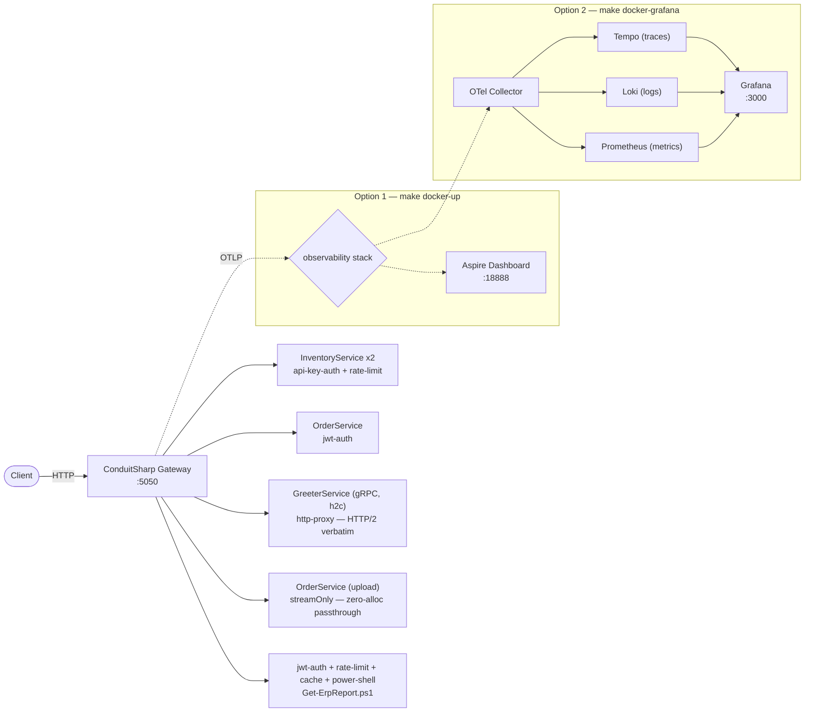
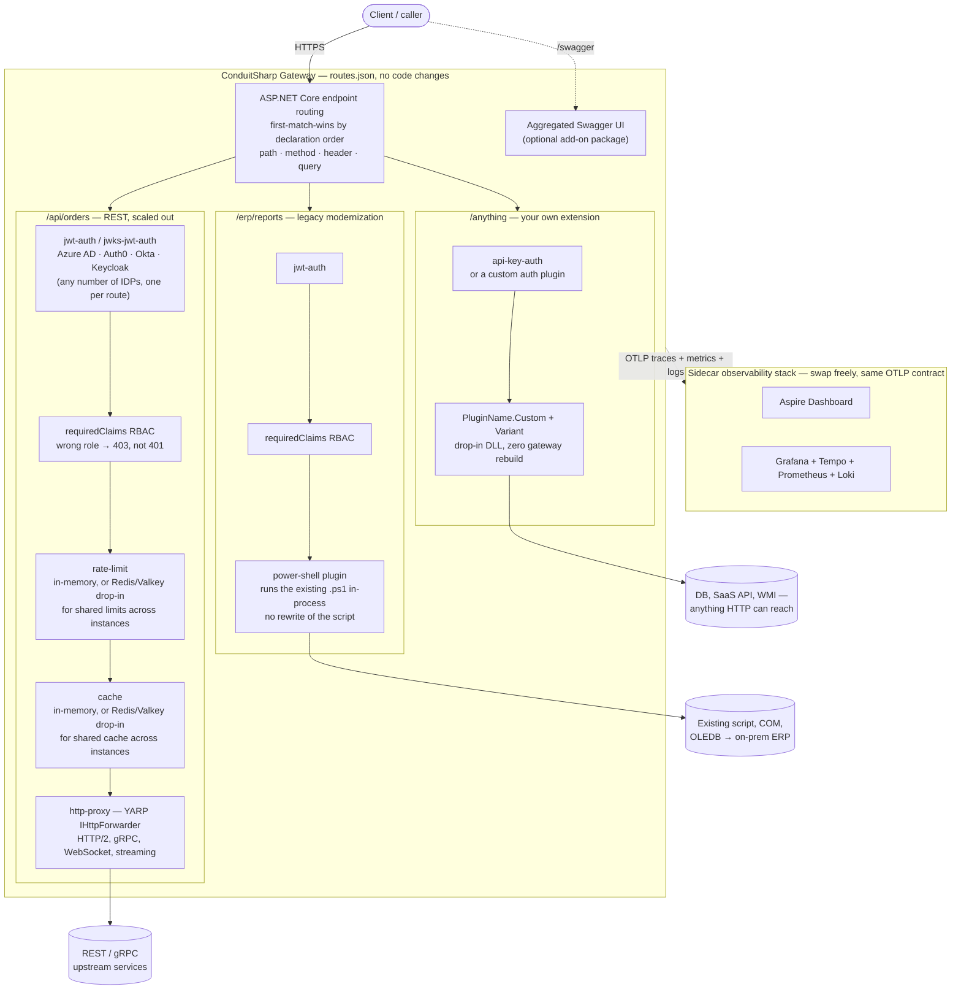
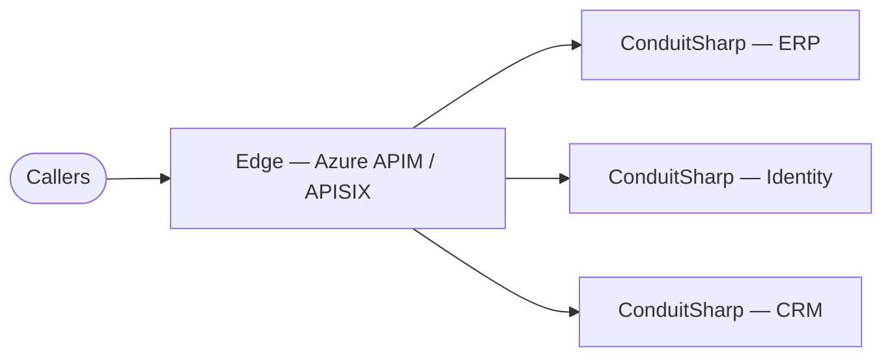
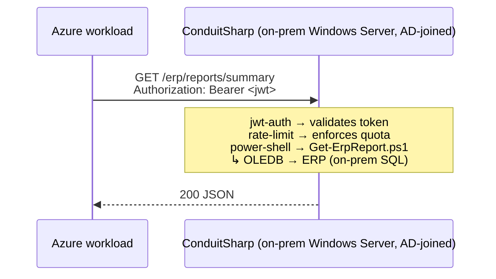
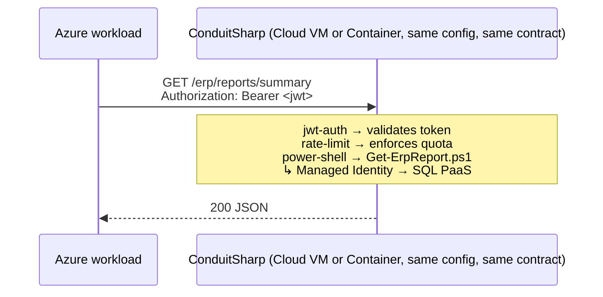
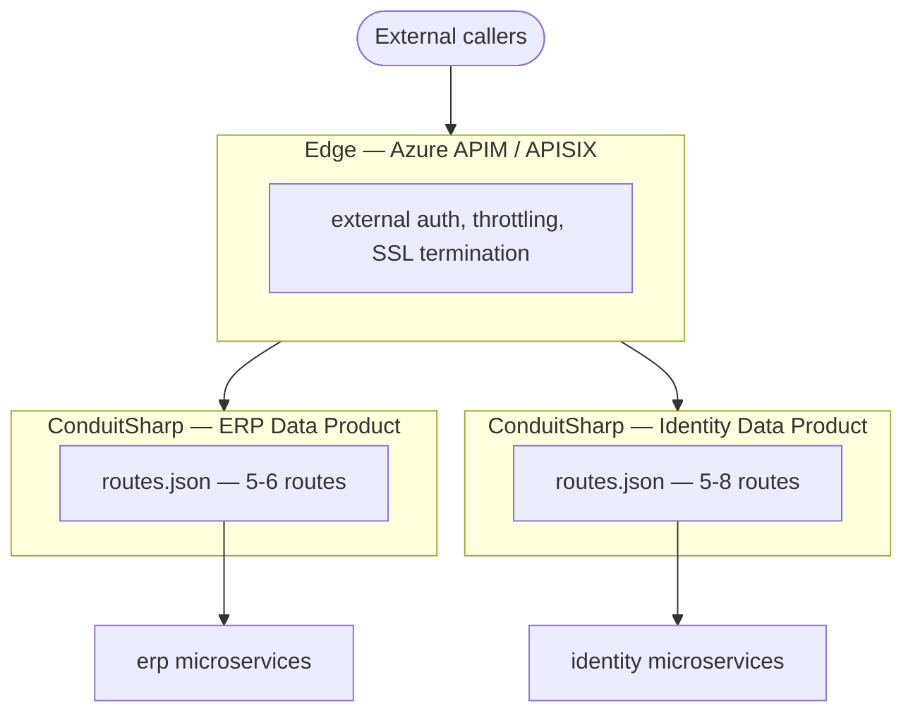

<p align="center">
  <h1 align="center">ConduitSharp</h1>
  <p align="center">The enterprise integration gateway for .NET. Expose existing automation as authenticated, observable APIs, no rewrites.</p>
  <p align="center">
    
    
    
  </p>
</p>

---

## Requirements

- **.NET 10** (LTS). Gateway and all plugins compile and run on .NET 10.
- **PowerShell 7 on Windows** (`pwsh`), for the LegacyGateway launcher (`start.ps1`) instead of `make`.
- **Docker** for the containerised example stack.

## Quick start

```bash
cd examples/LegacyGateway
make docker-up            # macOS / Linux: Docker Compose + Aspire Dashboard
pwsh start.ps1 -DockerUp  # Windows: same stack
```

```bash
# Health check, no auth
curl http://localhost:5050/health

# Inventory, API key
curl http://localhost:5050/api/inventory \
     -H "X-Api-Key: demo-api-key-conduitsharp-example"

# ERP report, JWT (token printed by make docker-up)
curl http://localhost:5050/erp/reports/summary \
     -H "Authorization: Bearer $TOKEN"
```

Six routes, three upstream services (REST, gRPC, a streamOnly upload), a PowerShell plugin, JWT and
API key auth, rate limiting, caching, OpenTelemetry traces, all from `routes.json` with no code
changes. Per-request traces at the **Aspire Dashboard**, `http://localhost:18888`.


```mermaid
flowchart LR
    client(["Client"]) -->|HTTP| gw["ConduitSharp Gateway\n:5050"]
    gw --> inv["InventoryService x2\napi-key-auth + rate-limit"]
    gw --> ord["OrderService\njwt-auth"]
    gw --> grt["GreeterService (gRPC, h2c)\nhttp-proxy — HTTP/2 verbatim"]
    gw --> upl["OrderService (upload)\nstreamOnly — zero-alloc passthrough"]
    gw --> fin["jwt-auth + rate-limit + cache + power-shell\nGet-ErpReport.ps1"]

    gw -.OTLP.-> choice{"observability stack"}

    subgraph opt1 ["Option 1 — make docker-up"]
        choice -.-> aspire["Aspire Dashboard\n:18888"]
    end

    subgraph opt2 ["Option 2 — make docker-grafana"]
        choice -.-> collector["OTel Collector"]
        collector --> tempo["Tempo (traces)"]
        collector --> loki["Loki (logs)"]
        collector --> prom["Prometheus (metrics)"]
        tempo & loki & prom --> grafana["Grafana\n:3000"]
    end
```

Grafana/Tempo/Prometheus/Loki instead of Aspire: `make docker-grafana` (macOS/Linux) or
`docker compose -f docker-compose.grafana.yml up --build -d` (Windows), then `http://localhost:3000`.
No Docker: `make run` (macOS/Linux) or `pwsh start.ps1` (Windows) runs the same example as local
processes with file-based traces.

---

Most enterprises run decades of working automation (PowerShell scripts, .NET Framework services,
scheduled tasks, ERP report extracts) with no API surface, no authentication, no observability.
Making them first-class in a modern API ecosystem normally means a rewrite.


```mermaid
flowchart TB
    client(["Client / caller"])
    client -->|HTTPS| router
    client -.->|/swagger| swaggerui

    subgraph gw ["ConduitSharp Gateway — routes.json, no code changes"]
        router["ASP.NET Core endpoint routing\nfirst-match-wins by declaration order\npath · method · header · query"]
        swaggerui["Aggregated Swagger UI\n(optional add-on package)"]

        subgraph route1 ["/api/orders — REST, scaled out"]
            direction LR
            r1auth["jwt-auth / jwks-jwt-auth\nAzure AD · Auth0 · Okta · Keycloak\n(any number of IDPs, one per route)"]
            r1rbac["requiredClaims RBAC\nwrong role → 403, not 401"]
            r1rl["rate-limit\nin-memory, or Redis/Valkey drop-in\nfor shared limits across instances"]
            r1cache["cache\nin-memory, or Redis/Valkey drop-in\nfor shared cache across instances"]
            r1fwd["http-proxy — YARP IHttpForwarder\nHTTP/2, gRPC, WebSocket, streaming"]
            r1auth --> r1rbac --> r1rl --> r1cache --> r1fwd
        end

        subgraph route2 ["/erp/reports — legacy modernization"]
            direction LR
            r2auth["jwt-auth"]
            r2rbac["requiredClaims RBAC"]
            r2ps["power-shell plugin\nruns the existing .ps1 in-process\nno rewrite of the script"]
            r2auth --> r2rbac --> r2ps
        end

        subgraph route3 ["/anything — your own extension"]
            direction LR
            r3auth["api-key-auth\nor a custom auth plugin"]
            r3custom["PluginName.Custom + Variant\ndrop-in DLL, zero gateway rebuild"]
            r3auth --> r3custom
        end

        router --> route1
        router --> route2
        router --> route3
    end

    r1fwd --> upstream[("REST / gRPC\nupstream services")]
    r2ps --> legacy[("Existing script, COM,\nOLEDB → on-prem ERP")]
    r3custom --> anything[("DB, SaaS API, WMI —\nanything HTTP can reach")]

    gw -. OTLP traces + metrics + logs .-> sidecar

    subgraph sidecar ["Sidecar observability stack — swap freely, same OTLP contract"]
        direction LR
        aspire["Aspire Dashboard"]
        grafanastack["Grafana + Tempo + Prometheus + Loki"]
    end
```

Per-route auth (multiple IDPs or a custom auth plugin), claim-based RBAC, a swappable cache and
rate-limit store (in-memory or Redis/Valkey), a swappable load-balancing policy, a YARP forwarding
engine (HTTP/2, gRPC, WebSockets), legacy scripts as endpoints via the PowerShell plugin, extension
via `Custom`, an opt-in aggregated Swagger UI, and a sidecar observability stack plugging into
Aspire or Grafana without touching the gateway. Piece by piece:
[ARCHITECTURE.md](ARCHITECTURE.md#capabilities-at-a-glance).

That is one gateway. Across an org: one instance per Data Product, each with its own small
`routes.json`, behind one shared edge gateway.


```mermaid
flowchart LR
    client(["Callers"]) --> edge["Edge — Azure APIM / APISIX"]
    edge --> gwA["ConduitSharp — ERP"]
    edge --> gwB["ConduitSharp — Identity"]
    edge --> gwC["ConduitSharp — CRM"]
```

One external contract, one org-wide policy point at the edge, and a route table per team small
enough to review. Full topology: [Deployment patterns](#deployment-patterns).

---

## Contents

- [The enterprise integration problem](#the-enterprise-integration-problem)
- [Enterprise scenarios](#enterprise-scenarios): ERP reporting · AD/SailPoint · Batch jobs
- [Why ConduitSharp](#why-conduitsharp)
- [At a glance](#at-a-glance)
- [Deployment patterns](#deployment-patterns): edge · sidecar · APIM integration (diagrams in [ARCHITECTURE.md](ARCHITECTURE.md#deployment-patterns))
- [Compared to alternatives](#compared-to-alternatives)
- [Installation](#installation)
- [Gateway settings](GATEWAY_SETTINGS.md)
- [Configuring routes](ROUTING.md)
- [Claim-based authorization (RBAC)](AUTHORIZATION.md)
- [TLS / HTTPS](TLS.md)
- [Observability](OBSERVABILITY.md)
- [Swagger aggregation](#swagger-aggregation)
- [Health endpoints](#health-endpoints)
- [Admin API](#admin-api)
- [Writing a plugin](#writing-a-plugin)
- [Plugin examples](#plugin-examples)
- [Shipping a plugin as a NuGet package](#shipping-a-plugin-as-a-nuget-package)
- [Drop-in external plugins](#drop-in-external-plugins-no-gateway-rebuild)
- [Contributing](#contributing)
- [Code of conduct](#code-of-conduct)
- [License](#license)

---

## The enterprise integration problem

Every large organisation carries hundreds of automation scripts and legacy services running critical
processes and invisible to the modern API ecosystem: no auth, no rate limiting, no observability, no
contract. Calling them means SSH sessions, scheduled tasks, or tribal knowledge.

The standard answer, a rewrite, takes quarters, carries regression risk, and burns capacity meant
for new capabilities. When it lands, the next script has already appeared on someone else's server.

**Put a gateway in front instead.** The automation keeps running as it does today while ConduitSharp
enforces security and observability standards at the boundary, surfaces each capability as an HTTP
endpoint, and gives the architecture team one auditable control plane for everything crossing the
wire. JWT auth, rate limiting, OpenTelemetry tracing, and structured logging apply to any Windows
automation, legacy service, or `.ps1`. **Legacy technical debt becomes an implementation detail.**

---

## Enterprise scenarios

The same shape in every large organisation: a critical process runs on a schedule, on someone's
laptop, or only when the right person is available, with no HTTP interface, no authentication, no
observability. Calling it requires knowing it exists.

### Scenario 1: ERP data products, legacy report extraction

ERP analysts pull report data via PowerShell scripts on an AD-joined on-prem Windows server. The
scripts work because of the on-prem stack: Windows-integrated auth, OLEDB drivers, Kerberos tickets,
direct network access to the ERP database. No abstraction layer, no documented contract, and a
dependency on infrastructure that stops existing once cloud migration begins.

New workloads on Azure VMs or containers are not domain-joined, cannot acquire Kerberos tickets, and
have no OLEDB drivers. The scripts cannot move and there is no API surface to move to. Two phases,
one HTTP contract throughout.

**Phase 1: wrap the existing workload on-prem, ship in a day.**

ConduitSharp deploys as a Windows Service on the same server; the PowerShell plugin runs the
existing script in-process. Data access is untouched.


```mermaid
sequenceDiagram
    participant Azure as Azure workload
    participant CS as ConduitSharp (on-prem Windows Server, AD-joined)

    Azure->>CS: GET /erp/reports/summary<br/>Authorization: Bearer <jwt>
    Note over CS: jwt-auth → validates token<br/>rate-limit → enforces quota<br/>power-shell → Get-ErpReport.ps1<br/>↳ OLEDB → ERP (on-prem SQL)
    CS-->>Azure: 200 JSON
```

**Phase 2: cloudify at your own pace, zero consumer disruption.**

Move ConduitSharp and the script to a cloud VM or container, swapping OLEDB + Kerberos for Managed
Identity and SQL PaaS. Script business logic is unchanged and consumers call the same URL with the
same JWT, never seeing that the backend moved.


```mermaid
sequenceDiagram
    participant Azure as Azure workload
    participant CS as ConduitSharp (Cloud VM or Container, same config, same contract)

    Azure->>CS: GET /erp/reports/summary<br/>Authorization: Bearer <jwt>
    Note over CS: jwt-auth → validates token<br/>rate-limit → enforces quota<br/>power-shell → Get-ErpReport.ps1<br/>↳ Managed Identity → SQL PaaS
    CS-->>Azure: 200 JSON
```

The gateway is the strangler seam: modernise the edge first, migrate the infrastructure behind it
later.

```json
{
  "id": "erp-report",
  "route": { "match": { "path": "/erp/reports/summary", "methods": ["GET"] } },
  "cluster": null,
  "plugins": [
    { "name": "jwks-jwt-auth", "order": 1, "config": { "jwksUri": "https://login.microsoftonline.com/{tenant}/discovery/v2.0/keys" } },
    { "name": "rate-limit",    "order": 2, "config": { "windowSeconds": 3600, "maxRequests": 100 } },
    { "name": "cache",         "order": 3, "config": { "ttlSeconds": 900 } },
    { "name": "custom", "variant": "power-shell", "order": 99, "config": { "scriptPath": "scripts/Get-ErpReport.ps1" } }
  ]
}
```

### Scenario 2: identity management, AD to SailPoint onboarding

An IT team maintains a PowerShell script querying Active Directory and pushing provisioning payloads
to SailPoint on a schedule. A failure goes unnoticed until Monday: no retry, no audit log, no
on-demand trigger for the identity team.

```json
{
  "id": "ad-sailpoint-provision",
  "route": { "match": { "path": "/identity/provision", "methods": ["POST"] } },
  "cluster": null,
  "plugins": [
    { "name": "jwt-auth",    "order": 1, "config": { "signingKey": "..." } },
    { "name": "rate-limit",  "order": 2, "config": { "windowSeconds": 60, "maxRequests": 10 } },
    { "name": "custom", "variant": "power-shell", "order": 99, "config": { "scriptPath": "scripts/Invoke-ADProvision.ps1" } }
  ]
}
```

The script does not change. Identity engineers get a JWT-authenticated endpoint callable from a
pipeline, a webhook, or a service desk integration, and failed provisioning shows up immediately in
the OTLP dashboard.

### Scenario 3: IT operations, batch jobs as on-demand endpoints

Scheduled tasks have no caller. Needing the output mid-cycle means waiting or running it manually,
with no audit trail, no concurrency control, and no CI/CD or ITSM integration. The same three-line
route config turns any `.ps1` into a triggered, observable HTTP endpoint.

---

**Same pattern every time.** A working process with no API surface gets a boundary without being
touched. Script stays, infrastructure stays, and the capability becomes authenticated,
rate-limited, cached, observable, and callable by anything that speaks HTTP.

---

## Why ConduitSharp

#### Architecture sets policy. Everything else stays where it is.

Each route declares its own ordered plugin list. ERP runs
`[jwks-jwt-auth → rate-limit → cache → power-shell]`, provisioning runs
`[jwt-auth → rate-limit → power-shell]`, a health check runs nothing. Routes are independent, so
adding a cache to one endpoint affects no other.

Security and observability standards live with one team in one file; the scripts, services, and
queries behind the gateway stay with whoever already owns them. A new policy is a plugin added to a
route in `routes.json`, with no coordination with the backend teams.

#### Built-in policies, zero code

JWT auth, JWKS validation, API key (plain and hashed), rate limiting, response caching, and header
transforms are built in and configured in JSON:

```json
"plugins": [
  { "name": "jwt-auth",        "order": 1, "config": { "signingKey": "..." } },
  { "name": "rate-limit",      "order": 2, "config": { "windowSeconds": 60, "maxRequests": 100 } },
  { "name": "cache",           "order": 3, "config": { "ttlSeconds": 300 } },
  { "name": "header-transform","order": 4, "config": { "request": { "set": { "X-Forwarded-By": "ConduitSharp" } }, "response": { "remove": ["Server"] } } }
]
```

#### Plugins in any .NET language or PowerShell, not Lua

Kong and Apache APISIX extend via Lua. ConduitSharp plugins implement one interface
(`IPipelinePlugin`) in **C#, F#, VB.NET, or PowerShell**:

| Language | How |
|---|---|
| **C#** | Reference `ConduitSharp.Core`, implement `IPipelinePlugin`, drop the DLL in `plugins/` |
| **F#** | As C#: identical .NET IL, functional style suits the pipeline |
| **VB.NET** | As C#: compile as a class library, drop in the DLL |
| **PowerShell** | A C# shim hosting `Microsoft.PowerShell.SDK` runs your `.ps1`, no rewrite |

The C# shim that runs a `.ps1` as a gateway handler:

```csharp
// IPipelinePlugin.ExecuteAsync IS the ASP.NET Core middleware signature — HttpContext, the
// plugin's JSON config, and next. To short-circuit, write the response and don't call next().
public sealed class PowerShellPlugin : IPipelinePlugin
{
    public PluginName Name    => PluginName.Custom;
    public string?    Variant => "power-shell";
    public string     Id      => "power-shell";

    public async Task ExecuteAsync(HttpContext context, JsonElement config, RequestDelegate next)
    {
        var options = JsonSerializer.Deserialize<PsConfig>(config)
            ?? throw new InvalidOperationException("PowerShell plugin config is null.");

        using var ps = PowerShell.Create();
        ps.AddScript("$ErrorActionPreference = 'Stop'"); // treat all errors as terminating
        ps.AddScript(await File.ReadAllTextAsync(options.ScriptPath));
        ps.AddParameter("Request", context.Request);

        try
        {
            var results = await ps.InvokeAsync();
            await context.Response.WriteAsync(string.Join("\n", results.Select(r => r.ToString())));
        }
        catch (RuntimeException ex) { context.Response.StatusCode = 500; await context.Response.WriteAsync(ex.Message); }
        catch (ParseException)      { context.Response.StatusCode = 500; await context.Response.WriteAsync("PowerShell script configuration error."); }
        // no next() — the script produced the response
    }
}
```

```json
{ "name": "custom", "variant": "power-shell", "order": 99, "enabled": true, "config": { "scriptPath": "scripts/MyReport.ps1" } }
```

`$ErrorActionPreference = 'Stop'` makes both terminating and non-terminating script errors surface
as a 500 instead of an empty body.

A ready-to-use build of this pattern, no shim to copy, is at
[plugins/ConduitSharp.Plugin.PowerShell](../plugins/ConduitSharp.Plugin.PowerShell): a `.ps1` run
in-process via the embedded `Microsoft.PowerShell.SDK` (no system `pwsh`), droppable into `plugins/`
as-is.

> Concurrent load or heavy ETL: see [PowerShell plugin: production considerations](ARCHITECTURE.md#powershell-plugin-production-considerations) for runspace pooling, out-of-process execution, and PSCustomObject memory guidance.

#### Extend without touching the gateway source, ship via NuGet

A plugin implements one interface against `ConduitSharp.Core` (on NuGet) and ships as a package. The
normal path is immutable: reference the package and register it in DI when embedding, or `COPY` the
published DLL into your Docker image. One versioned build, nothing dropped into a running server. A
plugin worth sharing across teams (a company-standard auth adapter, a domain-specific header
enricher) goes to an internal feed or the public gallery and is consumed like any other dependency.

Where rebuilding is not an option (an air-gapped box, an operator who cannot redeploy) the same DLL
drops into `plugins/` and is picked up on the next reload. Same artifact, same discovery, as a
fallback rather than the default.

#### Why plugins and not "just plain YARP + ASP.NET Core"?

Both work here and they compose.

**YARP's native per-route policies pass straight through.** A route's `route` block **is** YARP's
`RouteConfig`, verbatim, so `authorizationPolicy`, `rateLimiterPolicy`, `corsPolicy`, and `timeout`
work today: embed the gateway in your own app, register the policies, and the framework's own
auth/rate-limit middleware enforces them.

```json
"route": {
  "match": { "path": "/erp/{**rest}" },
  "authorizationPolicy": "erp-readers"     // your AddAuthorization policy, enforced by ASP.NET Core
}
```

(Pinned by `NativePolicyPassthroughTests`, so it cannot silently regress.)

**Two assumptions in the critique do not hold.** Endpoint filters (`AddEndpointFilter`) run only on
minimal-API handlers built by `RequestDelegateFactory`, **not** on YARP endpoints, which are plain
`RequestDelegate`s. And a native policy is the *name of a C# artifact fixed at compile time*: config
can reference one, never create one, and the standalone host runs no user C# at all.

Plugins are the other axis rather than a replacement. Native policy = behavior in code, referenced
by name, for embedders. Plugin = behavior **and** config in data: hot-reloadable, per route in JSON,
discovered from a dropped-in DLL, available to the zero-code standalone host. Mix them freely.

---

## At a glance

Each route in `routes.json` declares its own plugin chain. Routes share nothing: different auth,
different policies, different terminal handlers.

```
Incoming request → ASP.NET Core Endpoint Routing

  /api/inventory/{**rest}                 REST upstream, scaled out
    [1]  api-key-auth    →  401 if key missing or invalid
    [2]  rate-limit      →  429 if quota exceeded
    [99] http-proxy      →  RoundRobin(node-1:8080, node-2:8080)  →  response

  /greet.Greeter/{**method}               gRPC upstream — HTTP/2 end-to-end
    [99] http-proxy      →  HTTP/2 stream forwarded verbatim to greeter-svc:5301  →  response
                            pure passthrough, no transcoding — gRPC frames are opaque
                            to the gateway, and the forwarder sustains the multiplexed
                            h2c streams

  /erp/reports/summary                 No upstream — script produces response directly
    [1]  jwks-jwt-auth   →  401 if invalid (validates against Azure AD JWKS)
    [2]  rate-limit      →  429 if quota exceeded
    [3]  cache           →  serve cached body if fresh, else continue
    [99] power-shell     →  Get-ErpReport.ps1                   →  response

  /health                                 Passthrough — no auth, no policies
    [99] http-proxy      →  upstream:8080                          →  response
```

**The forwarding engine is YARP.** `http-proxy` names the point in the chain where YARP's
`IHttpForwarder` forwards the request; it is not itself a plugin. Declare it to place the forward
explicitly, or omit it and the forward appends at the end of the chain. HTTP/2, gRPC, WebSocket
tunnelling, response streaming, and trailers work on every route with no opt-in.

Retries, per-route mTLS, and the circuit breaker stay ConduitSharp's, wrapped around the forwarder.
See [Retries and circuit breaking](ROUTING.md#retries-and-circuit-breaking).

---

## Deployment patterns

Three topologies: edge gateway, sidecar next to individual legacy workloads, or per-Data-Product
domain gateway (one instance per team namespace, behind a larger edge gateway such as Azure API
Management or APISIX). Every instance emits OTLP traces correlating under a single trace ID via W3C
`traceparent` propagation.

The one enterprises land on most: one instance per Data Product, each with its own `routes.json`
(5-8 routes), in its own namespace, behind one shared edge gateway.


```mermaid
flowchart TB
    client(["External callers"]) --> edge

    subgraph edge ["Edge — Azure APIM / APISIX"]
        edgenote["external auth, throttling, SSL termination"]
    end

    edge --> gwA
    edge --> gwB

    subgraph gwA ["ConduitSharp — ERP Data Product"]
        rA["routes.json — 5-6 routes"]
    end
    subgraph gwB ["ConduitSharp — Identity Data Product"]
        rB["routes.json — 5-8 routes"]
    end

    rA --> svcA["erp microservices"]
    rB --> svcB["identity microservices"]
```

Each Data Product owns a small, reviewable route table rather than one team wading through a global
one, and the edge gateway keeps the single external contract and org-wide policy. Full topology
diagrams, trace waterfall examples, and scaling constraints:
[ARCHITECTURE.md, Deployment patterns](ARCHITECTURE.md#deployment-patterns).

---

## Compared to alternatives

ConduitSharp replaces an existing gateway or sits behind one, depending on the problem. Against
Ocelot it competes directly: same .NET stack, aimed at the integration scenarios above. It builds on
YARP rather than competing with it, using YARP as the forwarding engine and adding a per-route
plugin pipeline and PowerShell execution. Against Kong, APISIX, or Azure APIM it complements: those
handle external traffic at the edge, ConduitSharp handles legacy workload execution and internal
observability below.

|                                      | ConduitSharp  | Ocelot        | YARP              | Kong          | APISIX        |
| ------------------------------------ | ------------- | ------------- | ----------------- | ------------- | ------------- |
| **Language**                         | C# / .NET     | C# / .NET     | C# / .NET         | Lua / Nginx   | Lua / Nginx   |
| **Plugin language**                  | **C# / F# / VB.NET / PowerShell** <br/> + ASP.NET middleware | None | ASP.NET middleware | Lua      | Lua           |
| **PowerShell script execution**      | ✅ Plugin     | ❌ No         | ❌ No             | ❌ No         | ❌ No         |
| **Per-route plugin pipeline**        | ✅ Yes        | ❌ No         | ❌ No             | ✅ Yes        | ✅ Yes        |
| **Drop-in external plugins**         | ✅ Yes        | ❌ No         | ❌ No             | ✅ Lua only   | ✅ Lua only   |
| **Plugin contract as NuGet**         | ✅ Yes        | ❌ No         | ❌ No             | —             | —             |
| **Unit-testable without HTTP**       | ✅ Yes        | ❌ No         | ❌ No             | —             | —             |
| **OpenTelemetry (traces + metrics)** | ✅ Built-in   | ❌ No         | ✅ Yes            | ✅ Plugin     | ✅ Plugin     |
| **Swagger aggregation**              | ✅ Built-in   | ✅ Third-party | ❌ No            | ✅ Plugin     | ✅ Plugin     |
| **Forwarding engine**                | **YARP native** | Custom  | YARP native       | Nginx         | Nginx         |
| **Works behind Azure APIM / APISIX** | ✅ Yes        | ✅ Yes    | ✅ Yes        | ⚠️ Overlap   | ⚠️ Overlap   |
| **Windows Service / IIS native**     | ✅ Yes        | ✅ Yes        | ✅ Yes            | ❌ No         | ❌ No         |
| **Config format**                    | JSON file     | JSON file     | JSON / YAML       | Database      | YAML / etcd   |

---

## Installation

Pick by how you deploy, most common first. **Embedded library** and **Docker** fit immutable
infrastructure: build an image or app with the plugins baked in via NuGet, ship that. **Windows
Service / IIS** is the legacy-estate path, running the gateway *where the workloads already live*
(AD-joined boxes, ERP servers, IIS worker processes) where the Linux-first gateways cannot.

### Embedded library (NuGet), recommended

The gateway hosts *inside your own ASP.NET Core app*, the YARP `AddReverseProxy()` /
`MapReverseProxy()` model, instead of running as a separate process. Plugins arrive as NuGet
packages registered in DI, making the deployment one immutable, versioned build.

```bash
dotnet add package ConduitSharp.Gateway.AspNetCore
```

```csharp
using ConduitSharp.Gateway;

var builder = WebApplication.CreateBuilder(args);
builder.AddConduitSharpGateway(options =>
{
    options.PathPrefix = "/api";   // gateway owns /api/*; the rest of the app is yours
});

var app = builder.Build();
app.MapGet("/hello", () => "served by the host app");   // coexists with the gateway
app.UseConduitSharpGateway();
app.Run();
```

`ConduitSharpGatewayOptions` toggles each piece (observability, plugin-folder scanning, admin API,
health endpoints, route source, path prefix), so the gateway composes with an app that already owns
its OTel or health checks. NuGet plugins register with one DI line each, e.g.
`builder.Services.AddSingleton<ICacheService, RedisCacheService>()`. The aggregated Swagger UI is a
separate add-on, keeping Swashbuckle out of hosts that do not want it:
`dotnet add package ConduitSharp.Gateway.AspNetCore.Swagger`, then
`app.UseConduitSharpGatewaySwagger()` before `UseConduitSharpGateway()`. Runnable samples:
[examples/EmbeddedGateway](../examples/EmbeddedGateway) and [examples/EmbeddedGatewayPrefixed](../examples/EmbeddedGatewayPrefixed).

### Docker

```bash
docker run -p 5050:5050 \
  -v ./routes.json:/app/Configuration/routes.json \
  ghcr.io/liqngliz/conduitsharp:latest
```

Override the routes path with `-e Gateway__RoutesPath=/config/routes.json` if preferred. For the
immutable plugin path, build an image `FROM` this one and `COPY` the published plugin DLLs into
`/app/plugins/`: no runtime dropping, one versioned artifact.

### dotnet tool

```bash
dotnet tool install -g ConduitSharp.Gateway
conduitsharp
```

Works on Windows, macOS, and Linux. Requires .NET 10 SDK.

**Bare metal, Windows Service, or IIS**, the legacy-estate paths with the runtime bundled in the
binary: [docs/DEPLOYMENT_BAREMETAL.md](DEPLOYMENT_BAREMETAL.md).

---

## Reference documentation

- [Gateway settings](GATEWAY_SETTINGS.md): `appsettings.json`, env-var overrides, request-body budgets
- [Configuring routes](ROUTING.md): routes, load balancing, [retries & circuit breaking](ROUTING.md#retries-and-circuit-breaking), path & query syntax, built-in plugins
- [Claim-based authorization (RBAC)](AUTHORIZATION.md): `requiredClaims`, multiple providers, [Microsoft Entra ID setup](AUTHORIZATION.md#microsoft-entra-id-azure-ad-v20-token-app-role-rbac)
- [TLS / HTTPS and mTLS](TLS.md): inbound Kestrel, outbound upstream, mutual TLS
- [Observability](OBSERVABILITY.md): traces, metrics, OTLP export, structured logging

## Swagger aggregation

OpenAPI specs from upstream services aggregate into a single Swagger UI at `/swagger`. The
standalone gateway (binary, Docker, dotnet tool) has it built in; when
[embedding as a library](#embedded-library-nuget-recommended) it is an opt-in add-on package
(`ConduitSharp.Gateway.AspNetCore.Swagger` → `app.UseConduitSharpGatewaySwagger()`), so embedders
never take an unwanted Swashbuckle dependency. Two source modes per route:

- **`fetchFrom`**: fetches the spec live from a URL each time `/swagger` is opened, for upstreams publishing their own swagger.json
- **`specFile`**: reads a local JSON file, for specs committed alongside the gateway config

Add a `"swagger"` block to any route in `routes.json`:

```jsonc
// one `swagger` block per route; the rest of the route is unchanged.
// Full route schema: docs/ROUTING.md
"swagger": { "fetchFrom": "http://user-service:8080/swagger/v1/swagger.json" }

"swagger": { "specFile": "./specs/order-service.json" }
```

`http://your-gateway/swagger` then serves a UI with a dropdown for both services. Routes without a
`"swagger"` block do not appear, and if no route has one the `/swagger` endpoint is never
registered.

Individual specs live at `/swagger/{routeId}.json`, for pointing an external Swagger UI at the
gateway.

---

## Health endpoints

Always mapped (unless disabled via `ConduitSharpGatewayOptions.MapHealthEndpoints` when embedding), independent of auth or route config:

| Endpoint | Meaning |
| --- | --- |
| `GET /healthz` | Liveness. `200 OK` whenever the process is up, never touches upstreams. |
| `GET /readyz` | Readiness. `200 Ready` once a route table is loaded, else `503 Not ready`. |

`/readyz` stays independent of upstream reachability on purpose: a downstream outage should not pull
every gateway replica out of a load balancer's rotation.

---

## Admin API

Hot config reload and cache invalidation without redeploying the binary. **Disabled by default**,
active only when `Gateway.AdminKeyHash` is set.

The config stores a **SHA-256 hash** of the secret; the raw key never touches disk or config files.
Generate the hash first:

```powershell
# PowerShell
$key = "my-secret-key"
[System.Security.Cryptography.SHA256]::HashData(
    [System.Text.Encoding]::UTF8.GetBytes($key)
) | ForEach-Object { '{0:x2}' -f $_ }
```

```bash
# Linux / macOS
echo -n "my-secret-key" | sha256sum
```

Then set the hash in `Configuration/appsettings.json`:

```json
{
  "Gateway": {
    "AdminKeyHash": "a665a45920422f9d417e4867efdc4fb8a04a1f3fff1fa07e998e86f7f7a27ae3"
  }
}
```

Or via environment variable:

```bash
Gateway__AdminKeyHash=a665a45920422f9d417e4867efdc4fb8a04a1f3fff1fa07e998e86f7f7a27ae3 conduitsharp
```

### Reload routes

```
POST /admin/routes/reload
X-Admin-Key: your-secret-key
Content-Type: application/json

{ ...new routes.json content... }
```

The submitted JSON passes the same gates as startup (schema, plus every named plugin resolving with
a config that parses), is written to the routes file atomically, then swaps the route table in
place. **No restart:** the new table serves the next request, in-flight requests finish on the table
they started with, and a rejected reload changes nothing.

A *new plugin DLL* or an mTLS *client certificate* still needs a restart; both resolve from DI at
startup, so a reload cannot introduce one.

| Response | Meaning |
| --- | --- |
| `200 Routes reloaded.` | Valid config, file written, route table swapped in place |
| `400 Invalid routes configuration: ...` | Validation failed, running table untouched |
| `401 Unauthorized.` | Wrong or missing `X-Admin-Key` header |

> When `Gateway.AdminKeyHash` is not set, `POST /admin/routes/reload` and `DELETE /admin/cache/{routeId}` are treated as normal gateway requests and routed (or 404'd) like any other path.

### Invalidate a route's cache

```
DELETE /admin/cache/user-service-route
X-Admin-Key: your-secret-key
```

Flushes every cached response entry for that route, leaving other routes untouched, and returns
`200` with the number of entries removed. For a manual upstream data change that should not wait out
the route's `cache` plugin `ttlSeconds`.

---

## Writing a plugin

A plugin is one class implementing `IPipelinePlugin`: one interface, one method, plus a stable `Id`
for registry lookups. Architecture teams publish the constraint (`PluginName`, `routes.json`
config), development or operations teams implement the logic.

```csharp
using System.Text.Json;
using System.Text.Json.Serialization;
using ConduitSharp.Core.Pipeline;
using ConduitSharp.Core.Routing;

// Config lives in its own record — owns deserialization and validation.
public sealed record MyRateLimitConfig
{
    [JsonPropertyName("threshold")] public int Threshold { get; init; } = 100;

    internal static MyRateLimitConfig From(JsonElement raw) =>
        raw.Deserialize<MyRateLimitConfig>(new JsonSerializerOptions { PropertyNameCaseInsensitive = true })
        ?? throw new InvalidOperationException("my-rate-limit config is null.");
}

public sealed class MyRateLimitPlugin : IPipelinePlugin
{
    // Use an existing PluginName to replace the built-in — last registration wins.
    // For a brand-new plugin type use PluginName.Custom + a Variant (see "Naming" below).
    public PluginName Name => PluginName.RateLimit;

    // Id is the stable registry key — it, not Name, decides which plugin instance wins
    // when two DLLs register for the same slot. Keep it fixed across releases: renaming
    // it is a breaking change for anyone replacing this built-in.
    public string Id => "rate-limit";

    public async Task ExecuteAsync(HttpContext context, JsonElement config, RequestDelegate next)
    {
        // The route's config block is passed in on every call — nothing shared to copy first.
        var typed = MyRateLimitConfig.From(config);

        if (IsOverLimit(context.Request, typed.Threshold))
        {
            context.Response.Headers.RetryAfter = "60";
            context.Response.StatusCode = StatusCodes.Status429TooManyRequests;
            await context.Response.WriteAsync("Rate limit exceeded.");
            return; // stops the chain — upstream is never called
        }

        await next(context); // hand off to the next plugin or upstream
    }
}
```

That is the entire interface.

### Naming

`PluginName` is a strict enum (`jwt-auth`, `rate-limit`, `cache`, `http-proxy`, … in kebab-case
JSON), so a typo in `routes.json` fails at startup rather than per request. A **brand-new plugin
type** declares `PluginName.Custom` plus a self-chosen `Variant` string and routes select it by
both, with no Core recompile or fork:

```csharp
public PluginName Name    => PluginName.Custom;
public string?    Variant => "my-plugin-name";
public string     Id      => "my-plugin-name";  // stable registry key, never renumbered
```

> The registry keys on `Id`, not the numeric `PluginName`, keeping external plugin binaries immune
> to future enum changes. For a `Custom` plugin, `Id` conventionally matches `Variant`; for a plugin
> replacing a built-in, `Id` matches the built-in's own `Id` (e.g. `"rate-limit"`).

```json
{ "name": "custom", "variant": "my-plugin-name", "order": 2, "config": { } }
```

Variants are case-insensitive and any number of custom plugins coexist, each under its own
(name, variant) key.

To **replace** a built-in, declare its existing `PluginName` with no variant. Yours wins under
**last registration wins**: DI registrations added later (externally loaded DLLs, test overrides)
take precedence. Same rule for the non-plugin seams, where a drop-in `ICacheService`,
`IRateLimitStore`, YARP `ILoadBalancingPolicy`, or ASP.NET Core `MatcherPolicy` DLL in `plugins/`
overrides the built-in.

`http-proxy` is the one name this cannot replace, since forwarding is YARP's `IHttpForwarder` rather
than a plugin.

---

## Plugin examples

### Header injection

Internal headers before forwarding, for propagating a request ID or marking the source.

```csharp
public sealed class RequestIdPlugin : IPipelinePlugin
{
    public PluginName Name => PluginName.HeaderTransform;
    public string     Id   => "header-transform";

    public async Task ExecuteAsync(HttpContext context, JsonElement config, RequestDelegate next)
    {
        context.Request.Headers["X-Request-Id"] = Guid.NewGuid().ToString();
        context.Request.Headers["X-Forwarded-By"] = "ConduitSharp";
        await next(context);
    }
}
```

### Tenant resolver

Read a JWT sub-claim and stamp a tenant header before the upstream sees the request. For
multi-tenant ERP integrations where the upstream expects a tenant context it cannot derive itself.

```csharp
public sealed class TenantPlugin : IPipelinePlugin
{
    public PluginName Name => PluginName.HeaderTransform;
    public string     Id   => "header-transform";

    public async Task ExecuteAsync(HttpContext context, JsonElement config, RequestDelegate next)
    {
        if (context.Request.Headers.TryGetValue("Authorization", out var bearer))
        {
            var tenant = ExtractTenantFromJwt(bearer);
            if (tenant is not null)
                context.Request.Headers["X-Tenant-Id"] = tenant;
        }
        await next(context);
    }
}
```

### Custom plugins: terminal handlers

`PluginName.Custom` is the escape hatch for a plugin handling the request without forwarding
upstream. Set `"cluster": null` on the route and write the response without calling `next()`.

Fan-out aggregation across backend systems, direct database queries, COM/WMI calls, ERP API
orchestration, generated responses: anything producing a response with no single proxy target.

```csharp
public sealed class FanOutPlugin : IPipelinePlugin
{
    private readonly HttpClient _http;
    public FanOutPlugin(IHttpClientFactory factory) => _http = factory.CreateClient();

    public PluginName Name    => PluginName.Custom;
    public string?    Variant => "fan-out";
    public string     Id      => "fan-out";

    public async Task ExecuteAsync(HttpContext context, JsonElement config, RequestDelegate next)
    {
        var typed = FanOutConfig.From(config);

        // Fan out in parallel, honour per-target timeouts
        var tasks = typed.Targets.Select(async t =>
        {
            using var cts = new CancellationTokenSource(t.TimeoutMs);
            var response = await _http.GetStringAsync(t.Url, cts.Token);
            return (t.Name, Body: JsonDocument.Parse(response).RootElement);
        });

        var results = await Task.WhenAll(tasks);

        // Merge into { "orders": {...}, "inventory": {...} }
        var merged = JsonSerializer.Serialize(
            results.ToDictionary(r => r.Name, r => r.Body));

        context.Response.StatusCode  = StatusCodes.Status200OK;
        context.Response.ContentType = "application/json";
        await context.Response.WriteAsync(merged);
        // do not call next — there is no upstream to forward to
    }
}
```

**Plugin order matters.** `order` controls when each plugin runs. Custom and PowerShell plugins run
*last*, after auth and rate limiting have had their chance to reject the request.

```jsonc
// ❌ Wrong: custom runs first, auth and rate-limit never execute
"plugins": [
  { "name": "custom",      "order": 0  },
  { "name": "jwt-auth",    "order": 1  },
  { "name": "rate-limit",  "order": 2  }
]

// ✅ Correct: identity and quota enforced before the handler runs
"plugins": [
  { "name": "jwt-auth",    "order": 1  },
  { "name": "rate-limit",  "order": 2  },
  { "name": "custom",      "order": 99 }
]
```

The route must also set `"cluster": null`, or the gateway forwards after the plugin returns.

> Complex orchestration (partial failure handling, per-target retries, business-rule-driven merging)
> belongs in a dedicated aggregation service, with the gateway in front of it doing auth, rate
> limiting, and routing.

---

## Shipping a plugin as a NuGet package

Plugin authors never need the gateway source. The contract lives in [`ConduitSharp.Core` on NuGet](https://www.nuget.org/packages/ConduitSharp.Core).

```bash
dotnet new classlib -n Acme.GatewayPlugins
cd Acme.GatewayPlugins
dotnet add package ConduitSharp.Core
```

Implement `IPipelinePlugin`, publish to an internal NuGet feed or the public gallery, and gateway
operators install it like any other package. Company-standard auth adapters, domain-specific header
enrichers, and compliance plugins ship without forking the gateway or exposing source.

> Give the plugin a stable `Id` and keep it fixed across releases. The registry keys on `Id`, not
> the numeric `PluginName`, so consumers upgrade `ConduitSharp.Core` without recompiling against a
> shifted enum value.

---

## Drop-in external plugins (no gateway rebuild)

For teams that want to extend a running gateway without touching its source:

**1. Build your plugin** as a class library referencing `ConduitSharp.Core` from NuGet.

**2. Drop the compiled dll** into the `plugins/` folder next to the gateway executable:

```
ConduitSharp.Host/
  plugins/
    Acme.MyPlugin.dll
```

**3. Restart the gateway.** Plugin discovery is automatic:

```
Scanning 1 assemblies in 'plugins/' for IPipelinePlugin implementations.
Discovered 1 external plugin type(s): Acme.MyPlugin.AcmePlugin
```

Every plugin DLL loads into `AssemblyLoadContext.Default` with full trust; there is no isolation
between plugins or from the gateway. Each plugin's private dependencies resolve from the files
published alongside its DLL. See
[No assembly isolation](ARCHITECTURE.md#no-assembly-isolation-plugins-share-the-hosts-load-context).

**Overriding a built-in plugin:** declare the same `PluginName` as the built-in. External plugins
register after built-ins, so **last registration wins** and the drop-in takes over for every route
naming that plugin. No gateway source changes.

**Embedding instead?** Hosting [as a library](#embedded-library-nuget-recommended) needs no
`plugins/` folder: register the plugin in DI after `AddConduitSharpGateway()`, same
last-registration-wins rule.

```csharp
builder.AddConduitSharpGateway(o => o.EnablePluginDirectoryScan = false);
builder.Services.AddSingleton<IPipelinePlugin, AcmePlugin>();   // one line per NuGet plugin
```

> **Security note:** plugins run in-process with full trust. Only load assemblies from sources you control.

---

## Contributing

See [CONTRIBUTING.md](../CONTRIBUTING.md) for build instructions, test commands, and contribution guidelines.  
See [ARCHITECTURE.md](ARCHITECTURE.md) for internal design decisions and component overview.

---

## Code of conduct

This project follows the [Contributor Covenant 2.1](../CODE_OF_CONDUCT.md). Report violations to **oniplus.ar@gmail.com**.

---

## License

Licensed under the [Apache License, Version 2.0](../LICENSE).

Free for open source and commercial use. Apache 2.0 includes an explicit patent grant: contributors'
patent rights are licensed to all users of the software.
